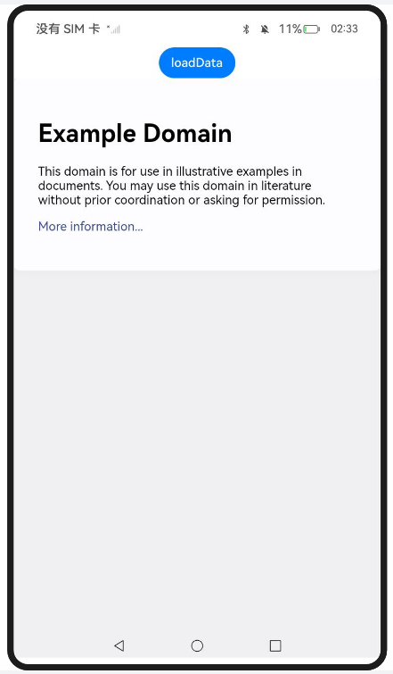
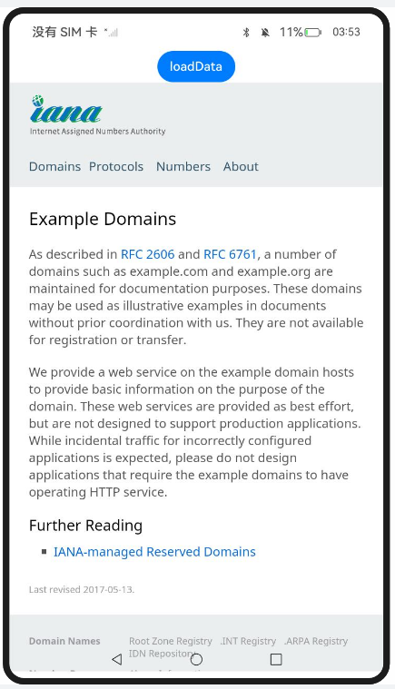
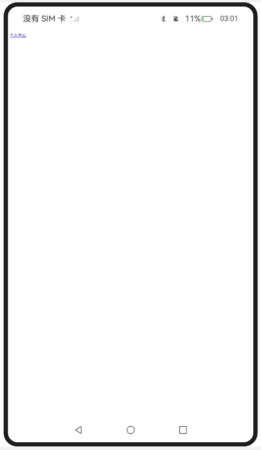
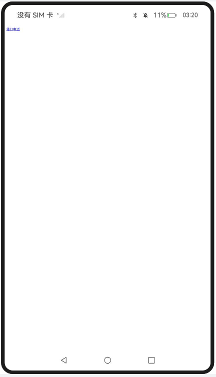
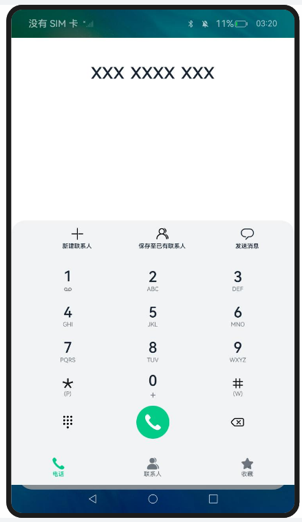

# 管理页面跳转及浏览记录导航

### 介绍

1. 本工程主要实现了对以下指南文档中 https://docs.openharmony.cn/pages/v5.0/zh-cn/application-dev/web/web-redirection-and-browsing-history-mgmt.md 示例代码片段的工程化，主要目标是实现指南中示例代码需要与sample工程文件同源。

### HistoryNavigati

#### 介绍

1. 本示例主要介绍管理页面跳转及浏览记录导航，如果存在历史记录，accessBackward()接口会返回true。同样可以使用accessForward()接口检查是否存在前进的历史记录。

#### 效果预览

| 主页                                                         | More information...                                          |
| ------------------------------------------------------------ | ------------------------------------------------------------ |
|  |  |

使用说明

1. 点击More information...链接到达下一界面，来生成历史记录。
1. 点击loadData按钮来触发前端页面的后退操作。

### PageRedirection

#### 介绍

1. 本示例主要介绍页面跳转管理和浏览记录导航。当用户点击网页链接需要跳转到应用内其它页面时，可以通过使用Web组件的onLoadIntercept()接口来实现。

#### 效果预览

| 主页                                                         | 跳转                                                         |
| ------------------------------------------------------------ | ------------------------------------------------------------ |
|  |  |

使用说明

1. 在前端route.html页面点击超链接，可跳转到应用的ProfilePage.ets页面。

### CrossApplicationRedirection

#### 介绍

本示例主要介绍页面管理及浏览记录导航功能，Web组件支持通过点击前端的超链接实现跨应用跳转。 

#### 效果预览

|  |  |
| ------------------------------------------------------------ | ------------------------------------------------------------ |

使用说明

1. 点击超链接导航至其它应用。

### 工程目录

```
entry/src/main/
|---ets
|---|---entryability
|---|---|---EntryAbility.ets
|---|---pages
|---|---|---CrossApplication Redirection.ets
|---|---|---HistoryNavigati.ets
|---|---|---Index.ets						// 首页
|---|---|---PageRedirection.ets
|---|---|---ProfilePage.ets
|---resources								// 静态资源
|---ohosTest
|---|---ets
|---|---|---tests
|---|---|---|---Ability.test.ets            // 自动化测试用例
```


### 相关权限

[ohos.permission.INTERNET](https://docs.openharmony.cn/pages/v5.0/zh-cn/application-dev/security/AccessToken/permissions-for-all.md#ohospermissioninternet)

### 依赖

不涉及。

### 约束与限制

1. 本示例仅支持标准系统上运行，支持设备：RK3568。
2. 本示例支持API14版本SDK，SDK版本号(API Version 14 Release)。
3. 本示例需要使用DevEco Studio 版本号(5.0.1Release)才可编译运行。

### 下载

如需单独下载本工程，执行如下命令：

```
git init
git config core.sparsecheckout true
echo code/DocsSample/ArkWeb/ManageWebPageLoadBrowse/ManagePageRedirectNav > .git/info/sparse-checkout
git remote add origin https://gitee.com/openharmony/applications_app_samples.git
git pull origin master
```