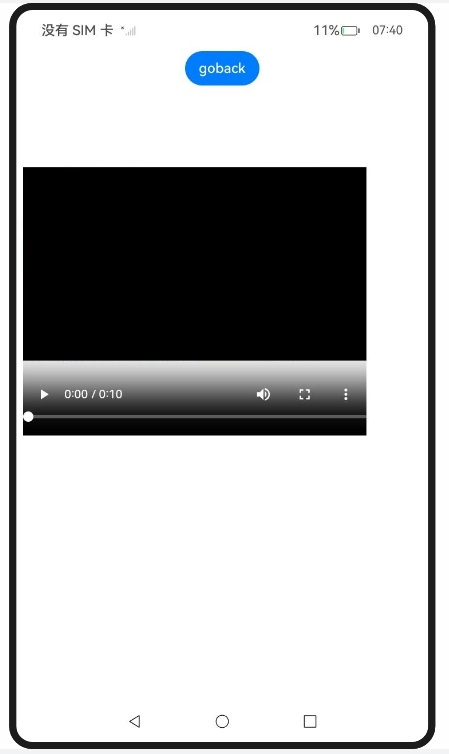
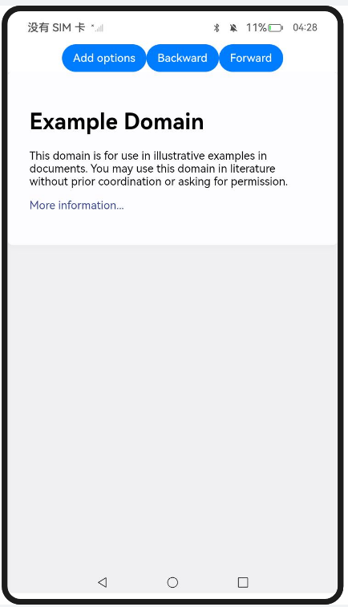
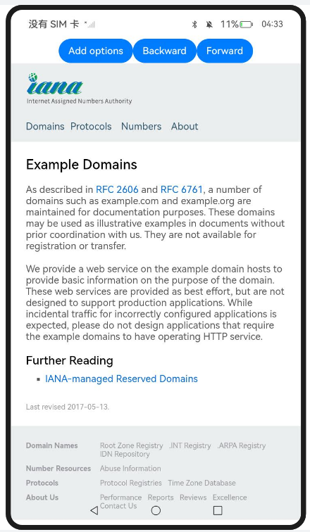
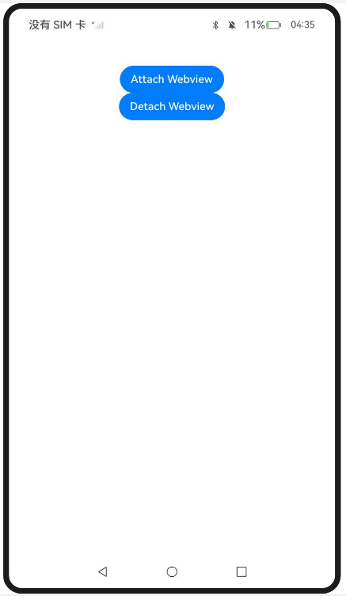
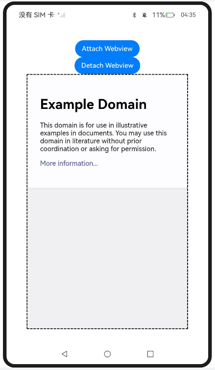

## entry:

### 拦截Web组件发起的网络请求

#### 介绍

1. 本工程主要实现了对以下指南文档中 https://docs.openharmony.cn/pages/v5.0/zh-cn/application-dev/web/web-scheme-handler.md 示例代码片段的工程化，主要目标是实现指南中示例代码需要与sample工程文件同源。

#### InterceptNetRequest

##### 介绍

1.  本示例主要实现拦截Web组件发起的网络请求，为Web组件设置网络拦截器， 设置自定义scheme需要遵循的规则，获取被拦截请求的请求信息并为被拦截的请求提供自定义的响应体。

##### 效果预览

| 主页                                                         | 本地MP4文件                                                  |
| ------------------------------------------------------------ | ------------------------------------------------------------ |
|  |  |

使用说明

1. 通过网络拦截接口对Web组件发出的请求进行拦截，并可以为被拦截的请求提供自定义的响应头以及响应体。
1. 点击link链接请求视频资源，读取本地mp4文件。

##### 工程目录

```
entry/src/main/
|---cpp										// cpp文件夹
|---ets
|---|---entryability
|---|---|---EntryAbility.ets
|---|---pages
|---|---|---Index.ets						// 首页
|---resources								// 静态资源
|---ohosTest
|---|---ets
|---|---|---tests
|---|---|---|---Ability.test.ets            // 自动化测试用例
```


##### 相关权限

[ohos.permission.INTERNET](https://docs.openharmony.cn/pages/v5.0/zh-cn/application-dev/security/AccessToken/permissions-for-all.md#ohospermissioninternet)

## entry2:

### Web组件前进后退缓存

#### 介绍

1. 本工程主要实现了对以下指南文档中 https://docs.openharmony.cn/pages/v5.0/zh-cn/application-dev/web/web-set-back-forward-cache.md 示例代码片段的工程化，主要目标是实现指南中示例代码需要与sample工程文件同源。

#### SetBackForwardCache

##### 介绍

1. 本示例主要设置Web组件前进后退缓存，Web组件为开发者提供了启用和配置前进后退缓存（以下简称BFCache）的功能。启用此功能后，能够显著提升用户返回至先前浏览网页的速度，开发者需要在调用initializeWebEngine()初始化ArkWeb内核之前调用enableBackForwardCache()来开启BFCache，启用BFCache后仅能存储一个页面，Web组件默认进入BFCache的页面可保持存活状态600秒。开发者可通过调用setBackForwardCacheOptions()设置每个Web实例的前进后退缓存策略，使BFCache能够容纳更多页面，从而在用户连续进行前进后退操作时，提供更快的加载速度。同时，开发者还能修改每个页面在缓存中的停留时间，延长页面在BFCache中的驻留期限，进而优化用户的浏览体验。

##### 效果预览

| 主页                                                         | 超链接                                                       |
| ------------------------------------------------------------ | ------------------------------------------------------------ |
|  |  |

使用说明

1. 点击Add options按钮设置Web组件可以缓存的数量上限为10，每个页面在缓存中停留300s。
2. 点击Backward按钮会触发WebviewController的backward方法，使Web视图后退到上一个浏览页面(如果存在上一页面且在后退缓存范围内)，实现类似以于浏览器后退按钮的功能。
3. 点击Forward按钮调用WebviewController的forward方法，使Web视图前进到下一个浏览页面(如果存在下一页且在前进缓存范围内)，与Backward按钮相对应。

##### 工程目录

```
entry2/src/main/
|---ets
|---|---entry2ability
|---|---|---Entry2Ability.ets
|---|---pages
|---|---|---Index.ets						// 首页
|---resources								// 静态资源
|---ohosTest
|---|---ets
|---|---|---tests
|---|---|---|---Ability.test.ets            // 自动化测试用例
```


##### 相关权限

[ohos.permission.INTERNET](https://docs.openharmony.cn/pages/v5.0/zh-cn/application-dev/security/AccessToken/permissions-for-all.md#ohospermissioninternet)

## entry3:

### Web组件在不同的窗口间迁移

#### 介绍

1. 本工程主要实现了对以下指南文档中 https://docs.openharmony.cn/pages/v5.0/zh-cn/application-dev/web/web-component-migrate.md 示例代码片段的工程化，主要目标是实现指南中示例代码需要与sample工程文件同源。

#### MigrateWebCompWin

##### 介绍

1. 本示例主要介绍Web组件在不同的窗口间迁移，Web组件在不同窗口间迁移是基于自定义节点能力实现的。通过BuilderNode，开发者可创建Web组件的离线节点，并结合自定义占位节点控制Web节点的挂载与移除。当从一个窗口上移除Web节点并挂载到另一个窗口中，即完成Web组件在窗口间的迁移。

##### 效果预览

| 主页                                                         | 挂载                                                         |
| ------------------------------------------------------------ | ------------------------------------------------------------ |
|  |  |

使用说明

1. 点击 Attach Webview 按钮，挂载 Web 视图，刷新NodeContainer使 Web 视图显示在页面上。
1. 点击 Detach Webview 按钮，卸载 Web 视图，刷新NodeContainer使 Web 视图将从页面上移除。

##### 工程目录

```
entry3/src/main/
|---ets
|---|---entry3ability
|---|---|---Entry3Ability.ets
|---|---pages
|---|---|---common.ets						// 提供动态挂载Web组件能力
|---|---|---Index.ets						// 首页
|---resources								// 静态资源
|---ohosTest
|---|---ets
|---|---|---tests
|---|---|---|---Ability.test.ets            // 自动化测试用例
```


##### 相关权限

[ohos.permission.INTERNET](https://docs.openharmony.cn/pages/v5.0/zh-cn/application-dev/security/AccessToken/permissions-for-all.md#ohospermissioninternet)

## 依赖

不涉及。

## 约束与限制

1. 本示例仅支持标准系统上运行，支持设备：RK3568。
2. 本示例支持API14版本SDK，SDK版本号(API Version 14 Release)。
3. 本示例需要使用DevEco Studio 版本号(5.0.1Release)才可编译运行。

## 下载

如需单独下载本工程，执行如下命令：

```
git init
git config core.sparsecheckout true
echo code/DocsSample/ArkWeb/ManageWebPageLoadBrowse/NetReqInterceptCacheWinOps > .git/info/sparse-checkout
git remote add origin https://gitee.com/openharmony/applications_app_samples.git
git pull origin master
```