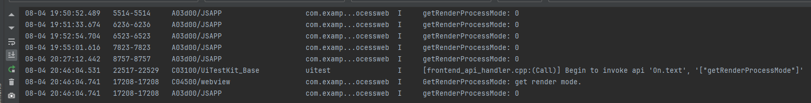
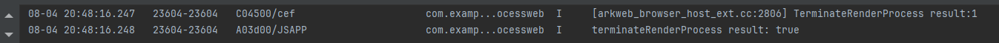
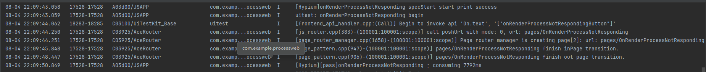
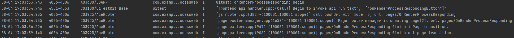
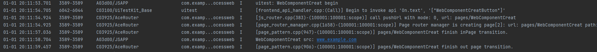

# ArkWeb进程

### 介绍

本工程主要实现了对以下指南文档中 [ArkWeb进程](https://gitcode.com/openharmony/docs/blob/master/zh-cn/application-dev/web/web_component_process.md#ohospermissioninternet) 和 [优化跳转至新Web组件过程中的页面闪烁现象](https://gitcode.com/openharmony/docs/blob/master/zh-cn/application-dev/web/web-router-flash-optimization.md#ohospermissioninternet) 示例代码片段的工程化，主要目标是实现指南中示例代码需要与sample工程文件同源。

## setRenderProcessMode

### 介绍

1. 本示例通过setRenderProcessMode设置渲染子进程的模式，从而控制渲染过程的单进程或多进程状态。

### 效果预览


### 使用说明

1. 此 Web 组件无页面展示，运行时通过系统日志输出相关信息。

## terminateRenderProcess

### 介绍

1. 本示例通过terminateRenderProcess来主动关闭渲染进程。若渲染进程尚未启动或已销毁，此操作将不会产生任何影响。此外，销毁渲染进程将同时影响所有与之关联的其它实例。

### 效果预览


### 使用说明

1. 此 Web 组件无页面展示，运行时通过系统日志输出相关信息。

## onRenderExited

### 介绍

1. 本示例通过onRenderExited来监听渲染进程的退出事件，从而获知退出的具体原因（如内存OOM、crash或正常退出等）。由于多个Web组件可能共用同一个渲染进程，因此，每当渲染进程退出时，每个受此影响的Web组件均会触发相应的回调。

### 效果预览


### 使用说明

1. 此 Web 组件无页面展示，运行时通过系统日志输出相关信息。

## onRenderProcessNotResponding

### 介绍

1. 本示例是当Web组件无法处理输入事件，或未能在预期时间内导航至新URL时，系统会判定网页进程为无响应状态，并触发onRenderProcessNotResponding回调。

### 效果预览


### 使用说明

1. 此 Web 组件无页面展示，运行时通过系统日志输出相关信息。

## onRenderProcessResponding

### 介绍

1. 本示例是在网页进程持续无响应期间，onRenderProcessNotResponding回调可能反复触发，直至进程恢复至正常运行状态，此时将触发onRenderProcessResponding回调。

### 效果预览


### 使用说明

1. 此 Web 组件无页面展示，运行时通过系统日志输出相关信息。

## Web组件创建

### 介绍

1. Web组件创建参数涵盖了多进程模型的运用。其中，sharedRenderProcessToken标识了当前Web组件所指定的共享渲染进程的token。在多渲染进程模式下，
   拥有相同token的Web组件将优先尝试重用与该token绑定的渲染进程。token与渲染进程的绑定关系，在渲染进程的初始化阶段形成。一旦渲染进程不再关联任何Web组件，它与token的绑定关系将被解除。

### 效果预览


### 使用说明

1. 此 Web 组件无页面展示，运行时通过系统日志输出相关信息。

## 优化跳转至新Web组件过程中的页面闪烁现象

### 介绍

1. 应用可以通过设置与网页背景色相同的Web组件的背景色，避免视觉闪烁，提升用户体验。例如，将Web组件的背景色设置为白色。
   在类似情况下，如果Web组件的默认背景色为白色，而网页背景色为灰色，导航到新的Web页面时可能会出现白色闪烁。同理，将Web组件的背景色设置为灰色可以解决此问题。

### 效果预览


### 使用说明

1. 通过点击主页的FixingPageFlickeringButton按钮，跳转到xxx.html网页。
### 工程目录

```
entry/src/main/
|---ets
|---|---entryability
|---|---|---EntryAbility.ets
|---|---pages
|---|---|---FixingPageFlickering.ets
|---|---|---Index.ets						// 首页
|---|---|---OnRenderExited.ets
|---|---|---OnRenderProcessNotResponding.ets
|---|---|---onRenderProcessResponding.ets
|---|---|---SetRenderProcessMode.ets
|---|---|---TerminateRenderProcess.ets    
|---|---|---WebComponentCreat.ets 
|---resources								// 静态资源
|---ohosTest
|---|---ets
|---|---|---tests
|---|---|---|---Ability.test.ets            // 自动化测试用例
```

### 相关权限

若使用本地资源，不涉及权限；若使用网络资源，需在module.json中配置网络权限：
{
"module": {
"requestPermissions": [
{
"name": "ohos.permission.INTERNET"
}
]
}
}

### 依赖

不涉及。

### 约束与限制

1. 本示例仅支持标准系统上运行。
2. 本示例支持API22版本SDK，SDK版本号(API Version 22 Release)。
3. 本示例需要使用DevEco Studio 版本号(6.0.0Release)才可编译运行。

### 下载

如需单独下载本工程，执行如下命令：

```
git init
git config core.sparsecheckout true
echo code/DocsSample/ArkWeb/ProcessWeb > .git/info/sparse-checkout
git remote add origin https://gitcode.com/openharmony/applications_app_samples/tree/master/code/DocsSample/ArkWeb
git pull origin master
```