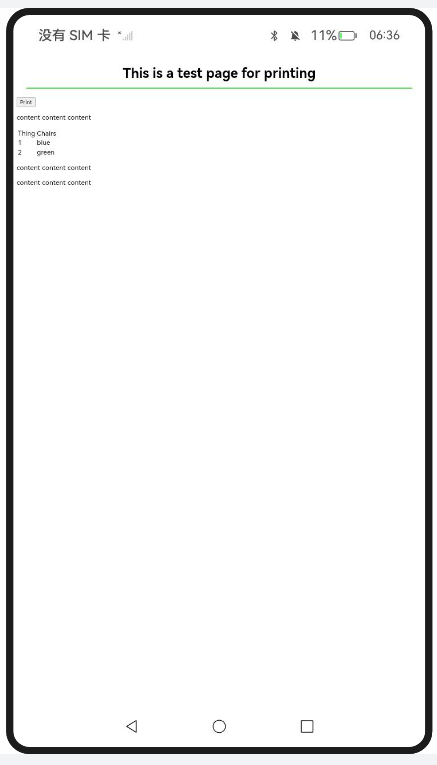
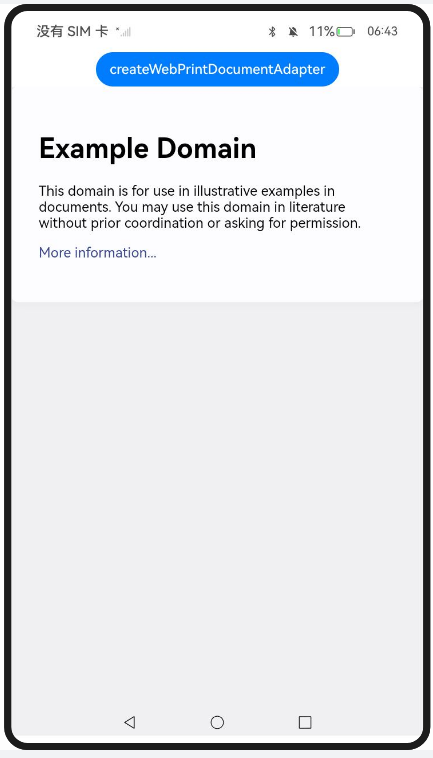
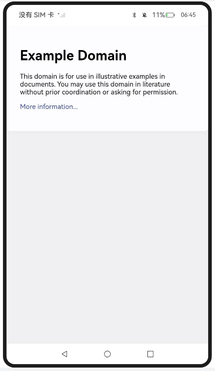
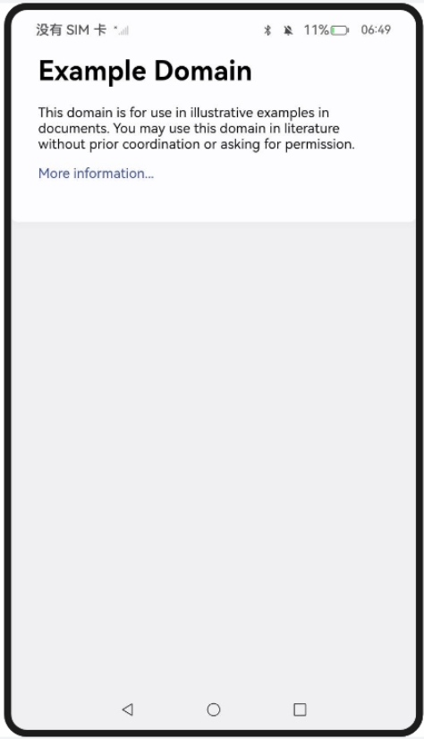

## 使用Web组件打印前端页面

### 介绍

2. 本工程主要实现了对以下指南文档中 https://docs.openharmony.cn/pages/v5.0/zh-cn/application-dev/web/web-print.md 示例代码片段的工程化，主要目标是实现指南中示例代码需要与sample工程文件同源。

### InitiatePrintW3CAPI

#### 介绍

1. 本示例主要介绍使用Web组件打印前端页面，通过创建打印适配器，拉起打印应用，并对当前Web页面内容进行渲染，渲染后生成的PDF文件信息通过fd传递给打印框架。W3C标准协议接口window.print()方法用于打印当前页面或弹出打印对话框。该方法没有任何参数，只需要在JavaScript中调用即可。

#### 效果预览

| 主页                                                         |
| ------------------------------------------------------------ |
|  |

使用说明

1. 点击print按钮，触发window.print()操作，即可对页面内容进行打印。

### InitiatePrintAppAPI

#### 介绍

1. 本示例主要介绍使用Web组件打印前端页面，应用侧通过调用createWebPrintDocumentAdapter创建打印适配器，通过将适配器传入打印的print接口调起打印。

#### 效果预览

| 主页                                                         |
| ------------------------------------------------------------ |
|  |

使用说明

1. 点击createWebPrintDocumentAdapter按钮应用侧会创建打印适配器，并将其传入打印接口，以触发打印操作。

## 使用Web组件的PDF文档预览能力

### 介绍

1. 本工程主要实现了对以下指南文档中 https://docs.openharmony.cn/pages/v5.0/zh-cn/application-dev/web/web-pdf-preview.md 示例代码片段的工程化，主要目标是实现指南中示例代码需要与sample工程文件同源。

### PreviewPDF

#### 介绍

1. 本示例主要介绍使用Web组件的PDF文档预览能力。Web组件提供了在网页中预览PDF的能力。应用可以通过Web组件的src参数和loadUrl()接口中传入PDF文件，来加载PDF文档。根据PDF文档来源不同，可以分为三种常用场景：加载网络PDF文档、加载本地PDF文档、加载应用内resource资源PDF文档。

#### 效果预览

| 主页                                                    |
| ------------------------------------------------------- |
|  |

使用说明

1. Web组件创建时指定默认加载的网络PDF文档example.com/test.pdf。

## 网页中安全区域计算和避让适配

### 介绍

### CalcAdjustSafeArea

1. 本工程主要实现了对以下指南文档中 https://docs.openharmony.cn/pages/v5.0/zh-cn/application-dev/web/web-safe-area-insets.md 示例代码片段的工程化，主要目标是实现指南中示例代码需要与sample工程文件同源。

#### 介绍

1. 本示例主要介绍网页中安全区域计算和避让适配。Web组件提供了利用W3C CSS进行安全区域计算并避让适配的能力，用来支持异形屏幕设备在沉浸式效果下页面的正常显示。此时，网页开发者想对重叠元素进行避让，就可以该能力。ArkWeb内核将持续监测Web组件及系统安全区域的位置与尺寸，依据两者的重叠部分，计算出当前Web组件的安全区域，以及在各个方向上所需避让的具体距离。

#### 效果预览

| 主页                                                         |
| ------------------------------------------------------------ |
|  |

使用说明

1. 通过expandSafeArea来开启沉浸式效果。Web组件根据实际情况对网页元素进行相应的避让，防止与系统的非安全区域发生重叠遮挡。

## 工程目录

```
entry/src/main/
|---ets
|---|---entryability
|---|---|---EntryAbility.ets
|---|---pages
|---|---|---Index.ets						// 首页
|---|---|---InitiatePrintAppAPI
|---|---|---InitiatePrintW3CAPI
|---|---|---PreviewPDF
|---|---|---CalcAdjustSafeArea
|---resources								// 静态资源
|---ohosTest
|---|---ets
|---|---|---tests
|---|---|---|---Ability.test.ets            // 自动化测试用例
```


## 相关权限

[ohos.permission.PRINT](https://docs.openharmony.cn/pages/v5.0/zh-cn/application-dev/security/AccessToken/permissions-for-all.md#ohospermissionprint)

[ohos.permission.INTERNET](https://docs.openharmony.cn/pages/v5.0/zh-cn/application-dev/security/AccessToken/permissions-for-all.md#ohospermissioninternet)

## 依赖

不涉及。

## 约束与限制

1. 本示例仅支持标准系统上运行，支持设备：RK3568。
2. 本示例支持API14版本SDK，SDK版本号(API Version 14 Release)。
3. 本示例需要使用DevEco Studio 版本号(5.0.1Release)才可编译运行。

## 下载

如需单独下载本工程，执行如下命令：

```
git init
git config core.sparsecheckout true
echo code/DocsSample/ArkWeb/ProcessWebPageCont > .git/info/sparse-checkout
git remote add origin https://gitee.com/openharmony/applications_app_samples.git
git pull origin master
```

