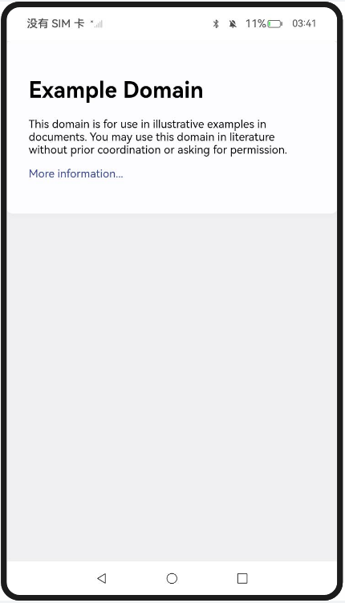

# 管理Cookie及数据存储

### 介绍

1. 实现对以下指南文档中 https://docs.openharmony.cn/pages/v5.0/zh-cn/application-dev/web/web-cookie-and-data-storage-mgmt.md 示例代码片段的工程化，保证指南中示例代码与sample工程文件同源。

### Cache_one

#### 介绍

1. 本示例主要介绍管理Cookie及数据存储的缓存与存储管理。使用了cacheMode()接口配置页面资源的缓存模式。

#### 效果预览

| 主页                                                 |
| ---------------------------------------------------- |
|  |

使用说明

1. 使用cacheMode()配置页面资源的缓存模式为None，加载资源使用cache，如果cache中无该资源则从网络中获取。

### Cache_two

#### 介绍

1. 本示例主要介绍管理Cookie及数据存储的缓存与存储管理相关功能，通过removeCache()接口清除已经缓存的资源。

#### 效果预览

| 主页                                                 |
| ---------------------------------------------------- |
|  |

使用说明

1. 点击按钮触发removeCache()接口清除已经缓存的资源。

### CookieManagement

#### 介绍

1. 本示例主要介绍管理Cookie及数据存储。使用了configCookieSync()接口来设置单个Cookie的值。

#### 效果预览

| 主页                                                        |
| ----------------------------------------------------------- |
|  |

使用说明

1. 点击按钮使用configCookieSync()接口为example.com设置单个Cookie的值。

### DomStorage

#### 介绍

1. 本示例主要介绍管理Cookie及数据存储的缓存与存储管理相关部分Dom Storage。使用domStorageAccess()接口进行使能配置。

#### 效果预览

| 主页                                                  |
| ----------------------------------------------------- |
|  |

使用说明

1. 通过Web组件的属性接口domStorageAccess()配置Dom Storage。

#  UserAgent开发指导

### 介绍

1. UserAgent（简称UA）是一个特殊的字符串，它包含了设备类型、操作系统及版本等关键信息。如果页面无法正确识别UA，可能会导致一系列异常情况，例如页面布局错误、渲染问题以及逻辑错误等。
2. 实现对以下指南文档中 https://docs.openharmony.cn/pages/v5.0/zh-cn/application-dev/web/web-default-userAgent.md 示例代码片段的工程化，保证指南中示例代码与sample工程文件同源。

### UserAgent_one

#### 介绍

1. 通过getUserAgent()接口获取当前默认用户代理，支持开发者基于默认的UserAgent去定制UserAgent。

#### 效果预览

| 主页                                                     |
| -------------------------------------------------------- |
|  |

使用说明

1. 在主界面，可以点击按钮获取当前默认用户代理。

### UserAgent_two

#### 介绍

1. 本示例主要展示了设置UserAgent相关的功能，使用了getUserAgent()，setCustomUserAgent()接口实现了定制UserAgent。

#### 效果预览

| 主页                                                       |
| ---------------------------------------------------------- |
|  |

使用说明

1. 通过this.controller.getUserAgent()获取当前的默认UserAgent字符串，并将其与自定义的字符串'xxx'进行拼接，得到定制后的UserAgent字符串，然后赋值给this.ua。
2. 使用this.controller.setCustomUserAgent(this.ua);将定制后的UserAgent设置到Web组件中，在后续加载网页等操作时，就会使用定制后的UserAgent。

### UserAgent_three

#### 介绍

1. 本示例主要介绍设置UserAgent相关的功能，通过getCustomUserAgent()接口获取自定义用户代理。

#### 效果预览

| 主页                                                         |
| ------------------------------------------------------------ |
|  |

使用说明

1. 点击按钮，通过getCustomUserAgent()接口获取自定义用户代理。

# 使用运动和方向传感器监测设备状态

### UseMotionDirSensor

#### 介绍

1. 实现对以下指南文档中 https://docs.openharmony.cn/pages/v5.0/zh-cn/application-dev/web/web-sensor.md 示例代码片段的工程化，保证指南中示例代码与sample工程文件同源。

#### 效果预览

| 主页                                                         | 弹窗                                                         |
| ------------------------------------------------------------ | ------------------------------------------------------------ |
|  |  |

使用说明

1. 点击加速度按钮申请权限，获取请求权限的资源类型，弹出提示框。
2. 点击onConfirm进行传感器授权处理。

## 工程目录

```
entry/src/main/
|---ets
|---|---entryability
|---|---|---EntryAbility.ets
|---|---pages
|---|---|---Index.ets						// 首页
|---|---|---Cache_one
|---|---|---Cache_two
|---|---|---CookieManagement
|---|---|---DomStorage
|---|---|---UserAgent_one.ets
|---|---|---UserAgent_three.ets
|---|---|---UserAgent_two.ets
|---|---|---UseMotionDirSensor.ets
|---resources								// 静态资源
|---ohosTest
|---|---ets
|---|---|---tests
|---|---|---|---Ability.test.ets            // 自动化测试用例
```

## 相关权限

[ohos.permission.INTERNET](https://docs.openharmony.cn/pages/v5.0/zh-cn/application-dev/security/AccessToken/permissions-for-all.md#ohospermissioninternet)

[ohos.permission.ACCELEROMETER](https://docs.openharmony.cn/pages/v5.0/zh-cn/application-dev/security/AccessToken/permissions-for-all.md#ohospermissionaccelerometer)

[ohos.permission.GYROSCOPE](https://docs.openharmony.cn/pages/v5.0/zh-cn/application-dev/security/AccessToken/permissions-for-all.md#ohospermissiongyroscope)

## 依赖

不涉及。

## 约束与限制

1. 本示例仅支持标准系统上运行，支持设备：RK3568。
2. 本示例支持API14版本SDK，SDK版本号(API Version 14 Release)。
3. 本示例需要使用DevEco Studio 版本号(5.0.1Release)才可编译运行。

## 下载

如需单独下载本工程，执行如下命令：

```
git init
git config core.sparsecheckout true
echo code/DocsSample/ArkWeb/SetBasicAttrsEvts/SetBasicAttrsEvtsTwo > .git/info/sparse-checkout
git remote add origin https://gitee.com/openharmony/applications_app_samples.git
git pull origin master
```


