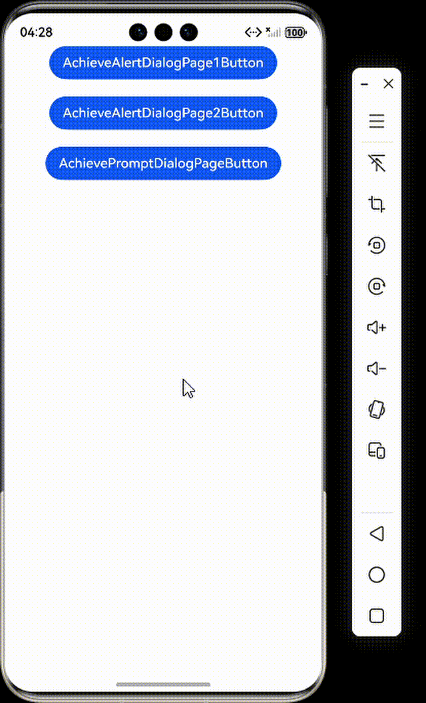
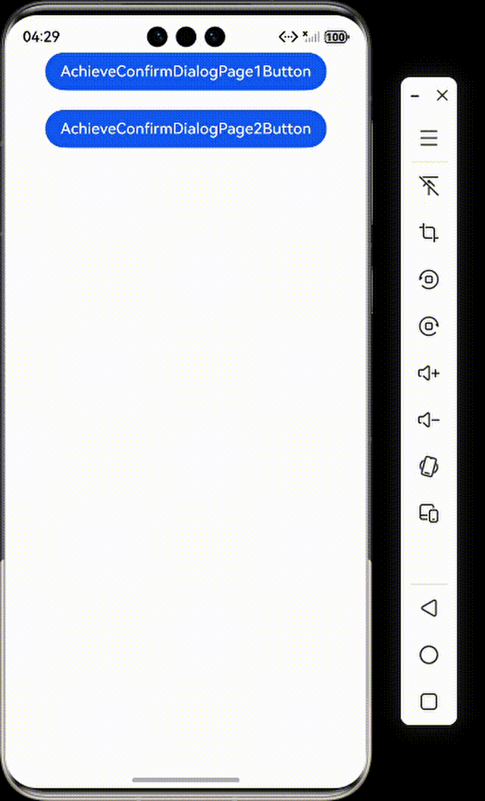
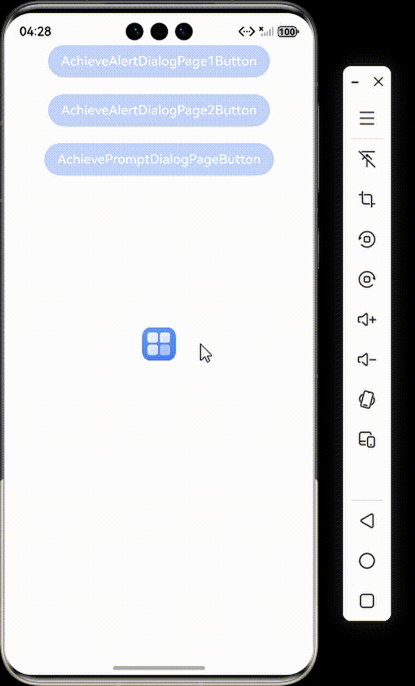

# 使用Web组件显示网页弹框

### 介绍

本工程主要实现了对以下指南文档中 [使用Web组件显示网页弹框](https://gitcode.com/openharmony/docs/blob/master/zh-cn/application-dev/web/web-dialog.md) 示例代码片段的工程化，主要目标是帮助开发者快速了解在HTML中，可以使用JavaScript创建三种类型的弹框：警告框window.alert(message)、确认框window.confirm(message)和提示框window.prompt(message, defaultValue)。这些弹框可以用于向用户传递信息、确认操作或请求输入。

### 实现Alert弹框

#### 介绍

1. window.alert()用于显示一个包含可选信息的对话框。警告框用于确保用户可以得到某些信息。当警告框出现后，用户需要点击确定按钮才能继续进行操作。

#### 用AlertDialog创建弹框

##### 效果预览


##### 使用说明

1. 在ArkUI中使用Web组件加载网页，并通过AlertDialog拦截并自定义显示网页中的alert弹窗。
2. 当网页调用window.alert()时，系统会触发onAlert事件，然后在原生应用中显示一个自定义的警告对话框。

#### 用CustomDialog-AlertDialog创建弹框。

##### 效果预览



##### 使用说明

1. 使用CustomDialogController和AlertDialog组件拦截网页alert弹窗并自定义显示样式。
2. 当网页调用window.alert()时，会触发onAlert事件，然后通过自定义对话框控制器显示美化后的警告对话框。

### 实现Prompt弹框

#### 介绍

1. window.prompt()用于显示一个对话框，并等待用户提交文本或取消对话框。用户需要输入某个值，然后点击确认或取消按钮。点击确认返回输入的值，点击取消返回null。

##### 用CustomDialog-CustomContentDialog创建弹框。

##### 效果预览


#### 使用说明

1. 使用CustomContentDialog自定义拦截网页prompt弹窗，提供带输入框的对话框。
2. 当网页调用window.prompt()时，会触发onPrompt事件并显示可输入文本的自定义对话框，用户输入内容后可返回给网页。

### 实现Confirm弹框

#### 介绍

1. window.confirm()用于显示一个包含可选消息的对话框，并等待用户确认或取消该对话框。

#### 用AlertDialog创建弹框。

##### 效果预览



##### 使用说明

1. 使用AlertDialog拦截网页confirm弹窗并自定义显示。
2. 当网页调用window.confirm()时，会触发onConfirm事件，然后在原生应用中显示带确认和取消按钮的自定义对话框。

#### 用CustomDialog-ConfirmDialog创建弹框。

##### 效果预览


##### 使用说明

1. 使用CustomDialogController和ConfirmDialog组件拦截网页confirm弹窗，并添加了"禁止后不再提示"的勾选框功能。
2. 当网页调用window.confirm()时，会显示带勾选框的自定义确认对话框，用户可选择允许或禁止操作。

### 工程目录

```
entry/src/main/
|---ets
|---|---entryability
|---|---|---EntryAbility.ets
|---|---pages
|---|---|---AchieveAlertDialogPage1.ets
|---|---|---AchieveAlertDialogPage2.ets
|---|---|---AchievePromptDialogPage1.ets
|---|---|---Index.ets						// 首页
|---resources								// 静态资源
|---ohosTest
|---|---ets
|---|---|---tests
|---|---|---|---Ability.test.ets            // 自动化测试用例

entry2/src/main/
|---ets
|---|---entryability
|---|---|---EntryAbility.ets
|---|---pages
|---|---|---AchieveConfirmDialogPage1.ets
|---|---|---AchieveConfirmDialogPage2.ets
|---|---|---Index.ets						// 首页
|---resources								// 静态资源
|---ohosTest
|---|---ets
|---|---|---tests
|---|---|---|---Ability.test.ets            // 自动化测试用例
```

### 具体实现

1. 通过Web组件的onAlert、onConfirm和onPrompt事件监听器，自定义网页中的三种JavaScript弹框功能。
2. 对于alert警告框，使用AlertDialog或CustomDialog显示包含网页来源和消息内容的警告信息，用户确认后调用event.result.handleConfirm()通知网页。
3. 对于confirm确认框，提供确认和取消两个按钮，根据用户选择分别调用handleConfirm或handleCancel返回布尔结。
4. 对于prompt输入框，通过CustomContentDialog构建包含文本输入框的自定义对话框，用户输入内容后通过handlePromptConfirm将文本返回给网页。

### 相关权限

不涉及

### 依赖

不涉及。

### 约束与限制

1. 本示例仅支持标准系统上运行。
2. 本示例支持API22版本SDK，SDK版本号(API Version 22 Release)。
3. 本示例需要使用DevEco Studio 版本号(6.0.0Release)才可编译运行。

### 下载

如需单独下载本工程，执行如下命令：

```
git init
git config core.sparsecheckout true
echo code/DocsSample/ArkWeb/ShowWebPageDialog > .git/info/sparse-checkout
git remote add origin https://gitcode.com/openharmony/applications_app_samples.git 
git pull origin master
```