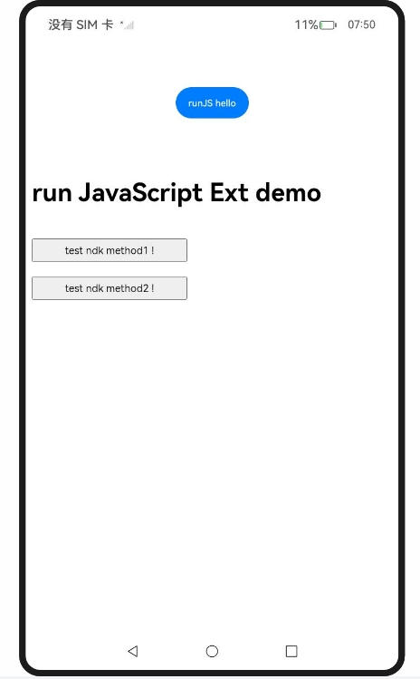
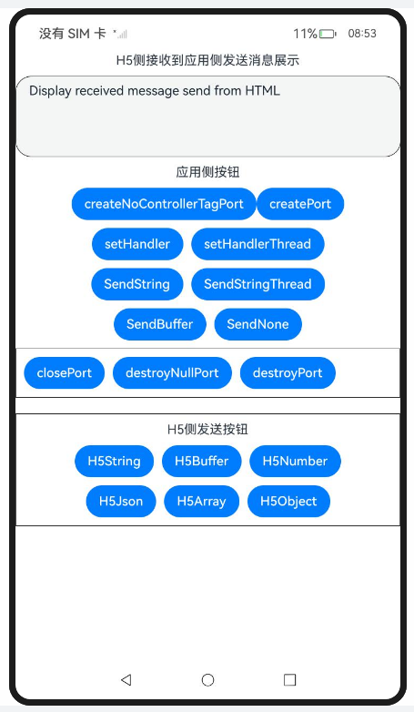
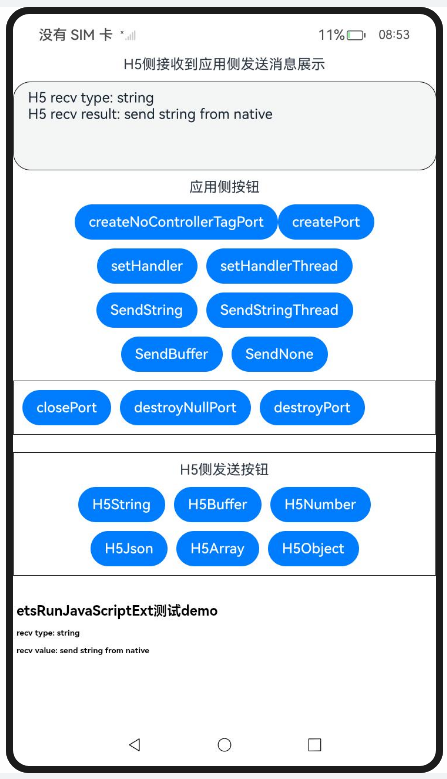

# Entry:

## 应用侧调用前端页面函数

### 介绍

1. 本示例主要介绍应用侧调用前端页面函数，应用侧可以通过runJavaScript()和runJavaScriptExt()方法调用前端页面的JavaScript相关函数。
2. 实现对以下指南文档中 https://docs.openharmony.cn/pages/v5.0/zh-cn/application-dev/web/web-in-app-frontend-page-function-invoking.md 示例代码片段的工程化，保证指南中示例代码与sample工程文件同源。

### 效果预览

| 主页                                                         | 绿色字体                                                     | 红色字体                                                     |
| ------------------------------------------------------------ | ------------------------------------------------------------ | ------------------------------------------------------------ |
|  |  |  |

使用说明

1. 点击 runJavaScript 按钮，文本字体变绿，此操作调用前端 htmlTest() 方法实现。
2. 点击 runJavaScriptCodePassed 按钮，通过向前端传递自定义JavaScript代码改变颜色。
3. 点击 Click Me! 按钮触发前端 callArkTS() 函数，开启交互逻辑，文本字体变红。

### 工程目录

```
entry/src/main/
|---ets
|---|---entryability
|---|---|---EntryAbility.ets
|---|---pages
|---|---|---Index.ets						// 首页
|---resources								// 静态资源
|---ohosTest
|---|---ets
|---|---|---tests
|---|---|---|---Ability.test.ets            // 自动化测试用例
```


### 相关权限

无。

# Entry2:

## 前端页面调用应用侧函数

### 介绍

1. 实现对以下指南文档中 https://docs.openharmony.cn/pages/v5.0/zh-cn/application-dev/web/web-in-page-app-function-invoking.md 示例代码片段的工程化，保证指南中示例代码与sample工程文件同源。

### JavaScriptProxy

#### 介绍

1. 本示例主要介绍前端页面调用应用侧函数。在Web组件初始化使用javaScriptProxy()接口注册应用侧代码。

#### 效果预览

| 主页                                                         | 触发callArkTS                                                |
| ------------------------------------------------------------ | ------------------------------------------------------------ |
|  |  |

使用说明

1. 点击deleteJavaScriptRegister按钮从 Web 端删除已注册对象。
1. 点击Click Me!按钮，触发callArkTS函数。

### Promise_one

#### 介绍

1. 本示例主要介绍前端页面调用应用侧函数，Promise使用场景，在应用侧new Promise。

#### 效果预览

| 主页                                                   |
| ------------------------------------------------------ |
|  |

使用说明

1. 点击refresh按钮刷新网页。
2. 点击Register JavaScript To Window按钮将testObj注册到前端。
3. 点击deleteJavaScriptRegister按钮删除Web端注册的testObjName对象。
4. 点击Click Me!按钮，触发callArkTS函数。

### Promise_two

#### 介绍

1. 本示例主要介绍前端页面调用应用侧函数，Promise使用场景，在前端页面new Promise。

#### 效果预览

| 主页                                                   |
| ------------------------------------------------------ |
|  |

使用说明

1. 点击refresh按钮刷新网页。
2. 点击Register JavaScript To Window按钮将 testObj 注册到前端。
3. 点击deleteJavaScriptRegister按钮删除Web端注册的testObjName对象。
4. 点击Click Me!按钮，触发callArkTS函数。

### RegisterJavaScriptProxy

#### 介绍

1. 本示例主要介绍前端页面调用应用侧函数，在Web组件初始化使用registerJavaScriptProxy()接口注册应用侧代码。

#### 效果预览

| 主页                                                         | 触发callArkTS                                                |
| ------------------------------------------------------------ | ------------------------------------------------------------ |
|  |  |

使用说明

1. 点击refresh按钮刷新网页。
2. 点击Register JavaScript To Window按钮将 testObj 注册到前端。
3. 点击deleteJavaScriptRegister按钮删除Web端注册的testObjName对象。
4. 点击Click Me!按钮，触发callArkTS函数。

### UsageOfComplexTypes_one

#### 介绍

1. 本示例主要介绍前端页面调用应用侧函数，在应用侧和前端页面之间传递Array。

#### 效果预览

| 主页                                                         |
| ------------------------------------------------------------ |
|  |

使用说明

1. 点击refresh按钮刷新网页。
2. 点击Register JavaScript To Window按钮将 testObj 注册到前端。
3. 点击deleteJavaScriptRegister按钮删除Web端注册的testObjName对象。
4. 点击Click Me!按钮，触发callArkTS函数。

### UsageOfComplexTypes_two

#### 介绍

1. 本示例主要介绍前端页面调用应用侧函数，应用侧和前端页面之间传递基础类型，非Function等复杂类型。

#### 效果预览

| 主页                                                         |
| ------------------------------------------------------------ |
|  |

使用说明

1. 点击refresh按钮刷新网页。
2. 点击Register JavaScript To Window按钮将 testObj 注册到前端。
3. 点击deleteJavaScriptRegister按钮删除Web端注册的testObjName对象。
4. 点击Click Me!按钮，触发callArkTS函数。

### UsageOfComplexTypes_three

#### 介绍

1. 本示例主要介绍前端页面调用应用侧函数，应用侧调用前端页面的Callback。

#### 效果预览

| 主页                                                         |
| ------------------------------------------------------------ |
|  |

使用说明

1. 点击refresh按钮刷新网页。
2. 点击Register JavaScript To Window按钮将 testObj 注册到前端。
3. 点击deleteJavaScriptRegister按钮删除Web端注册的testObjName对象。
4. 点击Click Me!按钮，触发callArkTS函数。

### UsageOfComplexTypes_four

#### 介绍

1. 本示例主要介绍前端页面调用应用侧函数，应用侧调用前端页面Object里的Function。

#### 效果预览

| 主页                                                         |
| ------------------------------------------------------------ |
|  |

使用说明

1. 点击refresh按钮刷新网页。
2. 点击Register JavaScript To Window按钮将 testObj 注册到前端。
3. 点击deleteJavaScriptRegister按钮删除Web端注册的testObjName对象。
4. 点击Click Me!按钮，触发callArkTS函数。

### UsageOfComplexTypes_five

#### 介绍

1. 本示例主要介绍前端页面调用应用侧函数，前端页面调用应用侧Object里的Function。

#### 效果预览

| 主页                                                         |
| ------------------------------------------------------------ |
|  |

使用说明

1. 点击refresh按钮刷新网页。
2. 点击Register JavaScript To Window按钮将 testObj 注册到前端。
3. 点击deleteJavaScriptRegister按钮删除Web端注册的testObjName对象。
4. 点击Click Me!按钮，触发callArkTS函数。

### 工程目录

```
entry2/src/main/
|---ets
|---|---entry2ability
|---|---|---Entry2Ability.ets
|---|---pages
|---|---|---Index.ets						// 首页
|---|---|---JavaScriptProxy
|---|---|---Promise_one
|---|---|---Promise_two
|---|---|---RegisterJavaScriptProxy
|---|---|---UsageOfComplexTypes_one
|---|---|---UsageOfComplexTypes_two
|---|---|---UsageOfComplexTypes_three
|---|---|---UsageOfComplexTypes_four
|---|---|---UsageOfComplexTypes_five
|---resources								// 静态资源
|---ohosTest
|---|---ets
|---|---|---tests
|---|---|---|---Ability.test.ets            // 自动化测试用例
```


### 相关权限

[ohos.permission.INTERNET](https://docs.openharmony.cn/pages/v5.0/zh-cn/application-dev/security/AccessToken/permissions-for-all.md#ohospermissioninternet)

# Entry3:

## 建立应用侧与前端页面数据通道

### 介绍

1. 实现对以下指南文档中 https://docs.openharmony.cn/pages/v5.0/zh-cn/application-dev/web/web-app-page-data-channel.md 示例代码片段的工程化，保证指南中示例代码与sample工程文件同源。

### 效果预览

| 主页                                                         | 向 HTML 发送消息                                             | 向 ArkTS 发送消息                                            |
| ------------------------------------------------------------ | ------------------------------------------------------------ | ------------------------------------------------------------ |
|  |  |  |

使用说明

1. 点击postMessage按钮初始化消息端口。
2. 点击SendDataToHTML按钮从 ArkTS 向 ETS 发送消息。
3. 点击SendToEts按钮，从 ETS 向 ArkTS 发送消息。

### 工程目录

```
entry3/src/main/
|---ets
|---|---entry3ability
|---|---|---Entry3Ability.ets
|---|---pages
|---|---|---Index.ets						// 首页
|---resources								// 静态资源
|---ohosTest
|---|---ets
|---|---|---tests
|---|---|---|---Ability.test.ets            // 自动化测试用例
```


### 相关权限

无。

# Entry4:

## 应用侧与前端页面的相互调用(C/C++)

### 介绍

1. 实现对以下文档中提供的 https://docs.openharmony.cn/pages/v5.0/zh-cn/application-dev/web/arkweb-ndk-jsbridge.md 示例代码片段的工程化，保证指南中示例代码与sample工程文件同源。

### 效果预览

| 主页                                                         |
| ------------------------------------------------------------ |
|  |

使用说明

1. 点击 runJS hello按钮调用testNapi.runJavaScript。
2. 点击test Native Development Kit method1 !按钮调用testNdkProxyObjMethod1。
3. 点击test Native Development Kit method2 !按钮调用testNdkProxyObjMethod2。

### 工程目录

```
entry4/src/main/
|---cpp										// cpp文件夹
|---ets
|---|---entry4ability
|---|---|---Entry4Ability.ets
|---|---pages
|---|---|---Index.ets						// 首页
|---resources								// 静态资源
|---ohosTest
|---|---ets
|---|---|---tests
|---|---|---|---Ability.test.ets            // 自动化测试用例
```


### 相关权限

无。

# Entry5:

## 建立应用侧与前端页面数据通道(C/C++)

### 介绍

1. 实现对以下文档中提供中 https://docs.openharmony.cn/pages/v5.0/zh-cn/application-dev/web/arkweb-ndk-page-data-channel.md 示例代码片段的工程化，保证指南中示例代码与sample工程文件同源。

### 效果预览

| 主页                                                         | 通信                                                         |
| ------------------------------------------------------------ | ------------------------------------------------------------ |
|  |  |

使用说明

1. 点击createNoControllerTagPort按钮ETS侧调用testNapi.createWebMessagePorts("noTag")。
2. 点击createPort按钮ETS侧调用 testNapi.createWebMessagePorts(this.webTaag)。
3. 点击setHandler按钮ETS侧调用testNapi.setMessageEventHandler(this.webTag(3)。
4. 点击setHandlerThread按钮ETS侧调用 testNapi.setMessageEventHandlerThread(this.webTag)。
5. 点击SendString按钮ETS侧清空h5Log,调用 testNapi.postMessage(this.webTag)，通过消息端口将内容发送到前端页面。

### 工程目录

```
entry5/src/main/
|---cpp										// cpp文件夹
|---ets
|---|---entry5ability
|---|---|---Entry5Ability.ets
|---|---pages
|---|---|---Index.ets						// 首页
|---resources								// 静态资源
|---ohosTest
|---|---ets
|---|---|---tests
|---|---|---|---Ability.test.ets            // 自动化测试用例
```


### 相关权限

无。

## 依赖

不涉及。

## 约束与限制

1. 本示例仅支持标准系统上运行，支持设备：RK3568。
2. 本示例支持API14版本SDK，SDK版本号(API Version 14 Release)。
3. 本示例需要使用DevEco Studio 版本号(5.0.1Release)才可编译运行。

## 下载

如需单独下载本工程，执行如下命令：

```
git init
git config core.sparsecheckout true
echo code/DocsSample/ArkWeb/UseFrontendJSApp > .git/info/sparse-checkout
git remote add origin https://gitee.com/openharmony/applications_app_samples.git
git pull origin master
```