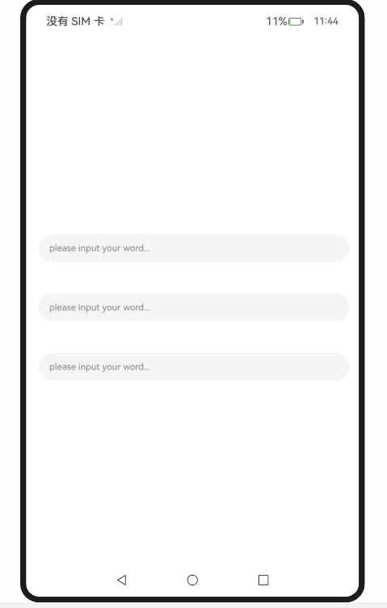
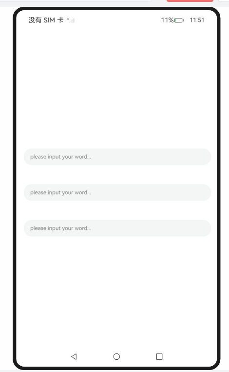
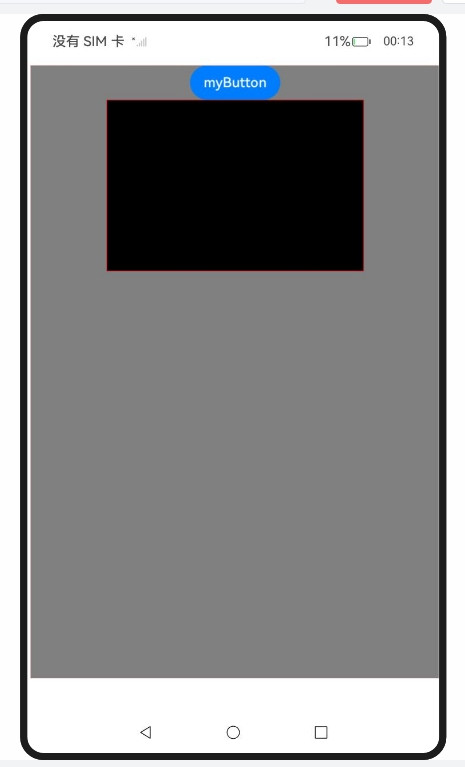

# 同层渲染

### 介绍

2. 本工程主要实现了对以下指南文档中 https://docs.openharmony.cn/pages/v5.0/zh-cn/application-dev/web/web-same-layer.md 示例代码片段的工程化，主要目标是实现指南中示例代码需要与sample工程文件同源。

### RenderTxtBoxSameLayer_one

#### 介绍

1. 本示例主要介绍Web页面中同层渲染输入框，在Web页面中，可以使用ArkUI原生的TextInput组件进行同层渲染。同层渲染支持<embed>/<object>两种标签。type类型可任意指定，两个字符串参数均不区分大小写，ArkWeb内核将会统一转换为小写。其中，tag字符串使用全字符串匹配，type使用字符串前缀匹配。

#### 效果预览

| 主页                                                         |
| ------------------------------------------------------------ |
|  |

使用说明

1. 在应用侧通过enableNativeEmbedMode来开启同层渲染功能，展示在对应区域的原生组件。
1. 调用onNativeEmbedLifecycleChange来监听同层渲染的生命周期变化。
1. 调用onNativeEmbedGestureEvent来监听同层渲染同层渲染区域的手势事件。

### RenderTxtBoxSameLayer_two

#### 介绍

1. 本示例主要介绍Web页面中同层渲染输入框，在Web页面中，可以使用ArkUI原生的TextInput组件进行同层渲染。同层渲染支持<embed>/<object>两种标签。type类型可任意指定，两个字符串参数均不区分大小写，ArkWeb内核将会统一转换为小写。其中，tag字符串使用全字符串匹配，type使用字符串前缀匹配。

#### 效果预览

| 主页                                                         |
| ------------------------------------------------------------ |
|  |

使用说明

1. 在应用侧通过enableNativeEmbedMode来开启同层渲染功能，展示在对应区域的原生组件。
1. 调用onNativeEmbedLifecycleChange来监听同层渲染的生命周期变化。
1. 调用onNativeEmbedGestureEvent来监听同层渲染同层渲染区域的手势事件。

### DrawXCompAVPBtn

#### 介绍

1. 本示例主要介绍同层渲染。通过enableNativeEmbedMode()控制同层渲染开关。Html文件中需要显式使用embed标签，并且embed标签内type必须以“native/”开头。同层标签对应的元素区域的背景为透明。

#### 效果预览

| 主页                                                         |
| ------------------------------------------------------------ |
|  |

使用说明

1. 绘制 XComponent、AVPlayer 和 Button 组件。

### 工程目录

```
entry/src/main/
|---ets
|---|---entryability
|---|---|---EntryAbility.ets
|---|---pages
|---|---|---DrawXCompAVPBtn.ets
|---|---|---Index.ets						// 首页
|---|---|---PlayerDemo.ets
|---|---|---RenderTxtBoxSameLayer_one.ets
|---|---|---RenderTxtBoxSameLayer_two.ets
|---resources								// 静态资源
|---ohosTest
|---|---ets
|---|---|---tests
|---|---|---|---Ability.test.ets            // 自动化测试用例
```


### 相关权限

[ohos.permission.INTERNET](https://docs.openharmony.cn/pages/v5.0/zh-cn/application-dev/security/AccessToken/permissions-for-all.md#ohospermissioninternet)

### 依赖

不涉及。

### 约束与限制

1. 本示例仅支持标准系统上运行，支持设备：RK3568。
2. 本示例支持API14版本SDK，SDK版本号(API Version 14 Release)。
3. 本示例需要使用DevEco Studio 版本号(5.0.1Release)才可编译运行。

### 下载

如需单独下载本工程，执行如下命令：

```
git init
git config core.sparsecheckout true
echo code/DocsSample/ArkWeb/UseSameLayerRender > .git/info/sparse-checkout
git remote add origin https://gitee.com/openharmony/applications_app_samples.git
git pull origin master
```