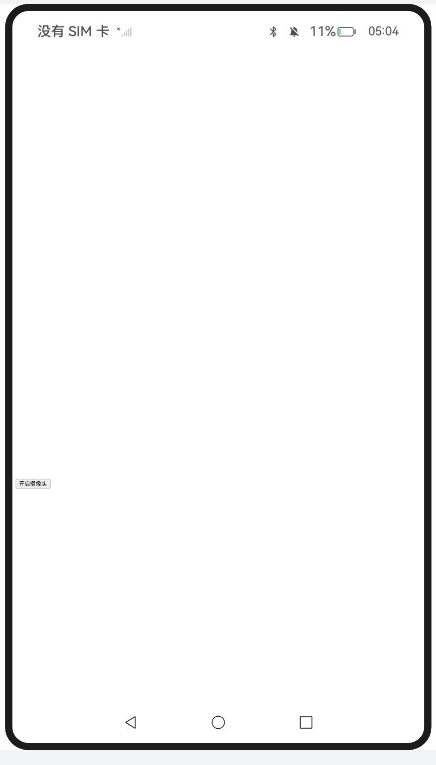
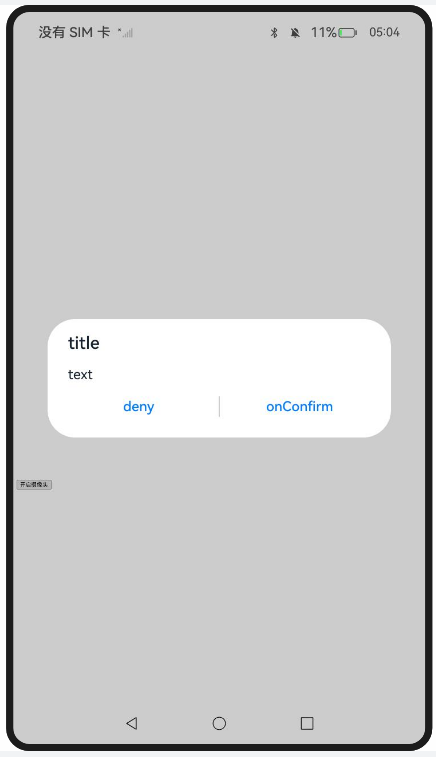
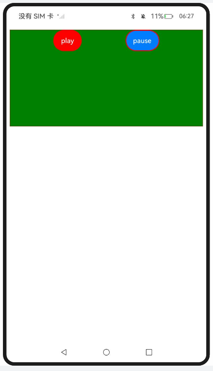

# entry:

### 使用WebRTC进行Web视频会议

#### 介绍

1. 本示例主要介绍使用WebRTC进行Web视频会议，Web组件可以通过W3C标准协议接口拉起摄像头和麦克风，通过onPermissionRequest接口接收权限请求通知，需在配置文件中声明相应的音频权限。
2. 本工程主要实现了对以下指南文档中 https://docs.openharmony.cn/pages/v5.0/zh-cn/application-dev/web/web-rtc.md 示例代码片段的工程化，主要目标是实现指南中示例代码需要与sample工程文件同源。

#### 效果预览

| 主页                                                         | 权限请求                                                     | 摄像头                                                       |
| ------------------------------------------------------------ | ------------------------------------------------------------ | ------------------------------------------------------------ |
|  |  |  |

使用说明

1. 点击前端页面中的开起摄像头按钮再点击onConfirm，打开摄像头和麦克风。

#### 工程目录

```
entry/src/main/
|---ets
|---|---entryability
|---|---|---EntryAbility.ets
|---|---pages
|---|---|---Index.ets						// 首页
|---resources								// 静态资源
|---ohosTest
|---|---ets
|---|---|---tests
|---|---|---|---Ability.test.ets            // 自动化测试用例
```

#### 相关权限

[ohos.permission.CAMERA](https://docs.openharmony.cn/pages/v5.0/zh-cn/application-dev/security/AccessToken/permissions-for-all.md#ohospermissioncamera)

[ohos.permission.MICROPHONE](https://docs.openharmony.cn/pages/v5.0/zh-cn/application-dev/security/AccessToken/permissions-for-all.md#ohospermissionmicrophone)

# entry2:

### 托管网页中的媒体播放

#### 介绍

1. 本示例主要介绍托管网页中的媒体播放。通过enableNativeMediaPlayer接口，开启接管网页媒体播放的功能，用来支持应用增强网页的媒体播放，如画质增强等。
2. 本工程主要实现了对以下指南文档中 https://docs.openharmony.cn/pages/v5.0/zh-cn/application-dev/web/app-takeovers-web-media.md 示例代码片段的工程化，主要目标是实现指南中示例代码需要与sample工程文件同源。

#### 效果预览

| 主页                                                         |
| ------------------------------------------------------------ |
|  |

使用说明

1. 使用时需要自行替换前端页面视频链接。
1. 点击play播放，点击pause暂停播放。

#### 工程目录

```
entry2/src/main/
|---ets
|---|---entry2ability
|---|---|---Entry2Ability.ets
|---|---pages
|---|---|---Index.ets						// 首页
|---|---|---PlayerDemo.ets					// 应用侧代码，视频播放示例
|---resources								// 静态资源
|---ohosTest
|---|---ets
|---|---|---tests
|---|---|---|---Ability.test.ets            // 自动化测试用例
```


#### 相关权限

[ohos.permission.INTERNET](https://docs.openharmony.cn/pages/v5.0/zh-cn/application-dev/security/AccessToken/permissions-for-all.md#ohospermissioninternet)

## 依赖

不涉及。

## 约束与限制

1. 本示例仅支持标准系统上运行，支持设备：RK3568。
2. 本示例支持API14版本SDK，SDK版本号(API Version 14 Release)。
3. 本示例需要使用DevEco Studio 版本号(5.0.1Release)才可编译运行。

## 下载

如需单独下载本工程，执行如下命令：

```
git init
git config core.sparsecheckout true
echo code/DocsSample/ArkWeb/UsingWebMultimedia > .git/info/sparse-checkout
git remote add origin https://gitee.com/openharmony/applications_app_samples.git
git pull origin master
```