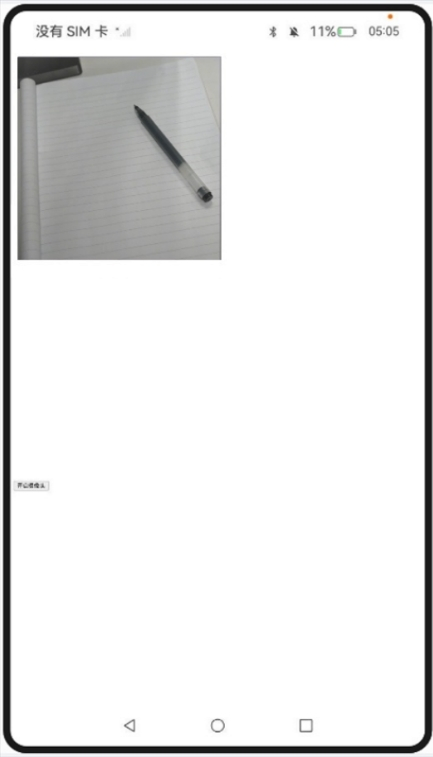

# entry:

### 使用WebRTC进行Web视频会议

### 介绍

1. 本示例主要介绍使用WebRTC进行Web视频会议，Web组件可以通过W3C标准协议接口拉起摄像头和麦克风，通过onPermissionRequest接口接收权限请求通知，需在配置文件中声明相应的音频权限。
2. 本工程主要实现了对以下指南文档中 https://docs.openharmony.cn/pages/v5.0/zh-cn/application-dev/web/web-rtc.md 示例代码片段的工程化，主要目标是实现指南中示例代码需要与sample工程文件同源。

### 效果预览

| 主页                                                         | 权限请求                                                     | 摄像头                                                       |
| ------------------------------------------------------------ | ------------------------------------------------------------ | ------------------------------------------------------------ |
|  |  |  |

使用说明

1. 点击前端页面中的开起摄像头按钮再点击onConfirm，打开摄像头和麦克风。

### 具体实现

* 通过使用WebRTC进行Web视频会议，参考源码：[Index.ets](https://gitcode.com/openharmony/applications_app_samples/blob/master/code/DocsSample/ArkWeb/UsingWebMultimedia/entry/src/main/ets/pages/Index.ets)
   * 开启setWebDebuggingAccess(true)便于调试。
   * 在aboutToAppear生命周期预申请必要的权限。
   * 通过onPermissionRequest监听Web页面的权限请求。
   * 弹出对话框让用户选择"允许"或"拒绝"。
   * 根据用户选择调用grant()或deny()方法。

### 工程目录

```
entry/src/main/
|---ets
|---|---entryability
|---|---|---EntryAbility.ets
|---|---pages
|---|---|---Index.ets						// 首页
|---resources								// 静态资源
|---ohosTest
|---|---ets
|---|---|---tests
|---|---|---|---Ability.test.ets            // 自动化测试用例
```

### 相关权限

[ohos.permission.CAMERA](https://docs.openharmony.cn/pages/v5.0/zh-cn/application-dev/security/AccessToken/permissions-for-all.md#ohospermissioncamera)

[ohos.permission.MICROPHONE](https://docs.openharmony.cn/pages/v5.0/zh-cn/application-dev/security/AccessToken/permissions-for-all.md#ohospermissionmicrophone)

# entry2:

### 托管网页中的媒体播放

### 介绍

1. 本示例主要介绍托管网页中的媒体播放。通过enableNativeMediaPlayer接口，开启接管网页媒体播放的功能，用来支持应用增强网页的媒体播放，如画质增强等。
2. 本工程主要实现了对以下指南文档中 https://docs.openharmony.cn/pages/v5.0/zh-cn/application-dev/web/app-takeovers-web-media.md 示例代码片段的工程化，主要目标是实现指南中示例代码需要与sample工程文件同源。

### 效果预览

| 主页                                                         |
| ------------------------------------------------------------ |
|  |

使用说明

1. 使用时需要自行替换前端页面视频链接。
1. 点击play播放，点击pause暂停播放。

### 具体实现

* 通过ArkWeb组件将原生视频播放器嵌入到Web页面中，参考源码：[Index.ets](https://gitcode.com/openharmony/applications_app_samples/blob/master/code/DocsSample/ArkWeb/UsingWebMultimedia/entry2/src/main/ets/pages/Index.ets)
   * 通过 .enableNativeMediaPlayer({ enable: true, shouldOverlay: true }) 开启Web组件的原生视频播放器托管功能。
   * 监听 onCreateNativeMediaPlayer 回调，当Web页面请求播放视频时触发。
   * 实现 webview.NativeMediaPlayerBridge 接口，作为Web内核与原生播放器之间的桥接控制层。
   * 创建 NodeController 和 BuilderNode，用于构建和托管同层渲染的自定义播放器UI组件。
   * 使用 XComponent 组件作为视频渲染的表面(Surface)，并将其ID设置给原生AVPlayer。
   * 实现 AVPlayerListener 监听器，将原生播放器的状态（如播放、暂停、错误）通过 webview.NativeMediaPlayerHandler 上报给Web内核。
   * 通过 onNativeEmbedGestureEvent 接收Web页面上的手势事件，并转发给对应的原生播放器UI组件进行处理。
   * 在组件销毁时，调用 release() 方法释放原生播放器资源，并清理同层渲染节点。

### 工程目录

```
entry2/src/main/
|---ets
|---|---entry2ability
|---|---|---Entry2Ability.ets
|---|---pages
|---|---|---Index.ets						// 首页
|---|---|---PlayerDemo.ets					// 应用侧代码，视频播放示例
|---resources								// 静态资源
|---ohosTest
|---|---ets
|---|---|---tests
|---|---|---|---Ability.test.ets            // 自动化测试用例
```


### 相关权限

[ohos.permission.INTERNET](https://docs.openharmony.cn/pages/v5.0/zh-cn/application-dev/security/AccessToken/permissions-for-all.md#ohospermissioninternet)

# entry3:

### Web组件支持画中画

### 介绍

1. 本示例主要介绍Web画中画。借助Picture-in-Picture Web API，在网页上拉起一个浮动窗口播放视频，以便用户在浏览器其他网页或者与其他应用交互时通过画中画窗口继续观看视频。
2. 本工程主要实现了对以下指南文档中 https://docs.openharmony.cn/pages/v5.0/zh-cn/application-dev/web/web-picture-in-picture.md  示例代码片段的工程化，主要目标是实现指南中示例代码需要与sample工程文件同源。

### 效果预览

| 主页                                                            |
|---------------------------------------------------------------|
|  |

使用说明

1. 使用时需要自行替换前端页面视频链接。
2. 点击开启画中画按钮，进入画中画播放模式，在画中画模式时点击退出画中画，恢复原页面播放。
3. 点击画中画窗口，可以显示控制层控件，支持播放、暂停、前进、后退；双击画中画窗口支持放大或缩小窗口。

### 具体实现

* 通过ArkWeb组件将原生视频播放器嵌入到Web页面中，参考源码：[Index.ets](https://gitcode.com/openharmony/applications_app_samples/blob/master/code/DocsSample/ArkWeb/UsingWebMultimedia/entry3/src/main/ets/pages/Index.ets)以及[PictureInPicture.html](https://gitcode.com/openharmony/applications_app_samples/blob/master/code/DocsSample/ArkWeb/UsingWebMultimedia/entry3/src/main/resources/rawfile/PictureInPicture.html)
   * 通过 $rawfile('PictureInPicture.html') 加载本地HTML文件。
   * 通过 document.pictureInPictureEnabled 检测浏览器画中画功能支持情况，不支持时隐藏按钮。
   * 创建“开启画中画”按钮，并绑定点击事件监听器。
   * 在按钮点击事件中，调用 video.requestPictureInPicture() 请求进入画中画模式。
   * 当视频处于画中画模式时，调用 document.exitPictureInPicture() 可退出画中画。
   * 监听 enterpictureinpicture 事件，在进入画中画时更新按钮文本为“退出画中画”。
   * 监听 leavepictureinpicture 事件，在退出画中画时更新按钮文本为“开启画中画”。
   * 使用 try...catch 捕获并处理画中画操作可能出现的异常。

### 工程目录

```
entry3/src/main/
|---ets
|---|---entry3ability
|---|---|---Entry3Ability.ets
|---|---pages
|---|---|---Index.ets						// 首页
|---resources								// 静态资源
|---ohosTest
|---|---ets
|---|---|---tests
|---|---|---|---Ability.test.ets            // 自动化测试用例
```


### 相关权限

[ohos.permission.INTERNET](https://docs.openharmony.cn/pages/v5.0/zh-cn/application-dev/security/AccessToken/permissions-for-all.md#ohospermissioninternet)

## 依赖

不涉及。

## 约束与限制

1. 本示例仅支持标准系统上运行，支持设备：RK3568。
2. 本示例支持API14版本SDK，SDK版本号(API Version 14 Release)。
3. 本示例需要使用DevEco Studio 版本号(5.0.1Release)才可编译运行。

## 下载

如需单独下载本工程，执行如下命令：

```
git init
git config core.sparsecheckout true
echo code/DocsSample/ArkWeb/UsingWebMultimedia > .git/info/sparse-checkout
git remote add origin https://gitee.com/openharmony/applications_app_samples.git
git pull origin master
```