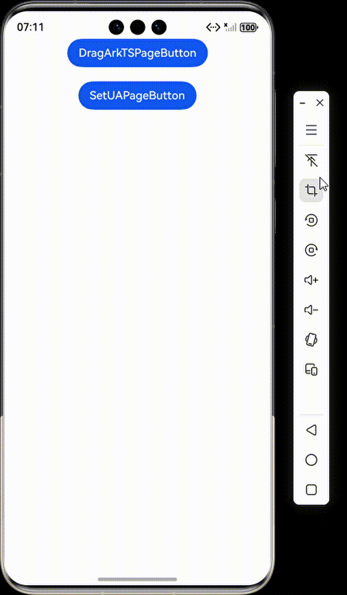

# 使用Web组件的拖拽功能与网页交互

### 介绍

本工程主要实现了对以下指南文档中 [使用Web组件的拖拽功能与网页交互](https://gitcode.com/openharmony/docs/blob/master/zh-cn/application-dev/web/web_drag.md) 示例代码片段的工程化，主要目标是帮助开发者快速了解ArkWeb的拖拽功能使应用能够在网页中实现元素的拖放，可以长按可拖拽的元素，将其拖至可放置的元素上，然后松手完成放置。

### 在ArkTS侧实现拖拽相关逻辑

#### 介绍

1. 建立应用侧与前端页面数据通道。
2. 在onDrop方法中，做简单逻辑，例如暂存一些关键数据。
3. 在ArkTS侧接受消息的方法中，添加应用处理逻辑，可以进行耗时任务。

#### 效果预览



#### 使用说明

1. 通过Web消息端口在ArkTS和H5页面间建立数据通道，支持跨端拖拽数据传递和事件处理。

### 为什么H5设置的拖拽事件没有触发

#### 介绍

1. 检查相关CSS资源是否正常设置，因为有些网页UA做了判断，针对特定设备的UA才会进行CSS样式设置。可以考虑在Web组件设置自定义UA解决这种问题。

#### 使用说明

1. 通过setCustomUserAgent方法在Web组件初始化时设置自定义用户代理字符串，在默认UA基础上追加"android"标识，用于模拟Android设备访问网页或适配特定网页渲染。

### 工程目录

```
entry/src/main/
|---ets
|---|---entryability
|---|---|---EntryAbility.ets
|---|---pages
|---|---|---Index.ets						// 首页
|---|---|---WebFocusManagement.ets
|---|---|---WebFocusManagement2.ets
|---resources								// 静态资源
|---ohosTest
|---|---ets
|---|---|---tests
|---|---|---|---Ability.test.ets            // 自动化测试用例
```

### 具体实现

1. 在ArkTS侧，创建一个Web组件，并设置了src为本地HTML文件。
2. 当页面加载完成后，创建Web消息端口，并将其中一个端口发送给HTML，以建立双向通信。
3. 当在Web组件内拖放元素时，ArkTS侧的onDrop事件会被触发，从DragEvent中获取数据。
4. 同时，HTML侧在拖放完成后会通过消息端口发送数据到ArkTS侧，ArkTS侧在端口的消息事件中接收并处理。

### 相关权限

不涉及。

### 依赖

不涉及。

### 约束与限制

1. 本示例仅支持标准系统上运行。
2. 本示例支持API22版本SDK，SDK版本号(API Version 22 Release)。
3. 本示例需要使用DevEco Studio 版本号(6.0.0Release)才可编译运行。

### 下载

如需单独下载本工程，执行如下命令：

```
git init
git config core.sparsecheckout true
echo code/DocsSample/ArkWeb/WebDragInteraction > .git/info/sparse-checkout
git remote add origin https://gitcode.com/openharmony/applications_app_samples.git 
git pull origin master
```