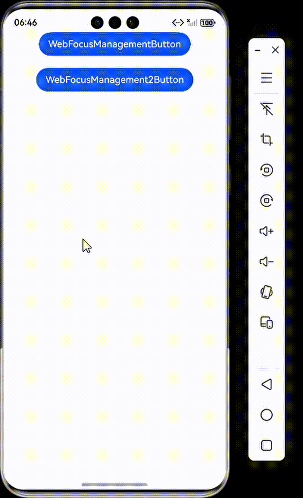
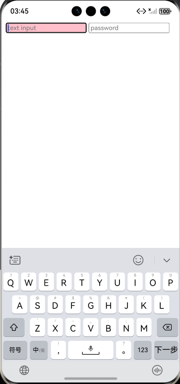

# Web组件焦点管理

### 介绍

本工程主要实现了对以下指南文档中 [Web组件焦点管理](https://gitcode.com/openharmony/docs/blob/master/zh-cn/application-dev/web/web-focus.md) 示例代码片段的工程化，主要目标是帮助开发者快速了解如何利用Web组件的焦点管理功能，有效管理Web组件的聚焦与失焦，同时利用H5侧的W3C标准接口，管理网页界面上唯一可交互的元素聚焦与失焦。

### Web组件与ArkUI组件焦点控制

#### 介绍

1. 应用侧通用获焦回调接口onFocus，获焦事件回调，绑定该接口的组件获焦时，回调响应。
2. 应用侧通用失焦回调接口onBlur，失焦事件回调，绑定该接口的组件失焦时，回调响应。
3. 应用侧主动申请获焦接口requestFocus，组件主动申请获焦。
4. 设置组件是否可获焦：应用可以通过设置focusable属性，控制Web组件是否能够获取焦点。Web组件默认可获焦。

#### 效果预览



#### 使用说明

1. 通过按钮可以分别控制两个网页视图获取焦点，获得焦点的网页边框会变为绿色，失去焦点时恢复红色。

### Web组件内H5元素焦点控制

#### 介绍

1. 加载本地HTML文件并实现H5表单元素的焦点控制。

#### 效果预览



#### 使用说明

1. 通过加载内置的HTML文件，演示了如何在Web组件中实现表单元素的焦点可视化反馈。当用户点击文本输入框或密码框时，输入框背景会动态变为粉色，提供直观的交互反馈，增强用户体验。

### 工程目录

```
entry/src/main/
|---ets
|---|---entryability
|---|---|---EntryAbility.ets
|---|---pages
|---|---|---Index.ets						// 首页
|---|---|---WebFocusManagement.ets
|---|---|---WebFocusManagement2.ets
|---resources								// 静态资源
|---ohosTest
|---|---ets
|---|---|---tests
|---|---|---|---Ability.test.ets            // 自动化测试用例
```

### 具体实现

1. 创建两个WebviewController，分别用于两个Web组件。
2. 使用@State装饰器定义两个变量来存储两个Web组件的边框颜色。
3. 创建两个按钮，点击按钮时分别调用两个WebviewController的requestFocus方法。
4. 为两个Web组件设置onFocus和onBlur事件，在获焦时改变边框颜色为绿色，失焦时改变为红色。
5. 加载本地的test.html文件，该文件已经内置了focus和blur事件来改变输入框的背景色。

### 相关权限

不涉及。

### 依赖

不涉及。

### 约束与限制

1. 本示例仅支持标准系统上运行。
2. 本示例支持API22版本SDK，SDK版本号(API Version 22 Release)。
3. 本示例需要使用DevEco Studio 版本号(6.0.0Release)才可编译运行。

### 下载

如需单独下载本工程，执行如下命令：

```
git init
git config core.sparsecheckout true
echo code/DocsSample/ArkWeb/WebFocusManagement > .git/info/sparse-checkout
git remote add origin https://gitcode.com/openharmony/applications_app_samples.git 
git pull origin master
```