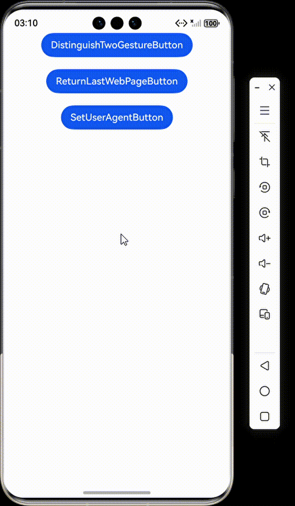

## 使用Web组件的手势与应用交互

#### 介绍

本工程主要实现了对以下指南文档中 https://gitcode.com/openharmony/docs/blob/master/zh-cn/application-dev/web/web-gesture.md 示例代码片段的工程化，主要目标是实现指南中示例代码需要与sample工程文件同源。

### ArkWeb手势与ArkUI手势

#### 介绍

1. 使用三指捏合，Web组件本身会进行缩放。这是因为ArkWeb接收到ArkUI识别出的PinchGesture，执行绑定的回调函数。同时，ArkWeb支持scale方法，能够调整Web组件的缩放比例。

#### 预览效果


#### 使用说明

1. 通过三指捏合手势实现网页内容的缩放控制，实时更新缩放比例并在手势结束时保存当前缩放状态。

### Web组件中如何通过手势滑动返回上一个Web页面

#### 介绍

1. 通过重写onBackPress函数来自定义返回逻辑，使用WebviewController判断是否返回上一个Web页面。

#### 使用说明

1. 重写返回键处理逻辑，优先在网页历史记录中后退，只有在无法后退时才执行默认的页面返回操作，实现了网页内导航与页面导航的无缝衔接。

### 为什么Web加载后网页无法交互？

#### 介绍

1. 网页可能基于其他平台的User-Agent进行判断。为解决此问题，可以在Web组件中设置自定义User-Agent。

#### 使用说明

1. 在控制器附加时设置自定义的移动端用户代理字符串，用于模拟特定浏览器环境或适配移动端网页显示。

### 工程目录

```
entry/src/main/
|---ets
|---|---entryability
|---|---|---EntryAbility.ets
|---|---pages
|---|---|---DistinguishTwoGesture.ets
|---|---|---Index.ets					// 首页
|---|---|---ReturnLastWebPage.ets					// 首页
|---|---|---SetUserAgent.ets
|---resources								// 静态资源
|---ohosTest
|---|---ets
|---|---|---tests
|---|---|---|---Ability.test.ets            // 自动化测试用例
```

### 相关权限

若使用本地资源，不涉及权限；若使用网络资源，需在module.json中配置网络权限：
{
"module": {
"requestPermissions": [
{
"name": "ohos.permission.INTERNET"
}
]
}
}

### 依赖

不涉及。

### 约束与限制

1. 本示例仅支持标准系统上运行。
2. 本示例支持API22版本SDK，SDK版本号(API Version 22 Release)。
3. 本示例需要使用DevEco Studio 版本号(6.0.0Release)才可编译运行。

### 下载

如需单独下载本工程，执行如下命令：

```
git init
git config core.sparsecheckout true
echo code/DocsSample/ArkWeb/WebGestureInteraction > .git/info/sparse-checkout
git remote add origin https://gitcode.com/openharmony/applications_app_samples/tree/master/code/DocsSample/ArkWeb
git pull origin master
```