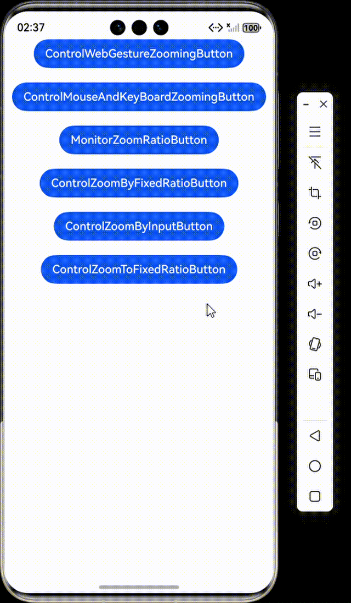
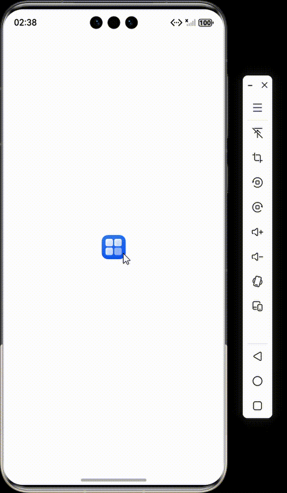
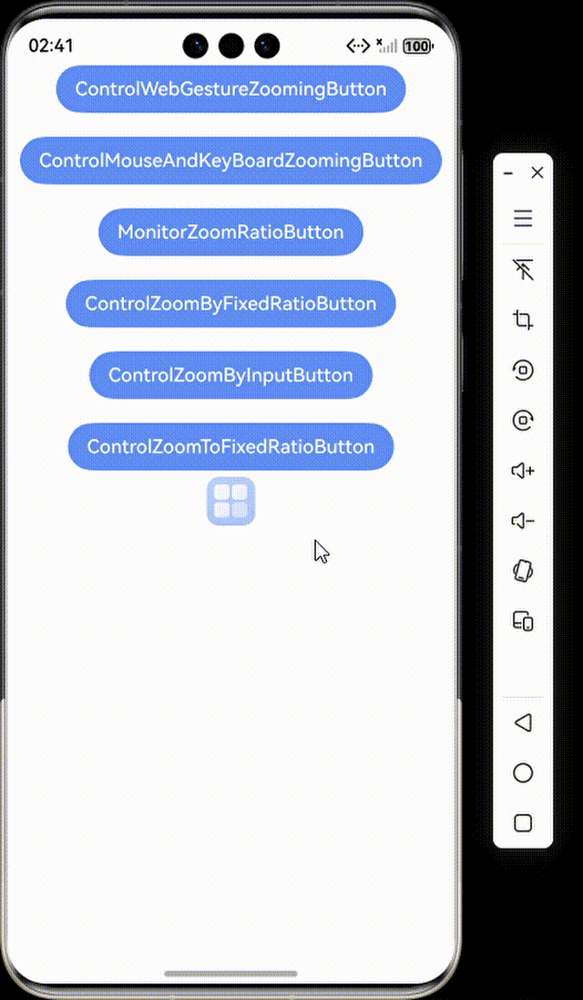

# 使用Web组件管理网页缩放

#### 介绍

本工程主要实现了对以下指南文档中 https://gitcode.com/openharmony/docs/blob/master/zh-cn/application-dev/web/web-scale-zoom.md 示例代码片段的工程化，主要目标是实现指南中示例代码需要与sample工程文件同源。

#### 使用说明

1. 此 Web 组件有页面展示

## 启用/禁用网页缩放

### 启用/禁用网页手势缩放

#### 介绍

1. 通过属性zoomAccess控制网页缩放功能，当设置为false时，网页不允许手势缩放行为。

#### 效果预览

#### 使用说明

1. 创建一个Web组件，通过WebviewController加载指定网页并禁用缩放功能.

### 启用/禁用网页键盘鼠标缩放

#### 介绍

1. ArkWeb默认支持通过Ctrl+按键'-'/'+' 或者 Ctrl+鼠标滚轮进行缩放。应用可以通过拦截键盘事件来阻止按键缩放，当前暂未支持拦截Ctrl+鼠标滚轮缩放。

#### 效果预览


#### 使用说明

1. 启用网页缩放功能，通过拦截Ctrl+加号/减号键的键盘事件来实现自定义的网页缩放控制逻辑。

## 监听页面缩放比例变化

#### 介绍

1. 应用可以通过onScaleChange接口监听页面缩放比例的变化。
2. 该接口事件对应手势事件(双指缩放)，event.newScale对应网页属性visualViewport.scale。

#### 效果预览


#### 使用说明

1. 当用户在网页中进行缩放操作时，该组件会通过回调函数实时输出新旧缩放比例的变化信息。

## 控制网页的缩放比例

### 以固定比例缩放页面

#### 介绍

1. 应用可以通过设置initialScale属性设置页面初始缩放比例。
2. zoomIn将当前网页进行放大，比例为25%；zoomOut将当前网页进行缩小，比例为20%。

#### 效果预览


#### 使用说明

1. 通过"zoomIn"和"zoomOut"两个按钮来放大和缩小网页内容，并提供了完善的错误处理机制来捕获缩放操作中的异常情况。

### 根据输入值控制页面缩放比例

#### 介绍

1. zoom基于当前网页比例进行缩放，入参要求大于0，当入参为1时为默认加载网页的缩放比例，入参小于1为缩小，入参大于1为放大。

#### 效果预览


#### 使用说明

1. 用户可以通过文本输入框输入任意数字作为缩放因子，点击按钮后网页将按照指定比例进行缩放，并具备完整的错误处理机制。

### 缩放页面到目标比例

#### 介绍

1. 通过onScaleChange接口，应用可以得知当前网页的缩放比例，配合zoom接口即可实现将页面缩放至指定比例的功能。

#### 效果预览


#### 使用说明

1. 通过实时监听页面缩放变化，将用户输入的目标缩放值自动转换为相对当前比例的调整因子，实现精确的缩放控制并具备完善的错误处理机制。


### 工程目录

```
entry/src/main/
|---ets
|---|---entryability
|---|---|---EntryAbility.ets
|---|---pages
|---|---|---ControlMouseAndKeyBoardZooming.ets
|---|---|---ControlWebGestureZooming.ets
|---|---|---ControlZoomByFixedRatio.ets
|---|---|---ControlZoomByInput.ets
|---|---|---ControlZoomToFixedRatio.ets
|---|---|---Index.ets					// 首页
|---|---|---MonitorZoomRatio.ets
|---resources								// 静态资源
|---ohosTest
|---|---ets
|---|---|---tests
|---|---|---|---Ability.test.ets            // 自动化测试用例
```

### 相关权限

若使用本地资源，不涉及权限；若使用网络资源，需在module.json中配置网络权限：
{
"module": {
"requestPermissions": [
{
"name": "ohos.permission.INTERNET"
}
]
}
}

### 依赖

不涉及。

### 约束与限制

1. 本示例仅支持标准系统上运行。
2. 本示例支持API22版本SDK，SDK版本号(API Version 22 Release)。
3. 本示例需要使用DevEco Studio 版本号(6.0.0Release)才可编译运行。

### 下载

如需单独下载本工程，执行如下命令：

```
git init
git config core.sparsecheckout true
echo code/DocsSample/ArkWeb/WebManagementZooming > .git/info/sparse-checkout
git remote add origin https://gitcode.com/openharmony/applications_app_samples/tree/master/code/DocsSample/ArkWeb
git pull origin master
```