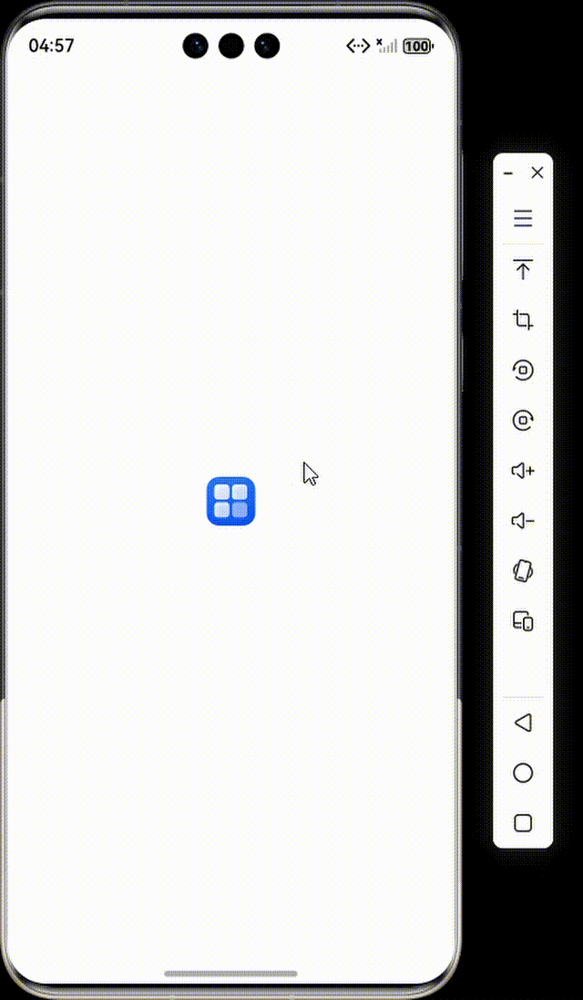
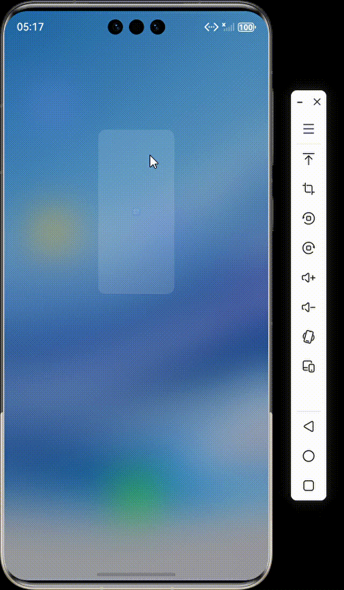
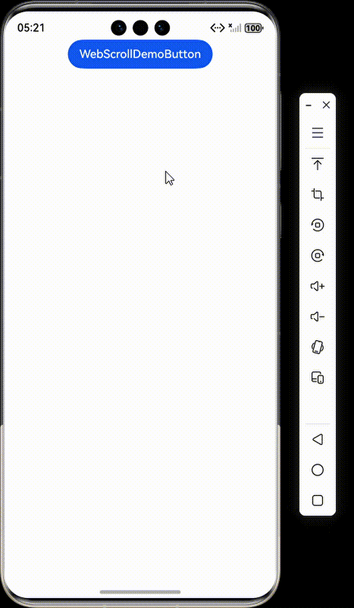
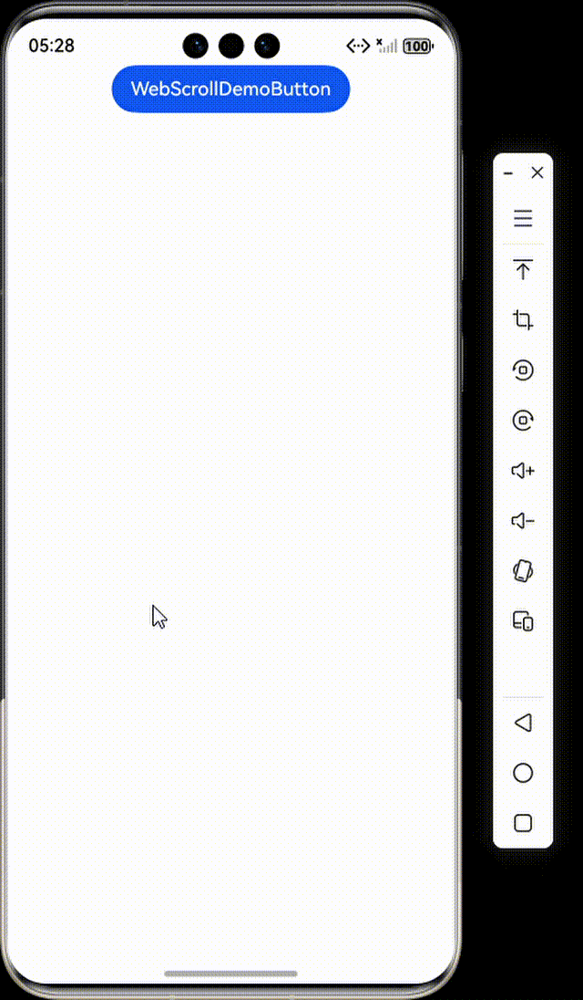

# Web页面显示内容滚动

### 介绍

本工程主要实现了对以下指南文档中 [Web页面显示内容滚动](https://gitcode.com/openharmony/docs/blob/master/zh-cn/application-dev/web/web-content-scrolling.md) 示例代码片段的工程化，主要目标是实现指南中示例代码需要与sample工程文件同源。

### 使用说明

1. 此 Web 组件有页面展示。

## 调用ArkTS侧接口控制Web页面滚动:scrollTo

### 介绍

1. 在指定时间内，将页面滚动到指定位置。

### 效果预览


### 使用说明

1. 该方法用于实现网页内容的快速回顶功能，将当前浏览位置重置到页面最顶端。

## 调用js侧接口控制Web页面滚动：scrollBy滚动一定距离

### 介绍

1. 相对当前滚动位置滚动一定距离（正数向下/右，负数向上/左）。

### 效果预览


### 使用说明

1. 该方法将当前窗口的滚动位置相对于当前位置进行偏移，参数deltaX和deltaY分别表示水平和垂直方向的滚动距离（单位：像素）。

## 调用js侧接口控制Web页面滚动：scrollBy渐进式滚动

### 介绍

1. 渐进式滚动。

### 效果预览


### 使用说明

1. 用户点击该按钮时，页面会向下滚动300像素，实现平滑的内容展开效果。

## 调用js侧接口控制Web页面滚动：scrollTo

### 介绍

1. 将页面滚动到指定坐标位置。

### 效果预览


### 使用说明

1. 该方法将窗口立即滚动到文档中指定的(x,y)坐标位置，其中x为水平滚动位置，y为垂直滚动位置（单位：像素）。

## 调用js侧接口控制Web页面滚动：scrollTo

### 介绍

1. 返回页面顶部。

### 效果预览


### 使用说明

1. 该方法实现页面的快速回顶功能，将滚动位置重置到文档的最开始处。

## 调用js侧接口控制Web页面滚动：scrollTo

### 介绍

1. 跳转到页面特定位置。

### 效果预览


### 使用说明

1. 该方法实现页面的精确定位滚动，常用于跳转到页面的特定段落或锚点位置。

### 工程目录

```
entry/src/main/
|---ets
|---|---entryability
|---|---|---EntryAbility.ets
|---|---pages
|---|---|---Index.ets						// 首页
|---|---|---WebScrollDemo.ets
|---resources								// 静态资源
|---ohosTest
|---|---ets
|---|---|---tests
|---|---|---|---Ability.test.ets            // 自动化测试用例
```

### 具体实现

1. 构建一个长页面的HTML字符串，用于展示滚动效果。
2. 在ArkTS中，创建WebviewController，用于控制Web组件。
3. 提供多个按钮，每个按钮触发一种滚动操作。
4. 对于ArkTS侧的滚动控制，直接调用WebviewController的滚动方法。
5. 对于JS侧的滚动控制，通过Wdocument.getElementById('对应按钮的id').addEventListener() 方法执行JavaScript代码。

### 相关权限

不涉及.

### 依赖

不涉及。

### 约束与限制

1. 本示例仅支持标准系统上运行。
2. 本示例支持API22版本SDK，SDK版本号(API Version 22 Release)。
3. 本示例需要使用DevEco Studio 版本号(6.0.0Release)才可编译运行。

### 下载

如需单独下载本工程，执行如下命令：

```
git init
git config core.sparsecheckout true
echo code/DocsSample/ArkWeb/WebScrollDemo > .git/info/sparse-checkout
git remote add origin https://gitcode.com/openharmony/applications_app_samples.git
git pull origin master
```