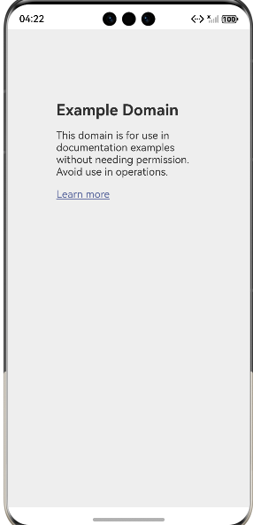
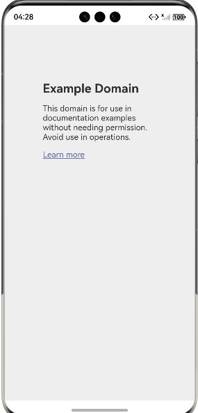
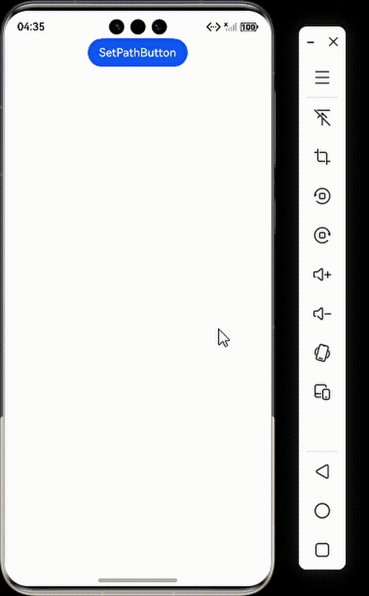

# 定位与解决Web白屏问题

### 介绍

本工程主要实现了对以下指南文档中 [定位与解决Web白屏问题](https://docs.openharmony.cn/pages/v6.0/zh-cn/application-dev/web/web-white-screen.md) 示例代码片段的工程化，主要目标是帮助开发者定位与解决Web的白屏问题。

### 检查权限和网络状态

### 开启相关权限：

#### 介绍

1. 本示例通过设置相关属性来开启相关权限。

#### 效果预览


#### 使用说明

1. 创建一个网页视图，加载指定网址并启用JavaScript、DOM存储、文件访问和在线图片加载等功能，用于展示网页内容。

### 修改UserAgent后再观察页面是否恢复正常

#### 介绍

1. 本示例通过修改UserAgent后再观察页面是否恢复正常。

#### 效果预览


#### 使用说明

1. 创建一个网页视图，在加载页面时自动在默认UserAgent后追加" DemoApp"标识，用于在访问网站时标识应用身份。

### 使用DevTools工具进行页面内容验证

#### 方法一：

#### 介绍

1. 开发者应使用http或https协议替代file或resource协议，确保Web组件能够成功访问跨域资源。替代的URL域名应为自定义构造，仅限于个人或组织使用，以防止与互联网上的实际域名冲突。此外，开发者需要利用Web组件的onInterceptRequest方法，对本地资源进行拦截和相应替换。

#### 效果预览


#### 使用说明

1. 通过拦截网络请求将在线网址映射到本地资源文件，实现离线加载网页内容并绕过跨域限制，适用于本地网页资源的开发和测试场景。

#### 方法二：

#### 介绍

1. 通过setPathAllowingUniversalAccess设置一个路径列表。当使用file协议访问该列表中的资源时，允许进行跨域访问本地文件。此外，一旦设置了路径列表，file协议将仅限于访问列表内的资源(此时，fileAccess的行为将会被此接口行为覆盖)。

#### 效果预览


#### 使用说明

1. 通过设置允许跨域访问的本地路径列表，使WebView中的网页能够通过XMLHttpRequest使用file协议安全地访问指定目录下的本地资源文件。

### 工程目录

```
entry/src/main/
|---ets
|---|---entryability
|---|---|---EntryAbility.ets
|---|---pages
|---|---|---ChangeUserAgent.ets
|---|---|---CrossDomainIntercept.ets
|---|---|---Index.ets						// 首页
|---|---|---OpenPermissions.ets
|---resources								// 静态资源
|---ohosTest
|---|---ets
|---|---|---tests
|---|---|---|---Ability.test.ets            // 自动化测试用例
entry2/src/main/
|---ets
|---|---entry2ability
|---|---|---Entry2Ability.ets
|---|---pages
|---|---|---Index.ets						// 首页
|---|---|---SetPath.ets
|---resources								// 静态资源
|---ohosTest
|---|---ets
|---|---|---tests
|---|---|---|---Ability.test.ets            // 自动化测试用例
```

### 具体实现

1. 验证设备的网络状态，包括是否已连接网络，设备自带的浏览器能否正常访问网页等（在线页面场景）。
2. 确保应用已添加网络权限：ohos.permission.INTERNET（在线页面必需）。
3. 使用http或https协议替代file或resource协议，确保Web组件能够成功访问跨域资源。替代的URL域名应为自定义构造，仅限于个人或组织使用，以防止与互联网上的实际域名冲突。此外，需要利用Web组件的onInterceptRequest方法，对本地资源进行拦截和相应替换。
4. 通过setPathAllowingUniversalAccess设置一个路径列表。当使用file协议访问该列表中的资源时，允许进行跨域访问本地文件。此外，一旦设置了路径列表，file协议将仅限于访问列表内的资源(此时，fileAccess的行为将会被此接口行为覆盖)。
5. 当路径列表中的任一路径不满足上述条件时，系统将抛出异常码401，并判定路径列表设置失败。如果路径列表设置为空，file协议的可访问范围将遵循fileAccess规则。
### 相关权限

需在module.json5中配置网络权限：
{
"module": {
"requestPermissions": [
{
"name": "ohos.permission.INTERNET"
}
]
}
}

### 依赖

不涉及。

### 约束与限制

1. 本示例仅支持标准系统上运行。
2. 本示例支持API22版本SDK，SDK版本号(API Version 22 Release)。
3. 本示例需要使用DevEco Studio 版本号(6.0.0Release)才可编译运行。

### 下载

如需单独下载本工程，执行如下命令：

```
git init
git config core.sparsecheckout true
echo code/DocsSample/ArkWeb/WebWriteScreenIssue > .git/info/sparse-checkout
git remote add origin https://gitcode.com/openharmony/applications_app_samples/tree/master/code/DocsSample/ArkWeb
git pull origin master
```