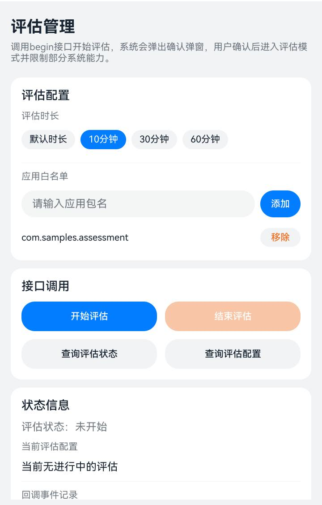

# 评估管理

## 介绍

本示例演示如何使用评估管理（Automatic Scene Configuration Kit）在应用中接入评估模式，覆盖开始评估、结束评估、评估状态查询、评估配置获取以及评估过程回调（onBegin、onInterrupted、onEnd）的完整流程。示例以一个在线答题场景承载这些接口：主页面配置评估参数并调用接口，进入评估模式后跳转到答题页面，答题页面根据评估时长倒计时，并在评估结束或被中断时保存作答结果并退出。

使用的包如下：

- [@ohos.customization.assessment（评估管理）](https://gitcode.com/openharmony/docs/blob/master/zh-cn/application-dev/reference/apis-assessment-kit/js-apis-customization-assessment.md)：提供begin、end、isActive、getConfiguration四个接口，以及AssessmentConfig、AssessmentError、AssessmentInterruptInfo、IAssessmentCallback、AssessmentErrorCode等类型。
- [@kit.AbilityKit](https://gitcode.com/openharmony/docs/blob/master/zh-cn/application-dev/reference/apis-ability-kit/Readme-CN.md)：提供UIAbilityContext，评估接口需要传入需要进入或退出评估模式的UIAbility上下文。
- [@kit.BasicServicesKit](https://gitcode.com/openharmony/docs/blob/master/zh-cn/application-dev/reference/apis-basic-services-kit/Readme-CN.md)：提供BusinessError用于处理接口抛出的业务错误，提供pasteboard用于清空剪切板数据。
- [@kit.ArkUI](https://gitcode.com/openharmony/docs/blob/master/zh-cn/application-dev/reference/apis-arkui/Readme-CN.md)：提供router和promptAction用于页面跳转与结果提示，提供window用于设置窗口沉浸式与隐私模式。
- [@kit.IMEKit](https://gitcode.com/openharmony/docs/blob/master/zh-cn/application-dev/reference/apis-ime-kit/Readme-CN.md)：提供inputMethod，用于开启简单键盘模式。
- [@kit.PerformanceAnalysisKit](https://gitcode.com/openharmony/docs/blob/master/zh-cn/application-dev/reference/apis-performance-analysis-kit/Readme-CN.md)：提供hilog，用于打印示例日志。
- [@kit.TestKit](https://gitcode.com/openharmony/docs/blob/master/zh-cn/application-dev/reference/apis-test-kit/Readme-CN.md)：提供Driver与abilityDelegatorRegistry，用于UI自动化用例。

## 效果预览



| 主页面 | 答题页面 |
| -------- | -------- |
| 配置评估时长与应用白名单，调用begin、end、isActive、getConfiguration接口，查看评估状态与回调事件记录 | 显示剩余时间、题目与选项，交卷时调用end接口结束评估 |

## 使用说明

1. 在主页面"评估配置"卡片中，点击时长标签选择本次评估的最大时长，"默认时长"对应duration取值0，表示由系统按默认时长处理。
2. 在"评估配置"卡片的输入框中输入应用包名，点击"添加"按钮加入白名单，点击"移除"按钮从白名单中删除，白名单中的应用在评估模式下仍可运行。
3. 点击"开始评估"按钮调用begin接口，系统弹出确认弹窗，用户确认后进入评估模式，onBegin回调返回code为0，页面自动跳转到答题页面。
4. 在答题页面点击选项作答，点击"上一题"和"下一题"切换题目，页面顶部按评估时长倒计时。
5. 点击"交卷"按钮调用end接口结束评估，系统解除评估模式下的能力限制，onEnd回调触发后弹窗展示作答数量并返回主页面。
6. 评估被中断时（用户取消、超时退出、系统错误、环境异常），onInterrupted回调触发，答题页面弹窗展示中断原因并返回主页面。
7. 在主页面点击"查询评估状态"按钮调用isActive接口，点击"查询评估配置"按钮调用getConfiguration接口，结果展示在"状态信息"卡片中。
8. "状态信息"卡片的回调事件记录按时间倒序展示最近20条回调与接口调用结果，便于观察接口行为。

## 工程目录

```
entry/src/main/ets/
|---common
|   |---constants
|   |   |---AssessmentConstants.ets          // 日志标签、评估结果码、时长候选值、AppStorage键值等常量
|   |---controllers
|   |   |---AssessmentController.ets         // 评估管理接口封装，注册IAssessmentCallback并发布评估状态与回调事件
|   |---utils
|   |   |---ContextUtil.ets                  // 获取UIAbilityContext的工具类
|   |   |---Logger.ets                       // 日志工具类
|---entryability
|   |---EntryAbility.ets                     // 入口Ability
|---entrybackupability
|   |---EntryBackupAbility.ets               // 备份扩展Ability
|---exam
|   |---model
|   |   |---ExamQuestion.ets                 // 题目数据模型与本地模拟题库
|   |---pages
|   |   |---ExamPage.ets                     // 答题页面，倒计时、作答、交卷、中断处理与应用侧加固
|   |---utils
|   |   |---ExamHardeningUtil.ets            // 应用侧加固工具类，含窗口沉浸式、隐私模式、清空剪切板与简单键盘
|---pages
|   |---Index.ets                            // 主页面，评估参数配置、接口调用与状态展示
entry/src/ohosTest/ets/test/
|---Assessment.test.ets                      // isActive与getConfiguration接口用例
|---AssessmentUi.test.ets                    // 主页面布局与交互的UI自动化用例
|---List.test.ets                            // 测试套件入口
```

## 具体实现

评估管理的接口调用统一封装在AssessmentController中，源码参考：[AssessmentController.ets](entry/src/main/ets/common/controllers/AssessmentController.ets)

* 开始评估：begin方法中构造AssessmentConfig（duration与allowedApps），调用assessment.begin并传入IAssessmentCallback。回调对象在构造函数中创建，onBegin、onInterrupted、onEnd三个事件统一由handleBegin、handleInterrupted、handleEnd处理。
* 结束评估：end方法调用assessment.end，仅开启评估的应用可以结束该评估。
* 状态与配置查询：queryActive方法调用assessment.isActive，queryConfiguration方法调用assessment.getConfiguration，两者均在catch中将错误转换为BusinessError并记录错误码。
* 状态发布：控制器将评估状态、回调事件类型、错误码、错误描述与事件序号写入AppStorage，页面通过@StorageLink与@StorageProp观察，避免在多个页面之间传递回调对象。

主页面的实现参考：[Index.ets](entry/src/main/ets/pages/Index.ets)

* 通过@StorageLink('assessmentActive')驱动"开始评估"与"结束评估"按钮的可用状态，未处于评估状态时结束按钮不可点击。
* 通过@StorageProp('assessmentEventSeq')配合@Watch监听回调事件，onBegin返回code为0时调用router.pushUrl跳转到答题页面，接口抛出业务错误时通过promptAction.showToast提示错误码。
* 通过@StorageProp('assessmentLogs')展示最近的回调事件记录。

答题页面的实现参考：[ExamPage.ets](entry/src/main/ets/exam/pages/ExamPage.ets)

* aboutToAppear中按AssessmentConfig.duration初始化倒计时，duration为0时展示"默认时长"且不启动定时器。
* 交卷时先统计已作答题目数量，再调用AssessmentController.end结束评估，等待onEnd回调后弹窗展示作答结果并返回主页面。
* 监听到onInterrupted回调时，按中断原因码（用户取消、超时退出、系统错误、环境异常）展示对应描述并返回主页面。
* onBackPress中调用end接口，保证退出答题页面时解除评估模式的能力限制。
* aboutToAppear中调用ExamHardeningUtil.applyHardening实施应用侧加固，aboutToDisappear中调用releaseHardening恢复窗口形态与输入法。

应用侧加固的实现参考：[ExamHardeningUtil.ets](entry/src/main/ets/exam/utils/ExamHardeningUtil.ets)

* 窗口沉浸式：通过window.getLastWindow获取当前窗口，调用setWindowLayoutFullScreen使内容延伸至状态栏与导航栏区域。
* 隐私模式：调用setWindowPrivacyMode禁止窗口被截屏与录屏，需申请ohos.permission.PRIVACY_WINDOW权限。
* 清空剪切板：调用pasteboard.getSystemPasteboard().clearData清除残留数据，避免借助剪切板传入答案。
* 简单键盘模式：调用inputMethod.setSimpleKeyboardEnabled将输入法面板限制为基础按键。
* 每项措施单独捕获异常并记录错误码与错误描述，单项失败不影响其余措施生效。

## 相关权限

本示例需要申请以下权限：

- [ohos.permission.ASSESSMENT_CONFIGURATION](https://gitcode.com/openharmony/docs/blob/master/zh-cn/application-dev/security/AccessToken/restricted-permissions.md#ohospermissionassessment_configuration)：允许应用进入考试场景。权限级别为system_basic，授权方式为系统授权（system_grant），属于受限权限，需经审批后应用才可获得。
- [ohos.permission.PRIVACY_WINDOW](https://gitcode.com/openharmony/docs/blob/master/zh-cn/application-dev/security/AccessToken/permissions-for-all.md#ohospermissionprivacy_window)：允许应用将窗口设置为隐私窗口，禁止截屏录屏，用于答题页面的应用侧加固。权限级别为normal，授权方式为系统授权（system_grant）。

## 依赖

无

## 约束与限制

1. 本示例仅支持标准系统上运行，支持设备：Phone | PC/2in1 | Tablet。
2. 本示例涉及的评估管理接口起始版本为26.1.0，需使用API 26.1.0及以上版本SDK编译运行，工程compatibleSdkVersion配置为26.0.0。
3. 本示例仅可在Stage模型下使用。
4. 评估管理能力依赖设备侧的评估配置服务，若设备不支持，接口会抛出错误码801（Capability not supported），此时主页面仍可正常展示，回调事件记录中会记录对应的错误码。
5. 同一设备同一时间仅允许存在一个进行中的评估，重复调用begin接口会报错；仅开启评估的应用可以结束该评估。

## 下载

如需单独下载本工程，执行如下命令：

```text
git init
git config core.sparsecheckout true
echo code/DocsSample/AutomaticSceneConfigurationKit/Assessment/ > .git/info/sparse-checkout
git remote add origin https://gitcode.com/openharmony/applications_app_samples.git
git pull origin master
```
