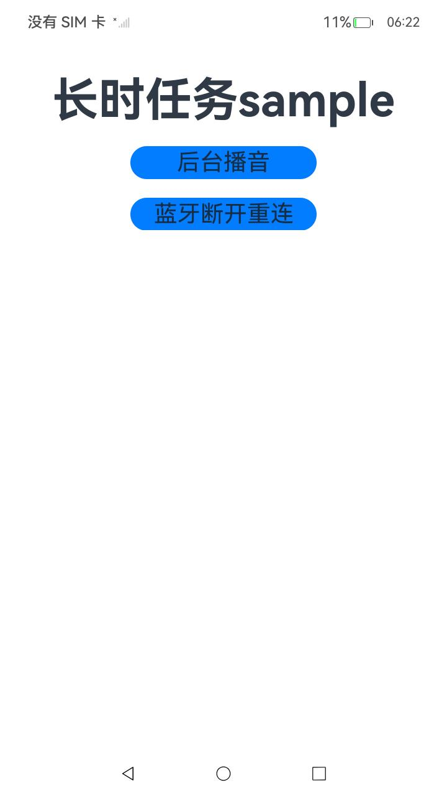
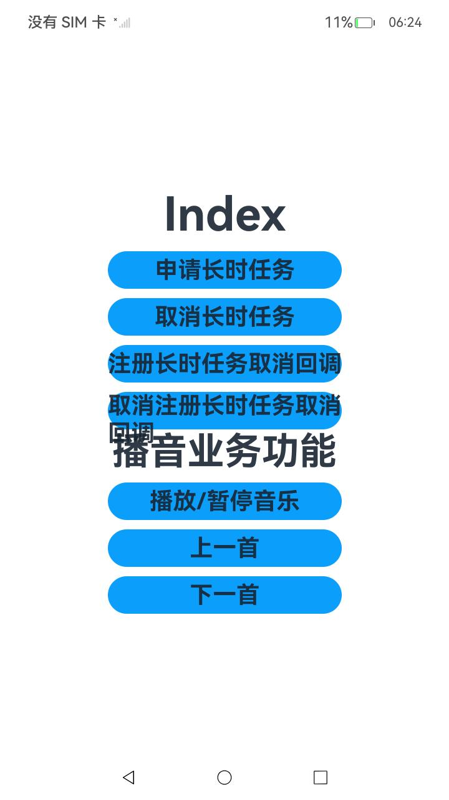

# 长时任务

### 介绍

本示例展示后台任务的长时任务。通过使用[@ohos.resourceschedule.backgroundTaskManager](https://gitcode.com/openharmony/docs/blob/master/zh-cn/application-dev/reference/apis-backgroundtasks-kit/js-apis-resourceschedule-backgroundTaskManager.md)实现后台播放音乐、蓝牙任务断开重连等功能。

### 效果预览

| 首页                                     |播音| 蓝牙       |
|-------------------|-------------------|-------------------|
|  ||  |

使用说明

场景一：后台播放音乐

1.进入应用，点击后台播音进入二级页面，然后点击播放/暂停音乐，申请长时任务，退出音乐界面推送至后台执行，音乐继续播放。

2.再次进入应用，点击播放/暂停音乐，取消长时任务，音乐停止。

场景二：蓝牙断开重连

蓝牙断开重连进行完整功能验证时，需要取消场景一申请的长时任务，同时建议使用具备后台管控能力的真机或模拟器设备进行验证。

针对客户端设备

1.进入应用，启动时会有弹窗提示是否同意授予蓝牙权限，同意授权并点击【蓝牙断开重连】进入二级页面，然后点击【申请蓝牙长时任务】及【注册暂停回调】。

2.点击【注册蓝牙设备监听】及【注册蓝牙连接状态监听】，点击【开始蓝牙扫描】，扫描到对端设备时需要进行连接授权。

3.连接成功之后，将应用退后台，并将两台设备远离直至蓝牙断连，蓝牙断连一段时间之后应用后台被挂起。

4.再将两台设备靠近，蓝牙靠近之后重新连接，应用后台重新保活。

针对服务端设备

进入应用，点击【蓝牙断开重连】进入二级页面，然后点击【gattServerTest】按钮并保持应用在前台运行。

### 工程目录
```
entry/src/main/ets/
|---Application
|   |---MyAbilityStage.ets                    
|---feature
|   |---BackgroundPlayerFeature.ts                 // 后台播放
|---MainAbility
|   |---MainAbility.ts                   
|---mock
|   |---BackgroundPlayerData.ts                    // 数据定义
|---pages
|   |---audioPlayback                              // 音频播放
|   |---bluetoothInteraction                       // 蓝牙断开重连
|   |---Index.ets                                  // 首页
|---util
|   |---Logger.ts                                  // 日志打印
```
### 具体实现

* 后台播放使用startBackgroundRunning方法向系统申请长时任务，stopBackgroundRunning方法向系统申请取消长时任务，getWantAgent方法创建一个WantAgent，createAudioPlayer方法创建一个视频播放实例，createAVSession方法创建一个会话对象，fileIo.open方法打开文件等接口实现后台音乐播放。
  * 源码链接：[BackgroundPlayerFeature.ts](entry/src/main/ets/feature/BackgroundPlayerFeature.ts)，[BackgroundPlayerData.ts](entry/src/main/ets/mock/BackgroundPlayerData.ts)
  * 接口参考：[@ohos.resourceschedule.backgroundTaskManager](https://gitcode.com/openharmony/docs/blob/master/zh-cn/application-dev/reference/apis-backgroundtasks-kit/js-apis-resourceschedule-backgroundTaskManager.md)，[@ohos.multimedia.media](https://gitcode.com/openharmony/docs/blob/master/zh-cn/application-dev/reference/apis-media-kit/arkts-apis-media.md)，[@ohos.multimedia.avsession](https://gitcode.com/openharmony/docs/blob/master/zh-cn/application-dev/reference/apis-avsession-kit/arkts-apis-avsession.md)，[@ohos.fileio](https://gitcode.com/openharmony/docs/blob/master/zh-cn/application-dev/reference/apis-core-file-kit/js-apis-fileio.md)，[@ohos.app.ability.wantAgent](https://gitcode.com/openharmony/docs/blob/master/zh-cn/application-dev/reference/apis-ability-kit/js-apis-app-ability-wantAgent.md)

* 蓝牙断开重连的申请长时任务、注册长时任务暂停回调、注册蓝牙设备监听、注册蓝牙连接状态监听、开始蓝牙扫描功能封装等功能在BluetoothInteractionIndex中。
  * 申请长时任务：使用startBackgroundRunning方法向系统申请长时任务，stopBackgroundRunning方法向系统申请取消长时任务。
  * 注册长时任务暂停回调：使用backgroundTaskManager.on('continuousTaskSuspend', callback)方法向系统注册暂停回调。
  * 注册蓝牙设备监听：使用ble.on('BLEDeviceFind', callback)方法注册蓝牙设备监听，然后通过ble.createGattClientDevice()方法注册gatt客户端，然后通过gattClient.connect()进行蓝牙连接。
  * 注册蓝牙连接状态监听：通过gattClient.on('BLEConnectionStateChange', callback)方法向系统注册蓝牙连接状态监听，蓝牙断连时通过ble.startBLEScan()重新发起蓝牙扫描。

### 相关权限

[ohos.permission.KEEP_BACKGROUND_RUNNING](https://gitcode.com/openharmony/docs/blob/master/zh-cn/application-dev/security/AccessToken/permissions-for-all.md#ohospermissionkeep_background_running)
[ohos.permission.USE_BLUETOOTH](https://gitcode.com/openharmony/docs/blob/master/zh-cn/application-dev/security/AccessToken/permissions-for-all.md#ohospermissionuse_bluetooth)
[ohos.permission.DISCOVER_BLUETOOTH](https://gitcode.com/openharmony/docs/blob/master/zh-cn/application-dev/security/AccessToken/permissions-for-all.md#ohospermissiondiscover_bluetooth)
[ohos.permission.ACCESS_BLUETOOTH](https://gitcode.com/openharmony/docs/blob/master/zh-cn/application-dev/security/AccessToken/permissions-for-all-user.md#ohospermissionaccess_bluetooth)

### 依赖

不涉及。

### 约束与限制

1.本示例仅支持标准系统上运行；

2.本示例已适配API version 20版本SDK，版本号：6.0 Release；

3.本示例需要使用DevEco Studio 版本号(6.0 Release)及以上版本才可编译运行。

### 下载

如需单独下载本工程，执行如下命令：
```
git init
git config core.sparsecheckout true
echo code/DocsSample/BackGroundTasksKit/ContinuousTask/ > .git/info/sparse-checkout
git remote add origin https://gitcode.com/openharmony/applications_app_samples.git
git pull origin master

```