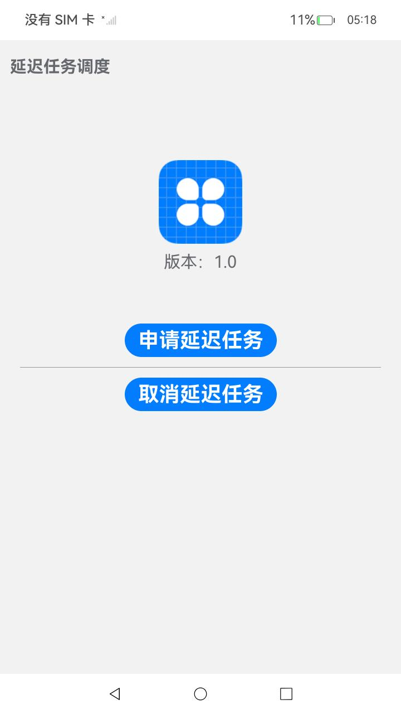

# 延迟任务调度

### 介绍

本示例使用[@ohos.WorkSchedulerExtensionAbility](https://gitcode.com/openharmony/docs/blob/master/zh-cn/application-dev/reference/apis-backgroundtasks-kit/js-apis-WorkSchedulerExtensionAbility.md),[@ohos.resourceschedule.workScheduler](https://gitcode.com/openharmony/docs/blob/master/zh-cn/application-dev/reference/apis-backgroundtasks-kit/js-apis-resourceschedule-workScheduler.md) 等接口，实现了申请延迟任务、取消延迟任务的功能。

### 效果预览

|首页                             |
|---------------------------------------|
||

使用说明

1. 未连接wifi状态下进入应用；
2. 进入首页后连接wifi；
3. 点击申请延迟任务，日志中会有相应的申请日志及回调；
4. 点击取消延迟任务，日志中会有相应的申请日志及回调；

### 工程目录
```
entry/src/main/ets/
|---Application
|   |---MyAbilityStage.ets                  // 入口文件
|---feature
|   |---WorkSchedulerSystem.ets             // 申请、取消延迟任务
|---pages
|   |---Index.ets                           // 首页
|---util
|   |---Logger.ets                          // 日志文件
|---WorkSchedulerAbility
|   |---WorkSchedulerAbility.ets            // 延迟任务触发后的回调
```

### 具体实现

* 该示例使用[startWork](https://gitcode.com/openharmony/docs/blob/master/zh-cn/application-dev/reference/apis-backgroundtasks-kit/js-apis-resourceschedule-workScheduler.md#workschedulerstartwork)方法申请延迟任务，使用[stopWork](https://gitcode.com/openharmony/docs/blob/master/zh-cn/application-dev/reference/apis-backgroundtasks-kit/js-apis-resourceschedule-workScheduler.md#workschedulerstopwork)方法取消延迟任务。
* 该示例使用[onWorkStart](https://gitcode.com/openharmony/docs/blob/master/zh-cn/application-dev/reference/apis-backgroundtasks-kit/js-apis-WorkSchedulerExtensionAbility.md#onworkstart)方法开始延迟任务调度回调，使用[onWorkStop](https://gitcode.com/openharmony/docs/blob/master/zh-cn/application-dev/reference/apis-backgroundtasks-kit/js-apis-WorkSchedulerExtensionAbility.md#onworkstop)方法结束延迟任务调度回调。
* 源码链接：[WorkSchedulerSystem.ets](entry/src/main/ets/feature/WorkSchedulerSystem.ets)，[WorkSchedulerAbility.ets](entry/src/main/ets/WorkSchedulerAbility/WorkSchedulerAbility.ets)。
* 接口参考：[@ohos.WorkSchedulerExtensionAbility](https://gitcode.com/openharmony/docs/blob/master/zh-cn/application-dev/reference/apis-backgroundtasks-kit/js-apis-WorkSchedulerExtensionAbility.md),[@ohos.resourceschedule.workScheduler](https://gitcode.com/openharmony/docs/blob/master/zh-cn/application-dev/reference/apis-backgroundtasks-kit/js-apis-resourceschedule-workScheduler.md)。

### 相关权限

不涉及

### 依赖

不涉及。

### 约束与限制

1.本示例仅支持标准系统上运行,支持设备：RK3568；

2.本示例已适配API version 20版本SDK，版本号：6.0 Release；

3.本示例需要使用DevEco Studio 版本号(6.0 Release)及以上版本才可编译运行。

### 下载

如需单独下载本工程，执行如下命令：
```
git init
git config core.sparsecheckout true
echo code/DocsSample/BackGroundTasksKit/WorkScheduler/ > .git/info/sparse-checkout
git remote add origin https://gitcode.com/openharmony/applications_app_samples.git
git pull origin master

```