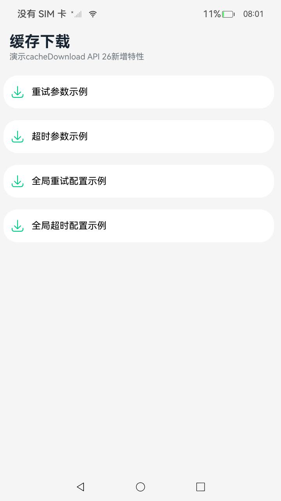
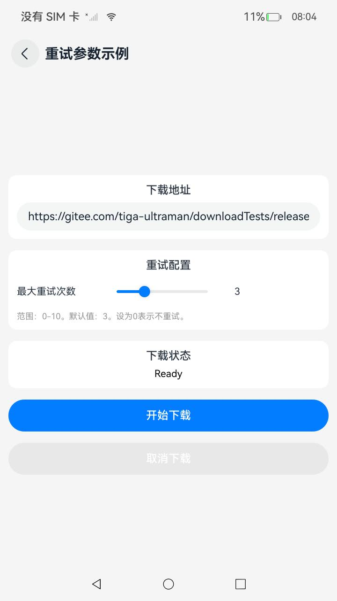
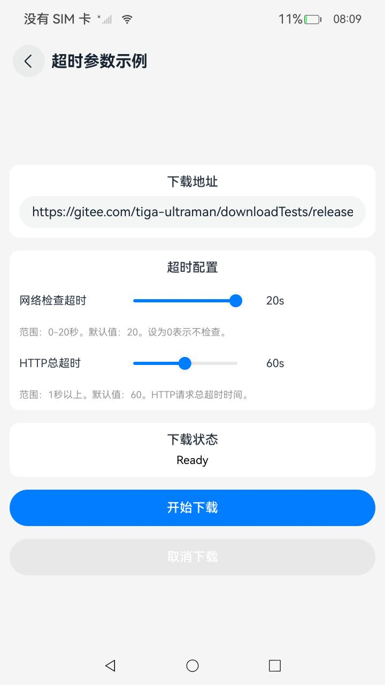
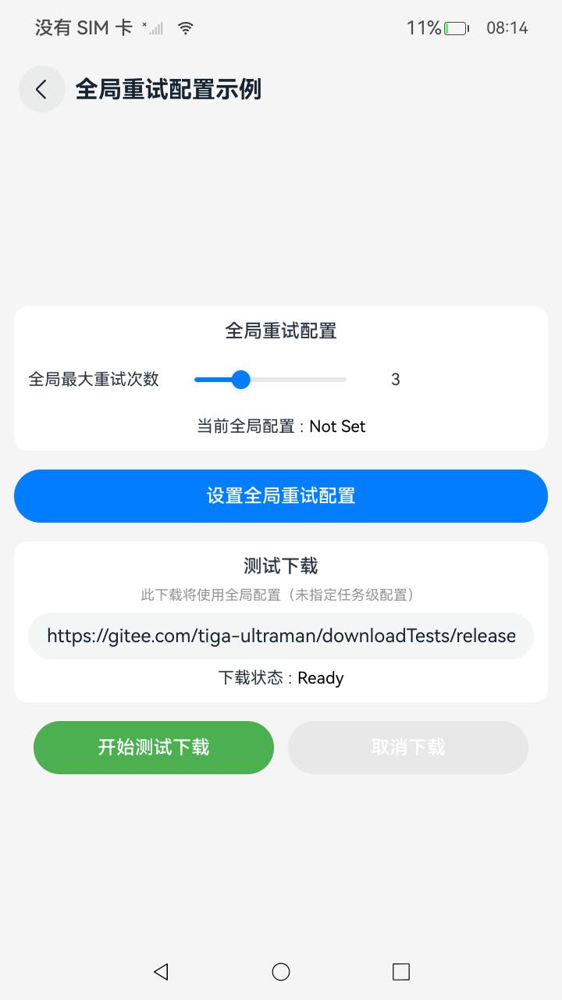
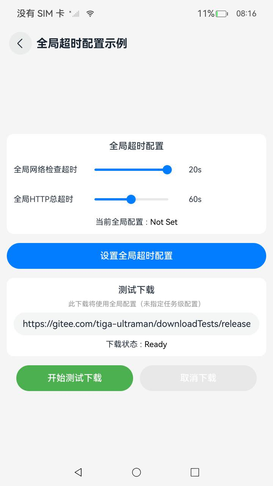

# 缓存下载

### 介绍
本示例使用[@ohos.request.cacheDownload](https://gitcode.com/openharmony/docs/blob/master/zh-cn/application-dev/reference/apis-basic-services-kit/js-apis-request-cacheDownload.md)接口演示API 26新增的RetryOptions、TimeoutOptions参数以及setGlobalRetryOptions、setGlobalTimeoutOptions接口的使用方法。

### 效果预览

&nbsp;&nbsp;&nbsp;&nbsp;

使用说明

1.首页展示四个功能入口：RetryOptions Demo、TimeoutOptions Demo、setGlobalRetryOptions Demo、setGlobalTimeoutOptions Demo，点击进入对应页面。

2.RetryOptions参数示例页面：
- 输入下载URL地址。
- 通过Slider调整maxRetryCount参数（范围0-10，默认值3）。
- 点击"Start Download"启动缓存下载任务，使用配置的RetryOptions参数。
- 点击"Cancel Download"取消当前下载任务。
- 下载完成后显示状态信息。

3.TimeoutOptions参数示例页面：
- 输入下载URL地址。
- 通过Slider调整networkCheckTimeout参数（范围0-20秒，默认值20）。
- 通过Slider调整httpTotalTimeout参数（范围1-120秒，默认值60）。
- 点击"Start Download"启动缓存下载任务，使用配置的TimeoutOptions参数。
- 点击"Cancel Download"取消当前下载任务。
- 下载完成后显示状态信息。

4.setGlobalRetryOptions接口示例页面：
- 通过Slider调整全局maxRetryCount参数。
- 点击"Set Global Retry Options"设置全局重试配置。
- 点击"Start Test Download"启动测试下载（不指定任务级retry，使用全局配置）。
- 点击"Cancel Download"取消下载任务。

5.setGlobalTimeoutOptions接口示例页面：
- 通过Slider调整全局networkCheckTimeout和httpTotalTimeout参数。
- 点击"Set Global Timeout Options"设置全局超时配置。
- 点击"Start Test Download"启动测试下载（不指定任务级timeout，使用全局配置）。
- 点击"Cancel Download"取消下载任务。

### 工程目录

```
CacheDownload
├── AppScope                                    
│   └── app.json5                               // APP信息配置文件
├── entry/src/main                              // 应用首页
│   ├── ets
│   │   ├── entryability
│   │   ├── pages
│   │   │   ├── Index.ets                       // 主页入口
│   │   │   ├── CacheDownloadRetry.ets         // RetryOptions参数示例页面
│   │   │   ├── CacheDownloadTimeout.ets       // TimeoutOptions参数示例页面
│   │   │   ├── GlobalRetryOptions.ets         // setGlobalRetryOptions接口示例页面
│   │   │   ├── GlobalTimeoutOptions.ets       // setGlobalTimeoutOptions接口示例页面
│   │   ├── utils
│   │   │   ├── Logger.ets                      // 日志工具类
│   │   │   ├── Constants.ets                   // 常量定义
│   └── module.json5
│
└── resources                                   // 资源文件
    ├── base/element
    │   ├── string.json                         // 字符串资源
    │   ├── color.json                          // 颜色资源
    ├── base/media
    │   ├── ic_download.svg                     // 下载图标
    ├── base/profile
    │   ├── main_pages.json                     // 页面路由配置
```

### 具体实现

* 本示例展示四个功能模块：

  * RetryOptions参数使用示例
    * 演示在CacheDownloadOptions中配置retry参数的方法。
    * retry参数为RetryOptions类型，包含maxRetryCount字段，用于设置最大重试次数。
    * 源码链接：[CacheDownloadRetry.ets](./entry/src/main/ets/pages/CacheDownloadRetry.ets)
    * 参考接口：[@ohos.request.cacheDownload](https://gitcode.com/openharmony/docs/blob/master/zh-cn/application-dev/reference/apis-basic-services-kit/js-apis-request-cacheDownload.md)

  * TimeoutOptions参数使用示例
    * 演示在CacheDownloadOptions中配置timeout参数的方法。
    * timeout参数为TimeoutOptions类型，包含networkCheckTimeout和httpTotalTimeout字段。
    * 源码链接：[CacheDownloadTimeout.ets](./entry/src/main/ets/pages/CacheDownloadTimeout.ets)
    * 参考接口：[@ohos.request.cacheDownload](https://gitcode.com/openharmony/docs/blob/master/zh-cn/application-dev/reference/apis-basic-services-kit/js-apis-request-cacheDownload.md)

  * setGlobalRetryOptions接口使用示例
    * 演示setGlobalRetryOptions接口的使用方法，设置全局重试配置。
    * 全局配置适用于所有未指定任务级retry的缓存下载任务。
    * 源码链接：[GlobalRetryOptions.ets](./entry/src/main/ets/pages/GlobalRetryOptions.ets)
    * 参考接口：[@ohos.request.cacheDownload](https://gitcode.com/openharmony/docs/blob/master/zh-cn/application-dev/reference/apis-basic-services-kit/js-apis-request-cacheDownload.md)

  * setGlobalTimeoutOptions接口使用示例
    * 演示setGlobalTimeoutOptions接口的使用方法，设置全局超时配置。
    * 全局配置适用于所有未指定任务级timeout的缓存下载任务。
    * 源码链接：[GlobalTimeoutOptions.ets](./entry/src/main/ets/pages/GlobalTimeoutOptions.ets)
    * 参考接口：[@ohos.request.cacheDownload](https://gitcode.com/openharmony/docs/blob/master/zh-cn/application-dev/reference/apis-basic-services-kit/js-apis-request-cacheDownload.md)

### API 26新增接口说明

| 接口/参数 | 类型 | 说明 |
|---|---|---|
| RetryOptions.maxRetryCount | number | 最大重试次数，范围0-10，默认值3，设为0表示不重试 |
| TimeoutOptions.networkCheckTimeout | number | 网络可用性检查超时（秒），范围0-20，默认值20，设为0表示不检查 |
| TimeoutOptions.httpTotalTimeout | number | HTTP请求总超时（秒），最小值1，默认值60 |
| CacheDownloadOptions.retry | RetryOptions | 任务级重试配置 |
| CacheDownloadOptions.timeout | TimeoutOptions | 任务级超时配置 |
| setGlobalRetryOptions(options?: RetryOptions) | function | 设置全局重试配置 |
| setGlobalTimeoutOptions(options?: TimeoutOptions) | function | 设置全局超时配置 |

### 相关权限

[ohos.permission.INTERNET](https://gitcode.com/openharmony/docs/blob/master/zh-cn/application-dev/security/AccessToken/permissions-for-all.md#ohospermissioninternet)

[ohos.permission.GET_NETWORK_INFO](https://gitcode.com/openharmony/docs/blob/master/zh-cn/application-dev/security/AccessToken/permissions-for-all.md#ohospermissionget_network_info)

### 约束与限制

1.本示例仅支持标准系统上运行。

2.本示例为Stage模型，支持API 26版本SDK，SDK版本号(API Version 26)，镜像版本号(6.0)。

3.本示例需要使用DevEco Studio版本号(5.0.5 Release)及以上版本才可编译运行。

4.运行本示例需全程联网。

### 下载

如需单独下载本工程，执行如下命令：

```bash
git init
git config core.sparsecheckout true
echo code/DocsSample/Basic-Services-Kit/request/CacheDownload/ > .git/info/sparse-checkout
git remote add origin https://gitcode.com/openharmony/applications_app_samples.git
git pull origin master
```