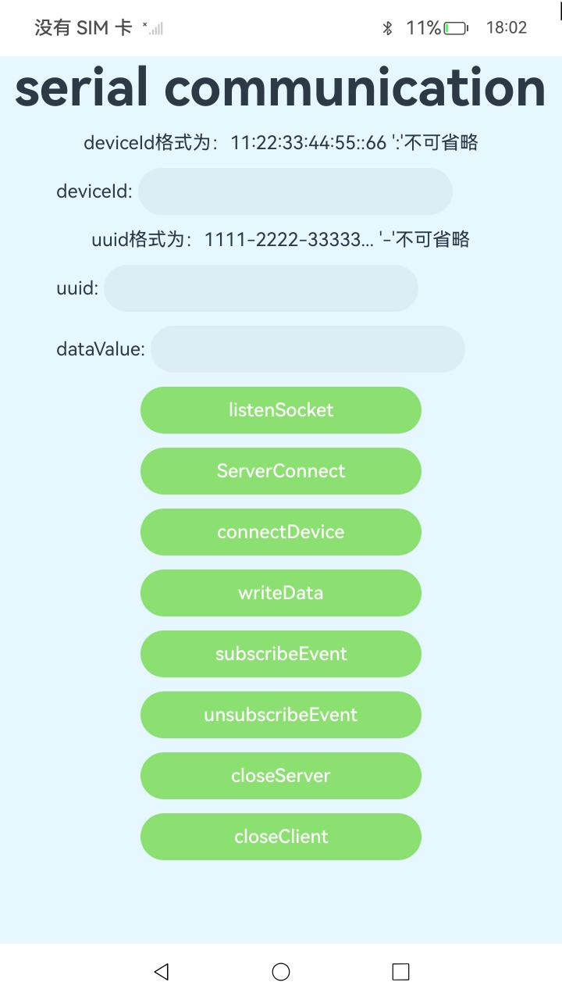

# 串行通信开发指导

### 介绍

本示例为开发指南中[蓝牙服务开发](https://gitee.com/openharmony/docs/blob/master/zh-cn/application-dev/connectivity/bluetooth/Readme-CN.md)章节中**传输数据开发指导***示例代码的完整工程,该工程中展示的代码详细描述可查如下链接：
 
[传输数据开发指导](https://gitee.com/openharmony/docs/blob/master/zh-cn/application-dev/connectivity/bluetooth/spp-development-guide.md)

### 效果预览
|Serial Communication|
|-------|
| |

### 使用说明

1. 启动应用，弹出申请蓝牙权限的弹窗，点击允许，打卡设备的蓝牙功能。
2. 按照格式输入deviceId和uuid。
3. 点击listenSocket创建服务器监听Socket。
4. 点击ServerConnect，socket等待客户端连接，连接成功返回clientId，弹出弹窗提示。
5. 点击connectDevice，连接对端设备。
6. 点击writeData，向客户端写入数据。
7. 点击subscribeEvent，订阅读请求事件。
8. 点击subscribeEvent，取消订阅读请求事件。
9. 点击closeServer，关闭服务。
10. 单击closeClient，关闭客户端。

### 工程目录
```
entry/src/main/ets/
|---entryability
|   |---EntryAbility.ets
|---entrybackupability
|   |---EntryBackupAbility.ets        
|---pages
|   |---Index.ets                      // 应用主页面
```

### 具体实现

#### 服务端向客户端写入数据

1. import需要的socket模块。
2. 需要SystemCapability.Communication.Bluetooth.Core系统能力。
3. 创开启设备蓝牙。
4. 创建服务端socket，返回serverId。
5. 服务端等待客户端连接，返回clientId。
6. 服务端向客户端写入数据。
7. （可选）服务端订阅客户端写入的数据。
8. 注销服务端socket。
9. 注销客户端socket。
10. 错误码请参见[蓝牙服务子系统错误码](https://gitee.com/openharmony/docs/blob/master/zh-cn/application-dev/reference/apis-connectivity-kit/errorcode-bluetoothManager.md).

#### 通过socket连接对端设备

1. import需要的socket模块。
2. 需要SystemCapability.Communication.Bluetooth.Core系统能力。
3. 开启设备蓝牙。
4. 开启ble扫描，获取对端设备mac地址。
5. 连接对端设备。
6. 错误码请参见[蓝牙服务子系统错误码](https://gitee.com/openharmony/docs/blob/master/zh-cn/application-dev/reference/apis-connectivity-kit/errorcode-bluetoothManager.md).

### 相关权限

[ohos.permission.ACCESS_BLUETOOTH](https://gitee.com/openharmony/docs/blob/master/zh-cn/application-dev/security/AccessToken/permissions-for-all-user.md#ohospermissionaccess_bluetooth)

### 依赖

不涉及。

### 约束与限制

1.本示例仅支持标准系统上运行, 支持设备：RK3568。

2.本示例为Stage模型，支持API14版本SDK，版本号：5.0.2.57，镜像版本号：OpenHarmony_5.0.2.57。

3.本示例需要使用DevEco Studio NEXT Developer Preview2 (Build Version: 5.0.5.306， built on December 12, 2024)及以上版本才可编译运行。

### 下载

如需单独下载本工程，执行如下命令：

````
git init
git config core.sparsecheckout true
echo code/DocsSample/ConnectivityKit/Bluetooth/SerialCommunication/ > .git/info/sparse-checkout
git remote add origin https://gitee.com/openharmony/applications_app_samples.git
git pull origin master
````