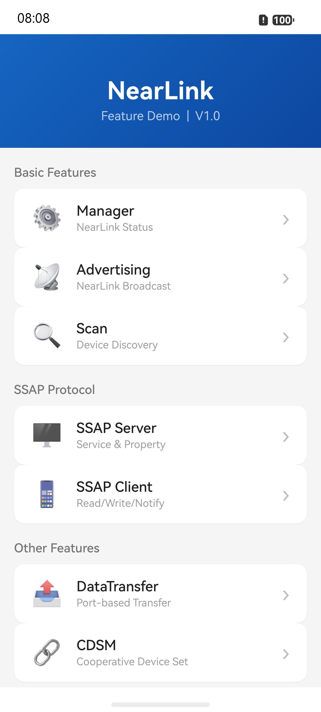
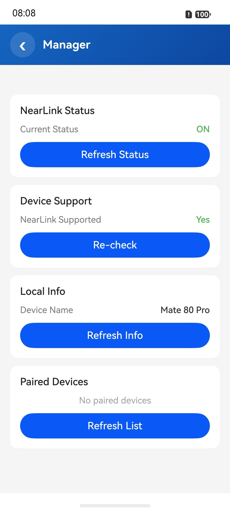
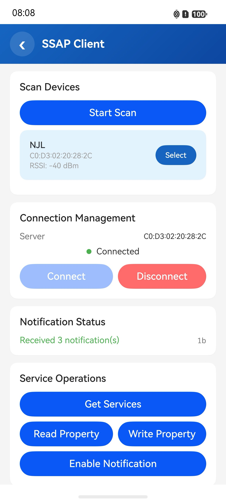
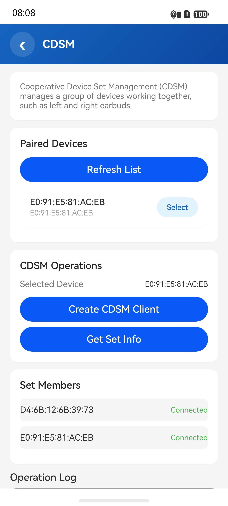

# NearLink

## Introduction

This sample demonstrates the application of OpenHarmony NearLink technology, implementing the following features based on the `@ohos.nearlink` API series:

- **Manager**: Query NearLink state, device support, local name, and paired devices, corresponding to the package [@ohos.nearlink.manager](https://developer.huawei.com/consumer/cn/doc/harmonyos-references/js-apis-nearlink-manager).
- **Advertising**: Start/stop NearLink advertising, supporting custom manufacturer data and service data, corresponding to the package [@ohos.nearlink.advertising](https://developer.huawei.com/consumer/cn/doc/harmonyos-references/js-apis-nearlink-advertising).
- **Scan**: Device discovery, supporting filtering by name or address and full scanning, corresponding to the package [@ohos.nearlink.scan](https://developer.huawei.com/consumer/cn/doc/harmonyos-references/js-apis-nearlink-scan).
- **SSAP Server**: Create an SSAP server, add services and properties, and support read, write, and notification operations, corresponding to the package [@ohos.nearlink.ssap](https://developer.huawei.com/consumer/cn/doc/harmonyos-references/js-apis-nearlink-ssap).
- **SSAP Client**: Create an SSAP client, scan for and connect to the server, and perform read, write, and notification subscription, corresponding to the package [@ohos.nearlink.ssap](https://developer.huawei.com/consumer/cn/doc/harmonyos-references/js-apis-nearlink-ssap).
- **DataTransfer**: Port-based data transfer, supporting port creation/destruction, connection/disconnection, and data sending/receiving, corresponding to the package [@ohos.nearlink.dataTransfer](https://developer.huawei.com/consumer/cn/doc/harmonyos-references/js-apis-nearlink-data-transfer-api).
- **CDSM**: Collaborative device set management, querying member information of device sets, corresponding to the package [@ohos.nearlink.cdsm](https://developer.huawei.com/consumer/cn/doc/harmonyos-references/js-apis-nearlink-cdsm).

## Preview

| Main Page | Manager | SSAP Client | CDSM |
| --------- | ------- | ----------- | ---- |
|  |  |  |  |

### Usage

1. After launching the application, the main page displays entries to all feature modules.
2. Tap **Manager** to view the NearLink state and support status of the current device.
3. Tap **Advertising** to start advertising with customizable advertising parameters.
4. Tap **Scan** to scan for nearby NearLink devices, with filtering by name or address supported.
5. Tap **SSAP Server** to create a server and start advertising. After a client connects, property notifications can be sent.
6. Tap **SSAP Client** to scan for server devices. After connecting, read, write, and notification subscription operations can be performed.
7. Tap **DataTransfer** to create a data port. After scanning for and connecting to a peer device, data can be sent and received.
8. Tap **CDSM** to query collaborative device set information of paired devices.

## Project Structure

```
entry/src/main/ets/
├── entryability/
│   └── EntryAbility.ets              // Ability entry
├── entrybackupability/
│   └── EntryBackupAbility.ets        // Backup and restore entry
├── pages/
│   └── Index.ets                     // Entry page, Navigation container
├── nearlink/                         // Scenario business directory
│   ├── pages/
│   │   ├── MainPage.ets              // Main page, feature module navigation
│   │   ├── ManagerPage.ets           // NearLink management page
│   │   ├── AdvertisingPage.ets       // Advertising feature page
│   │   ├── ScanConfigPage.ets        // Scan configuration page
│   │   ├── SsapServerPage.ets        // SSAP server page
│   │   ├── SsapClientPage.ets        // SSAP client page
│   │   ├── DataTransferPage.ets      // Data transfer page
│   │   └── CdsmPage.ets              // CDSM management page
│   └── components/
│       └── CommonComponents.ets      // Common UI components (NavBar, SectionCard, etc.)

Library/src/main/ets/
└── nearlink/                         // Feature encapsulation directory
    ├── feature/
    │   └── NearLinkConstants.ets     // Feature constants (UUID, ManufacturerID, etc.)
    └── NearLinkFeature.ets           // Feature API encapsulation (Manager/Advertising/Scan)

entry/src/ohosTest/ets/test/          // UI automation test cases
├── List.test.ets                     // Test suite entry
├── Ability.test.ets                  // Application launch test
├── MainPageNavigation.test.ets       // Page navigation test
└── ...                               // UI verification tests for each feature page
```

## Implementation

The Library module encapsulates common NearLink feature APIs, and the entry module demonstrates specific usage:

- **NearLink Management**: In entry, ManagerPage directly invokes `manager.getState()`, `manager.isNearLinkSupported()`, `manager.onStateChange`, etc. to query device information and listen for state changes; in Library, `NearLinkFeature` encapsulates `getLocalName()` and `getPairedDevices()` for reuse by pages.
- **Advertising**: In Library, `NearLinkFeature.buildAdvertisingParams()` encapsulates advertising parameter construction. In entry, AdvertisingPage (with custom service data) and SsapServerPage call this API to build parameters and control advertising via `advertising.startAdvertising/stopAdvertising`.
- **Scan**: In Library, `NearLinkFeature.buildManufacturerFilter()` encapsulates filter condition construction. In entry, ScanConfigPage invokes `scan.startScan/stopScan` with name/address filters, while SsapClientPage and DataTransferPage filter specific devices by `manufacturerId` through this API.
- **SSAP Protocol**: In entry, SsapServerPage creates a `Server` instance, adds `Service` and `Property`, and registers callbacks for connection state, read/write requests, and MTU changes. SsapClientPage creates a `Client` instance and, after connecting, performs `readProperty`, `writeProperty`, and `setPropertyNotification`.
- **Data Transfer**: In entry, DataTransferPage manages ports via `createPort/destroyPort`, establishes connections via `connect/disconnect`, sends data via `writeData`, and receives data via the `onReadData` callback.
- **CDSM**: In entry, CdsmPage creates a client via `createCdsmClient`, queries device set information via `getCdsmInfo`, and listens for changes via `onCdsmInfoChange`.

## Required Permissions

- [ohos.permission.ACCESS_NEARLINK](https://developer.huawei.com/consumer/cn/doc/harmonyos-guides/permissions-for-all-user#ohospermissionaccess_nearlink): Used to access NearLink communication APIs.

## Dependencies

No external dependencies.

## Constraints and Limitations

1. This sample only runs on the standard system. Supported devices: OpenHarmony devices with NearLink hardware.
2. This sample uses the Stage model and supports API version 26. SDK version: 26.0.0.
3. This sample requires DevEco Studio NEXT (Build Version: 5.0.5.200 or later) to compile and run.
4. This application uses the `ohos.permission.ACCESS_NEARLINK` permission, which is at the normal level with user_grant authorization mode. It is requested from the user at runtime, and no ACL configuration is required.

## Download

To download this project separately, run the following commands:

```bash
git init
git config core.sparse-checkout true
echo code/DocsSample/ConnectivityKit/NearLink/ > .git/info/sparse-checkout
git remote add origin https://gitcode.com/openharmony/applications_app_samples.git
git pull origin master
```
