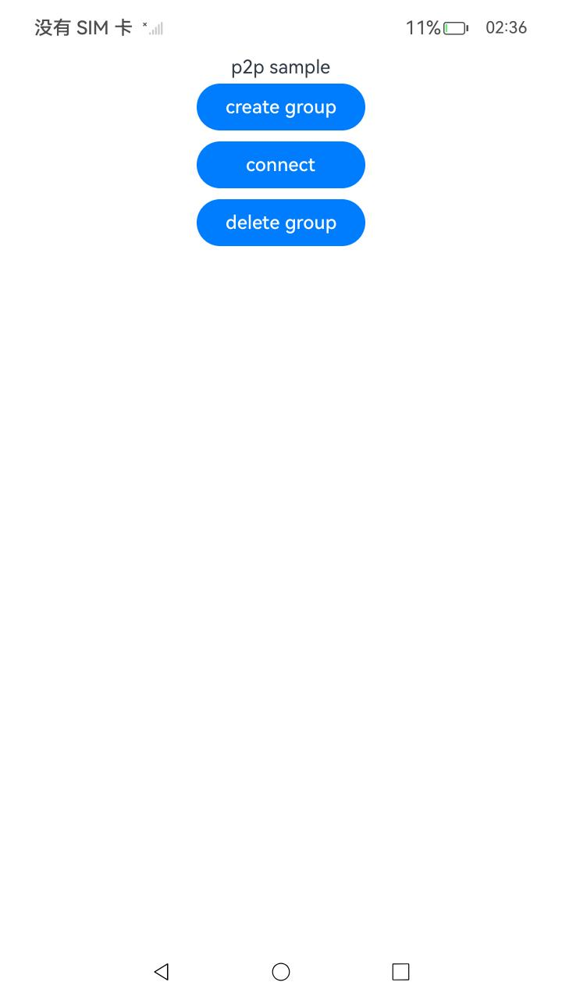

# P2P模式开发指南

### 介绍

本示例通过将[Connectivity Kit指南文档](https://gitee.com/openharmony/docs/tree/master/zh-cn/application-dev/connectivity)中各场景的开发示例，展示在工程中，帮助开发者更好地理解ArkUI提供的组件及组件属性并合理使用。该工程中展示的代码详细描述可查如下链接：
[P2P模式开发](https://gitee.com/openharmony/docs/blob/master/zh-cn/application-dev/connectivity/wlan/p2p-development-guide.md)。

### 效果预览
|应用界面|
|-------|
| |

### 使用说明

1. 在主界面，可以点击对应按钮，执行相应的操作。
2. 按钮上方会显示执行信息。

### 工程目录
```
entry/src/main/ets/
├── entryability
│   ├── EntryAbility.ets
│   ├── p2pability.ets                     // 创建或删除群组
│   └── p2pConnect.ets                     // p2p连接
├── entrybackupability
│   └── EntryBackupAbility.ets
└── pages
    └── Index.ets                          // 应用主界面
```

### 相关权限

[ohos.permission.GET_WIFI_INFO](https://gitee.com/openharmony/docs/blob/master/zh-cn/application-dev/reference/apis-connectivity-kit/js-apis-wifiManager.md#wifimanagercreategroup9)

### 依赖

不涉及。

### 约束与限制

1.本示例仅支持标准系统上运行, 支持设备：RK3568。

2.本示例为Stage模型，支持API14版本SDK，版本号：5.0.2.57，镜像版本号：OpenHarmony_5.0.2.57。

3.本示例需要使用DevEco Studio NEXT Developer Preview2 (Build Version: 5.0.5.306， built on December 12, 2024)及以上版本才可编译运行。

### 下载

如需单独下载本工程，执行如下命令：

````
git init
git config core.sparsecheckout true
echo code/DocsSample/ConnectivityKit/Wlan > .git/info/sparse-checkout
git remote add origin https://gitee.com/openharmony/applications_app_samples.git
git pull origin master
````