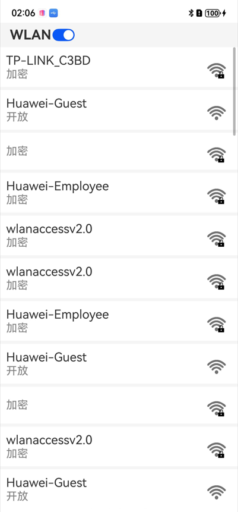

# P2P模式开发指南

### 介绍

本示例通过将[Connectivity Kit指南文档](https://gitee.com/openharmony/docs/tree/master/zh-cn/application-dev/connectivity)中各场景的开发示例，展示在工程中，帮助开发者更好地理解ArkUI提供的组件及组件属性并合理使用。该工程中展示的代码详细描述可查如下链接：
[P2P模式开发](https://gitee.com/openharmony/docs/blob/master/zh-cn/application-dev/connectivity/wlan/p2p-development-guide.md)。
[Wi-Fi扫描](https://gitee.com/openharmony/docs/blob/master/zh-cn/application-dev/connectivity/wlan/scan-development-guide.md)。
[STA模式开发](https://gitee.com/openharmony/docs/blob/master/zh-cn/application-dev/connectivity/wlan/sta-development-guide.md)。

### 效果预览
|应用界面|
|主页                                     |建议网络连接                                     | WiFi列表                               |
|---------------------------------------------|---------------------------------------|-----------------------------------------|
||||
|P2p测试                                      |P2p连接                                     | 创建群组                               |
|---------------------------------------------|---------------------------------------|-----------------------------------------|
||||


|获取真实BSSID授权                         |
|-----------------------------------------|
|     |

### 使用说明

1. 启动应用后会判断WLAN是否激活，如果是激活状态，点击wifi列表会扫描并展示可用WiFi列表；
2. 点击首页建议击网络连接，填写可选参数，连接建议网络；
3. 点击首页P2p测试，进行P2p连接和创建群组场景测试。

### 工程目录
```
entry/src/main/ets/
|---component
|   |---P2pView.ets            // P2p列表详情页
|   |---TitleBar.ets           // 页面头部组件
|   |---WifiView.ets           // wifi列表详情页
|---entryability
|   |---EntryAbility.ets       // 应用入口，在这里请求相关权限和进入首页
|---pages
|   |---Index.ets              // 首页
|   |---AvailableWifi.ets      // 热点扫描信息列表
|   |---WifiConnect.ets        // 建议网络连接
|   |---P2pTest.ets            // P2p测试场景
|   |---AvailableP2p.ets       // P2p扫描信息列表
|   |---P2pSetting.ets         // 创建群组
```

### 具体实现

* 开始测试前需打开设备WiFi，
首页：[Index.ets](entry/src/main/ets/pages/Index.ets)。

* 建议网络连接：[WifiConnect.ets](entry/src/main/ets/pages/WifiConnect.ets)，根据提示填写参数信息通过connectwifi()发起连接。
* wifi的扫描功能：首页点击wifi列表，在[AvailableWifi.ets](entry/src/main/ets/pages/AvailableWifi.ets) 通过(entry/src/main/ets/component/WifiView.ets)显示每一个WiFi信息，调用getScanInfos()获取扫描结果，调用定时器每3s获取一次。
* P2p场景测试：
    *p2p连接：[AvailableP2p.ets.ets](entry/src/main/ets/pages/AvailableP2p.ets) 通过(entry/src/main/ets/component/P2pView.ets)显示每一个P2p信息，点击列表信息通过connectP2p()函数发起连接。
    *创建P2P群组：在[P2pSetting.ets](entry/src/main/ets/pages/P2pSetting.ets) 填写参数信息通过createGroup()来创建群组。
### 相关权限

[ohos.permission.GET_WIFI_INFO](https://gitee.com/openharmony/docs/blob/master/zh-cn/application-dev/security/AccessToken/permissions-for-all.md#ohospermissionget_wifi_info)

[ohos.permission.SET_WIFI_INFO](https://gitee.com/openharmony/docs/blob/master/zh-cn/application-dev/security/AccessToken/permissions-for-all.md#ohospermissionset_wifi_info)

[ohos.permission.GET_WIFI_PEERS_MAC](https://gitee.com/openharmony/docs/blob/master/zh-cn/application-dev/security/AccessToken/restricted-permissions.md#ohospermissionget_wifi_peers_mac)
### 依赖

不涉及。

### 约束与限制

1. 本示例仅支持标准系统上运行, 支持设备：RK3568。

2. 本示例需要使用DevEco Studio 5.0.5 及以上版本才可编译运行。

3. 本示例已适配API version 20版本SDK，本示例需要使用@ohos.wifiManager系统权限的系统接口。使用Full SDK时需要手动从镜像站点获取，并在DevEco Studio中替换，具体操作可参考[替换指南](https://gitee.com/openharmony/docs/blob/master/zh-cn/application-dev/faqs/full-sdk-switch-guide.md/) 。

4. 本示例需要使用ohos.permission.GET_WIFI_INFO、ohos.permission.SET_WIFI_INFO的权限为system_grant级别、ohos.permission.GET_WIFI_PEERS_MAC的权限为system_basic级别(相关权限级别可通过[权限定义列表](https://gitee.com/openharmony/docs/blob/master/zh-cn/application-dev/security/AccessToken/permissions-for-all.md) 查看)，需要手动配置对应级别的权限签名。

### 下载

如需单独下载本工程，执行如下命令：

```
git init
git config core.sparsecheckout true
echo code/DocsSample/ConnectivityKit/Wlan > .git/info/sparse-checkout
git remote add origin https://gitee.com/openharmony/applications_app_samples.git
git pull origin master
```