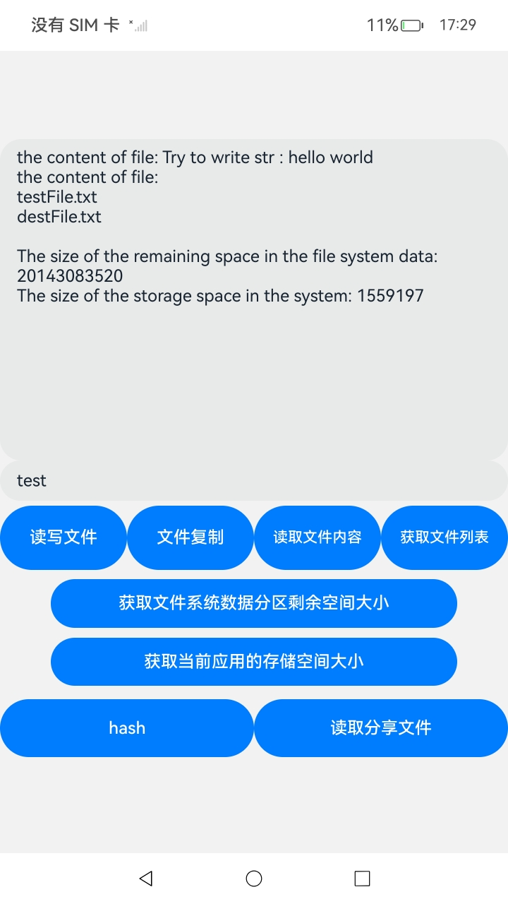

# 应用文件访问（ArKTS）

## 介绍

本实例主要实现了对应用沙箱目录下的文件的访问，使用ohos.file.fileuri 、ohos.file.fs、ohos.file.statvfs、ohos.application.Want 。实现了文件的创建、读写、内容复制、文件流的使用、文件哈希流的使用、文件系统空间大小的获取以及对分享文件的接收和读取功能，该工程中展示的代码详细描述可查如下链接。

- [ 应用文件访问(ArkTS)](https://gitee.com/openharmony/docs/blob/OpenHarmony-5.0.1-Release/zh-cn/application-dev/file-management/app-file-access.md)

## 效果预览

| 应用成功启动界面                                  | 文件访问结果                                    |
| ------------------------------------------------- | ----------------------------------------------- |
|  |  |

使用说明：

1. 本应用主要是对应用的沙箱文件进行访问，同时能获取到文件系统的存储空间大小。
2. 在主界面中通过点击相应的按钮，应用可以完成相应的功能，完成的反馈将如日志的形式出现在主界面的上半部分。
3. 本应用涉及到了对分享文件的接收和读取，在使用分享文件的应用通过弹窗选择跳转到本应用之后，点击“查看分享的文件数据”可以读取到分享文件的内容。

## 工程目录

```
//应用文件访问
FileSample
├──entry/src/main
|	├──ets
|	|	├──commom
|	|	|	├──Logger.ts				// 日志工具
|	|	├──entryability
|	|	|	└──EntryAbility.ets         // 程序入口类
|	|	├──entrybackupability
|	|	|	└──EntryBackupAbility.ets   
|	|	├──fileFs
|	|	|	└──fileFs.ets               // 文件访问函数
|	|	└──pages                        // 页面文件
|	|		└──Index.ets 				// 主界面
|	├──resources						// 资源文件目录	
```

## 具体实现

- 在应用开始访问文件之前，使用UIAbilityContext[获取UIAbility的上下文信息](https://gitee.com/openharmony/docs/blob/OpenHarmony-5.0.1-Release/zh-cn/application-dev/application-models/uiability-usage.md)，然后调用Context的相关接口获取应用的沙箱文件路径。

- 文件的新建、读写、内容复制、查看文件列表、文件流的使用、文件哈希流的使用的功能函数都集成在fileFs.ets文件中，源码参考：fileFs.ets。

- 使用fs.openSync、fs.writeSync、fs.readSync、fs.closeSync分别用来来创建文件夹、打开文件、写文件、读文件、关闭文件，文件接口请参考：[ohos.file.fs](https://gitee.com/openharmony/docs/blob/OpenHarmony-5.0.1-Release/zh-cn/application-dev/reference/apis-core-file-kit/js-apis-file-fs.md)

- 使用[ohos.file.statvfs](https://gitee.com/openharmony/docs/blob/OpenHarmony-5.0.1-Release/zh-cn/application-dev/reference/apis-core-file-kit/js-apis-file-statvfs.md)、ohos.file.storageStatistics提供的API获取文件系统空间和应用空间的大小。

- 该应用涉及对分享文件的接收和读取，需要配置[ module.json5](https://gitee.com/openharmony/docs/blob/OpenHarmony-5.0.1-Release/zh-cn/application-dev/quick-start/module-configuration-file.md)文件，示例如下。

  ```
  {
    "module": {
      ...
      "abilities": [
        {
          ...
          "skills": [
            {
              ...
              "actions": [
                "ohos.want.action.sendData"
              ],
              "uris": [
                {
                  "scheme": "file",
                  "type": "text/plain"
                }
             ]
            }
          ]
        }
      ]
    }
  }
  
  ```

## 相关权限

无

## 依赖

不涉及

## 约束与限制

1.本示例仅支持标准系统上运行，支持设备：RK3568。

2.本示例为Stage模型，支持API14版本SDK，版本号：5.0.2.58，镜像版本号：OpenHarmony 5.0.2.58。

3.本示例需要使用DevEco Studio 5. 1Release (Build Version: 5.0.5.306, built on December 6, 2024)及以上版本才可编译运行。

## 下载

如需单独下载本工程，执行如下命令

```
git init
git config core.sparsecheckout true
echo code/DocsSample/CoreFile/FileSample > .git/info/sparse-checkout
git remote add origin https://gitee.com/openharmony/applications_app_samples.git
git pull origin master
```

