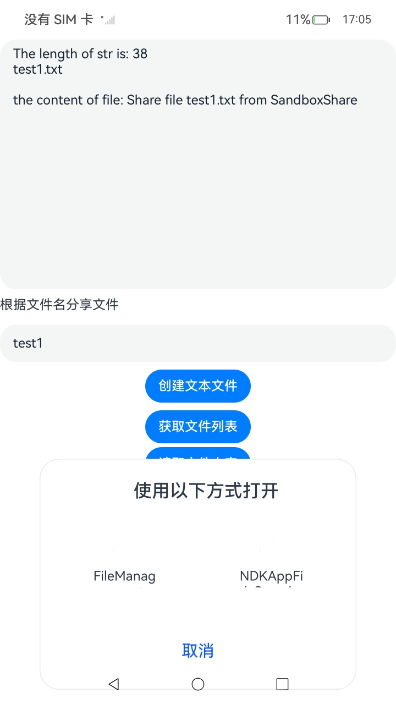
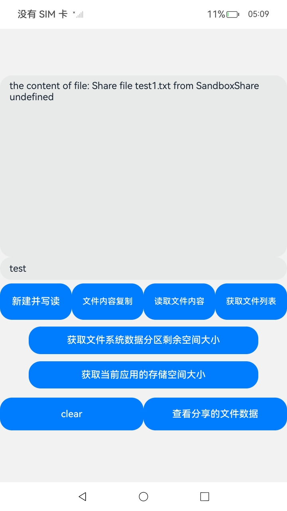

# 应用文件分享

本示例主要展示了沙箱文件分享相关的功能，使用 ohos.file.fileuri、ohos.file.fs、ohos.ability.wantConstant、ohos.application.Want 等接口，实现了获取文件uri、创建沙箱文件、提供want中操作want常数、应用组件间的信息传递的功能，该工程中展示的代码详细描述可查如下链接。

-  [ 应用文件分享](https://gitee.com/openharmony/docs/blob/OpenHarmony-5.0.1-Release/zh-cn/application-dev/file-management/share-app-file.md)

### 效果预览

| 创建文件界面                                      | 选择分享应用弹窗                                  | 应用接收文件并读取                                        |
| ------------------------------------------------- | ------------------------------------------------- | --------------------------------------------------------- |
|  |  |  |

使用说明：

1. 因本应用的功能依赖FileSample（code/DocsSample/CoreFile/FileSample）应用，在使用本应用之前首先应安装FileSample应用，文件分享之前使FileSample应用在后台。
2. 在主界面，可以点击创建文件按钮，在沙箱目录下创建一个txt文件，通过“查看文件列表”和“获取文件内容”按钮分别获取文件列表和test.txt文件的内容。
3. 点击“文件分享”按钮，可以拉起分享弹窗，选择要接收的应用之后，该应用就会被拉起，接收传递的want参数后可以根据对应的URI对分享的文件进行读写。

### 工程目录
```
├──entry/src/main
|	├──ets
|	|	├──common
|	|	|	└──Logger.ts                 // 日志工具
|	|	├──entryability
|	|	|	└──EntryAbility.ets          // 程序入口类
|	|	├──entrybackupability
|	|	|	└──EntryBackupAbility.ets			  		   
|	|	├──fileFs
|	|	|	└──fileFs.ets                // 文件访问函数
|	|	└──pages                         // 页面文件
|	|		└──Index.ets                 // 主界面
|	├──resources						 // 资源文件目录
```
### 具体实现

* 增添文件、查找指定类型文件、获取文件uri、传递want信息启动ability的功能接口封装在fileFs.ts，源码参考：FileFs.ts

  * 使用fs.openSync、fs.writeSync、fs.readSync、fs.closeSync分别用来打开文件、写文件、读文件、关闭文件。文件接口请参考：[@ohos.file.fs](https://gitee.com/openharmony/docs/blob/OpenHarmony-5.0.1-Release/zh-cn/application-dev/reference/apis-core-file-kit/js-apis-file-fs.md)

  * 使用fileUri.getUriFromPath来获取文件uri，文件URI的获取请参考接口文档：[@ohos.file.fileuri](https://gitee.com/openharmony/docs/blob/OpenHarmony-5.0.1-Release/zh-cn/application-dev/reference/apis-core-file-kit/js-apis-file-fileuri.md)

  * 分享文件至FileSample应用打开并读取。
  * 调用 implicitStartAbility 方法传递want参数启动新的ability。

### 相关权限

无

### 依赖

本应用需要依赖FileSample应用和NDKAppFileSample应用，启动前预先安装这两个应用才可以进行自动化测试，若只安装了FileSample依赖应用，请删除SandBoxShare_005测试用例，沙箱文件需分享至FileSample应用打开并读取内容。

### 约束与限制

1.本示例仅支持标准系统上运行，支持设备：RK3568。

2.本示例为Stage模型，支持API14版本SDK，版本号：5.0.2.58，镜像版本号：OpenHarmony 5.0.2.58。

3.本示例需要使用DevEco Studio 5. 1Release (Build Version: 5.0.5.306, built on December 6, 2024)及以上版本才可编译运行。

### 下载

如需单独下载本工程，执行如下命令：
```
git init
git config core.sparsecheckout true
echo code/DocsSample/CoreFile/SandBoxShare > .git/info/sparse-checkout
git remote add origin https://gitee.com/openharmony/applications_app_samples.git
git pull origin master
