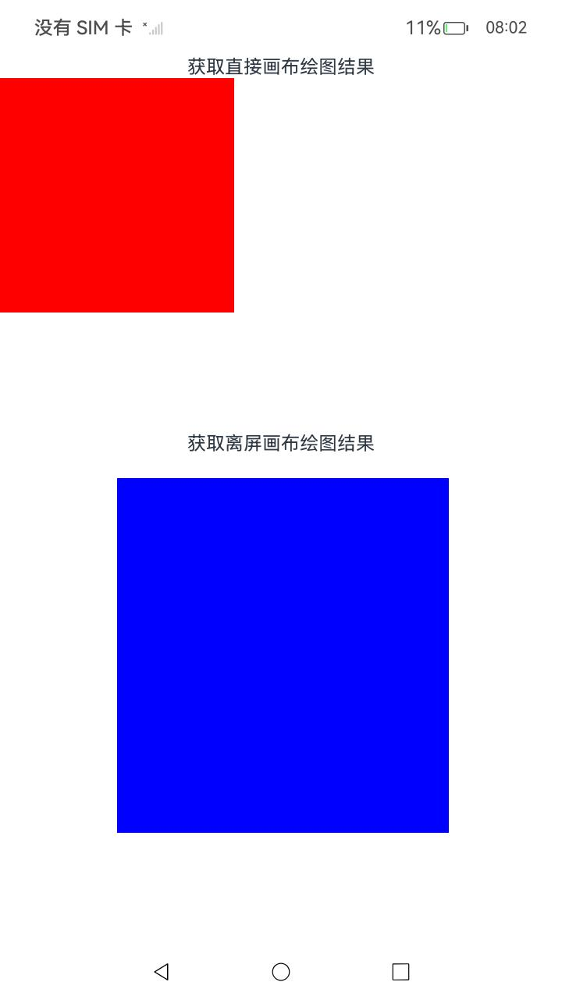
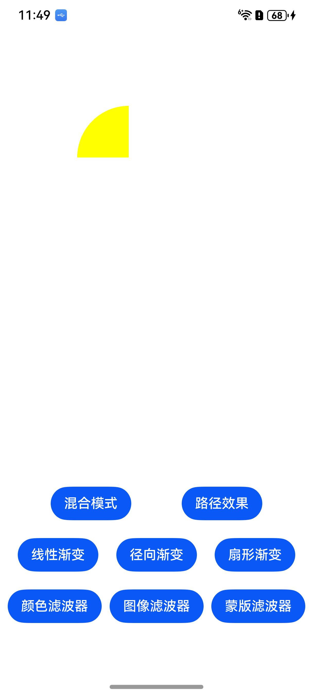
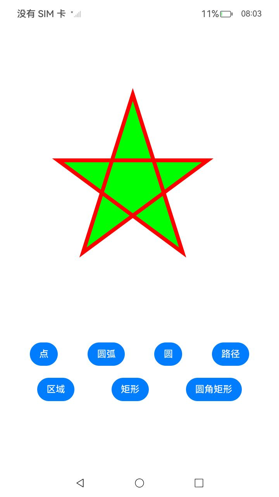

# ArkTSGraphicsDraw

## 介绍

本示例基于开发>图形->ArkGraphics 2D（方舟2D图形服务）-> [图形绘制与显示](https://gitee.com/openharmony/docs/tree/OpenHarmony-5.0.1-Release/zh-cn/application-dev/graphics#/openharmony/docs/blob/OpenHarmony-5.0.1-Release/zh-cn/application-dev/graphics/textblock-drawing-arkts.md)中的ArkTS部分开发。

本示例主要功能如下：

- 演示画布的获取与绘制结果的显示，画布的类型分为直接画布与离屏画布。
- 演示画布操作及状态处理，通过对画布进行裁剪、平移等操作控制绘图结果
- 演示绘制效果，绘制经过填充、描边、着色器、滤波器等效果处理过后的图形。
- 演示图元绘制，绘制多种几何形状、绘制位图及绘制字块。

## 效果预览

| 主页                              | 画布获取                            | 绘制效果                            | 图元绘制                          |
| --------------------------------- | ----------------------------------- | ----------------------------------- | --------------------------------- |
|  |  |  |  |


使用说明：

1. 点击主页的导航标签组件，进入对应的演示页面。演示页面包括：
   - 画布的获取与绘制结果的显示
   - 画布操作及状态处理
   - 基础绘制效果
   - 复杂绘制效果
   - 几何图形绘制
   - 图片绘制
   - 字块绘制
2. 在演示页面内点击绘制按钮，界面绘制出对应图案。
3. 点击返回按钮，退出应用。

## 工程目录

```
ArkTSGraphicsDraw
entry/src/main
├──ets
│  ├──drawing
|  |  └──pages
|  |  	├──BasicEffect.ets (基础渲染效果界面)
|  |  	├──CanvasGetResult.ets (画布的获取与绘制结果的显示界面)
|  |  	├──CanvasOperationState.ets (画布操作及状态处理界面)
|  |  	├──ComplexEffect.ets (复杂绘制效果界面)
|  |  	├──PixelMapDrawing.ets (图片绘制界面)
|  |  	├──ShapeDrawing.ets (几何形状绘制界面)
|  |  	└──TextBlockDrawing.ets (字块绘制界面)
│  └──pages                      
│     └──Index.ets (UI主界面)
└──resources (资源文件)
entry/src/ohosTest/ets/
├── test
|   ├── Ability.test.ets (UI测试代码)
|   └── List.test.ets (测试套件列表)
└── utils
    └── Logger.ets (logger日志类)
```

## 具体实现

1. 自定义渲染节点 (`MyRenderNode`)：继承自 `RenderNode`，重写draw函数绘制图案。
2. 自定义节点控制器 (`MyNodeController`)：继承自 `NodeController`，自定义`makeNode` 方法。创建了一个根节点 (`rootNode`)，并将 `myRenderNode` 添加为根节点的子节点。通过设置 `backgroundColor`、`frame`、`pivot`、`scale` 等属性，来控制渲染节点的显示效果。
3. 绘制内容的切换：`MyRenderNode`中的`drawFunctions` 数组存储了多个绘制函数，`draw` 方法根据当前的绘制函数索引调用对应的绘制函数。当绘制索引更改时，调用 `invalidate()`触发重绘，切换绘制内容。

## 相关权限

不涉及

## 依赖

不涉及。

## 约束和限制

1. 本示例支持标准系统上运行，支持设备：RK3568;

2. 本示例支持API14版本SDK，版本号：5.0.2.58；

3. 本示例已支持使DevEco Studio 5.0.1 Release (构建版本：5.0.5.306，构建 2024年12月6日)编译运行

## 下载

如需单独下载本工程，执行如下命令：

```
git init
git config core.sparsecheckout true
echo code/DocsSample/Drawing/ArkTSGraphicsDraw/ > .git/info/sparse-checkout
git remote add origin OpenHarmony/applications_app_samples
git pull origin master
```