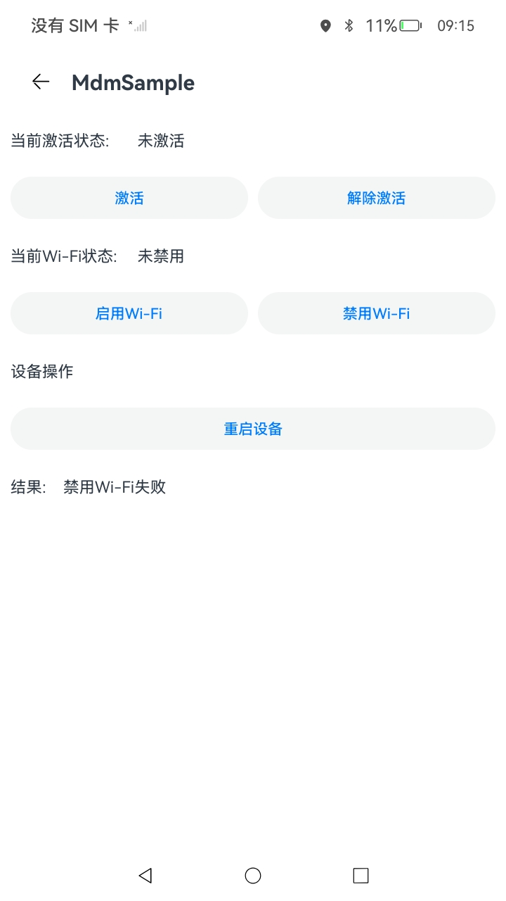
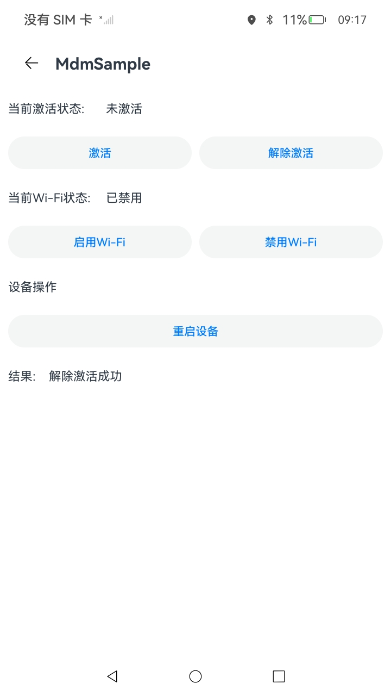
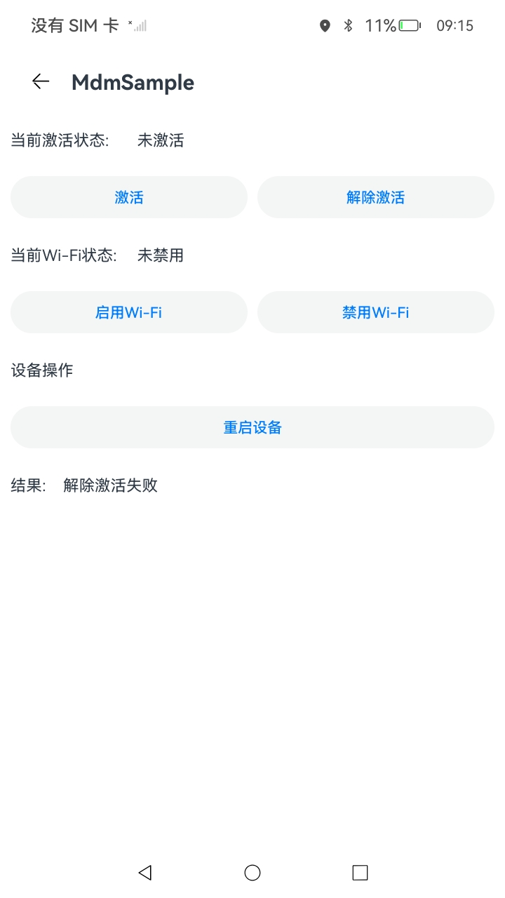

# EnterpriseAdminExtensionAbility的创建与使用（仅对系统应用开放）

### 介绍

企业设备管理扩展能力，是MDM应用必备组件。当开发者为企业开发MDM（Mobile Device Management）应用时，需继承EnterpriseAdminExtensionAbility，在EnterpriseAdminExtensionAbility实例中实现MDM业务逻辑，EnterpriseAdminExtensionAbility实现了系统管理状态变化通知功能。本示例依照开发指南[MDM Kit（企业设备管理）](https://gitee.com/openharmony/docs/blob/master/zh-cn/application-dev/mdm/Readme-CN.md)进行编写。本示例涉及使用接口：@ohos.enterprise.adminManager中的[disableAdmin](https://developer.huawei.com/consumer/cn/doc/harmonyos-references/js-apis-enterprise-adminmanager#adminmanagerdisableadmin)接口，@ohos.enterprise.restrictions中的[setDisallowedPolicy](https://developer.huawei.com/consumer/cn/doc/harmonyos-references/js-apis-enterprise-restrictions#restrictionssetdisallowedpolicy)、[getDisallowedPolicy](https://developer.huawei.com/consumer/cn/doc/harmonyos-references/js-apis-enterprise-restrictions#restrictionsgetdisallowedpolicy)接口，以及@ohos.enterprise.deviceControl中的[operateDevice](https://developer.huawei.com/consumer/cn/doc/harmonyos-references/js-apis-enterprise-devicecontrol#devicecontroloperatedevice)接口。

### 效果预览

| 禁用Wi-Fi成功                                          | 禁用Wi-Fi失败                                           | 解除激活成功                                           | 解除激活失败                                            |
| ------------------------------------------------------ | ------------------------------------------------------- | ------------------------------------------------------ | ------------------------------------------------------- |
|  |  |  |  |

使用说明

1. 安装完成后，进行调试时，需要使用命令激活企业设备管理拓展能力。

2. 激活：hdc shell edm enable-admin -n 包名 -a 企业设备管理扩展能力类名，如本应用hdc shell edm enable-admin -n com.example.mdmsample -a EnterpriseAdminAbility。

3. 解除激活：hdc shell edm disable-admin -n 包名，如本应用hdc shell edm disable-admin -n com.example.mdmsample。

4. 点击“功能入口”进入功能示例页面。在激活状态下，点击按钮可调用对应的接口。例如：点击“禁用Wi-Fi”可禁用Wi-Fi功能。


### 工程目录
```
entry/src/main/ets/
|---common
|   |---Logger.ts                     // 日志工具
|---enterpriseadminability
|   |---EnterpriseAdminAbility.ets    // 数据类型
|---entryability
|   |---EntryAbility.ets              // 程序入口
|---pages
|   |---component                     // 自定义组件目录
|       |---headComponent.ets         // 自定义AtionBar
|       |---normalButtonComponent.ets // 自定义通用Button
|   |---mainPage.ets                  // 主页
|---utils
|   |---CommonEventManagerHelper.ets  // 事件管理
|   |---CommonEventValue.ets          // 事件定义
|   |---DataPreferencesHelper.ets     // 数据工具
```
### 具体实现

* 该示例通过EnterpriseAdminExtensionAbility实现了禁用/启用设备Wi-Fi功能和设备重启功能。adminManager中的disableAdmin方法用于根据bundleName将企业设备管理拓展能力解除激活。deviceControl中的operateDevice可以根据传入的operate参数值（在本示例中为reboot）来控制设备。restrictions中的setDisallowedPolicy可以根据传入的feature参数值（在本示例中为wifi）来配置通用限制类策略。
  各个接口的调用均在EnterpriseAdminExtensionAbility中完成，EnterpriseAdminExtensionAbility和UIAbility之间采用CES（Common Event Service，公共事件服务）订阅事件的方式进行通信。
* 接口参考：[@ohos.enterprise.EnterpriseAdminExtensionAbility](https://gitee.com/openharmony/docs/blob/master/zh-cn/application-dev/reference/apis-mdm-kit/js-apis-EnterpriseAdminExtensionAbility.md)，[@ohos.enterprise.adminManager](https://gitee.com/openharmony/docs/blob/master/zh-cn/application-dev/reference/apis-mdm-kit/js-apis-enterprise-adminManager.md)，[@ohos.app.ability.Want](https://gitee.com/openharmony/docs/blob/master/zh-cn/application-dev/reference/apis-ability-kit/js-apis-app-ability-want.md)，[@ohos.enterprise.deviceControl](https://gitee.com/openharmony/docs/blob/master/zh-cn/application-dev/reference/apis-mdm-kit/js-apis-enterprise-deviceControl.md)，[@ohos.enterprise.restrictions](https://gitee.com/openharmony/docs/blob/master/zh-cn/application-dev/reference/apis-mdm-kit/js-apis-enterprise-restrictions.md)

### 相关权限

1. 允许应用激活设备管理员应用权限：ohos.permission.MANAGE_ENTERPRISE_DEVICE_ADMIN

2. 允许设备管理应用管理限制策略权限：ohos.permission.ENTERPRISE_MANAGE_RESTRICTIONS

3. 允许设备管理应用操作设备权限：ohos.permission.ENTERPRISE_OPERATE_DEVICE

### 依赖

不涉及。

### 约束与限制

1. 本示例已适配API version 18版本SDK，版本号：5.1.0.59。

2. 本示例需要使用DevEco Studio 5.1.0 Canary1 (Build Version: 5.1.0.230 构建 2025年1月10日)及以上版本才可编译运行。

### 下载

如需单独下载本工程，执行如下命令：
```
git init
git config core.sparsecheckout true
echo code/DocsSample/EnterpriseAdminExtensionAbility/EnterpriseAdminExtensionAbility/ > .git/info/sparse-checkout
git remote add origin https://gitee.com/openharmony/applications_app_samples.git
git pull origin master
```
