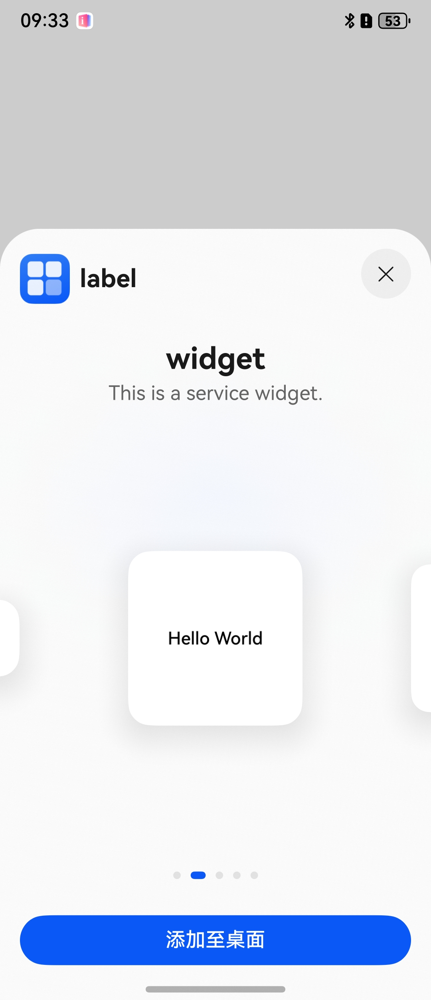
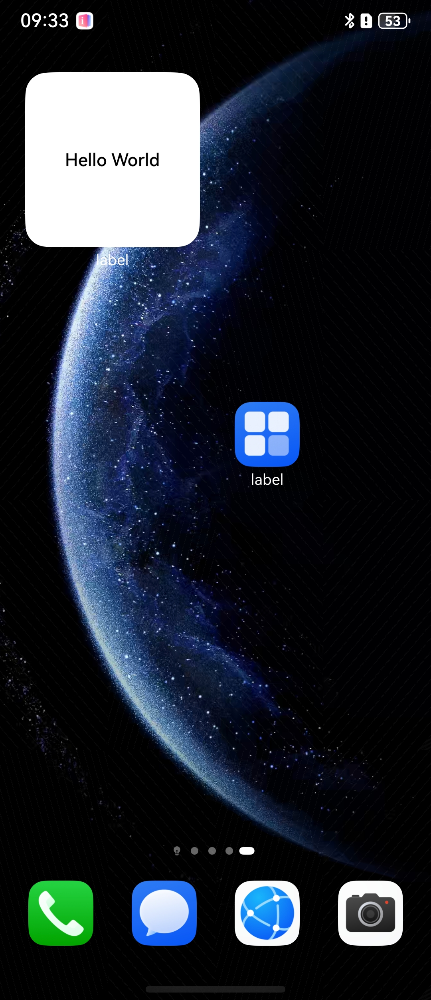

# 应用内拉起卡片管理加桌

### 介绍
卡片开发服务支持将应用的ArkTS卡片添加到桌面。

### 效果预览

| 应用内拉起卡片管理按钮                         |   添加卡片到桌面按钮                    | 添加卡片到桌面                    |
|----------------------------|------------------------------------|------------------------------------|
|  |  |  |

### 工程目录

```
entry/src/main/ets/                 
|---entryability
|   └---EntryAbility.ets
|---entryformability
|   └---EntryFormAbility.ets                       
└---pages
    └---Index.ets                      // 代码实现
└---widget
    └---pages
        └---WidgetCard.ets
```


### 具体实现 
桌面提供统一的卡片管理页面。应用通过[formProvider](https://gitcode.com/openharmony/docs/blob/master/zh-cn/application-dev/reference/apis-form-kit/js-apis-app-form-formProvider.md)模块提供的[openFormManager](https://gitcode.com/openharmony/docs/blob/master/zh-cn/application-dev/reference/apis-form-kit/js-apis-app-form-formProvider.md#formprovideropenformmanager18)接口，能够拉起卡片管理页面，触发卡片添加至桌面操作，点击“添加至桌面”，实现卡片添加至桌面的功能。


### 相关权限

不涉及。

### 依赖

不涉及。

### 约束与限制

1.本示例为Stage模型，支持API19版本SDK，SDK版本号（API Version 19 Release）。

### 下载

```shell
git init
git config core.sparsecheckout true
echo code/DocsSample/Form/AddFormFromApp/ > .git/info/sparse-checkout
git remote add origin https://gitcode.com/openharmony/applications_app_samples.git
git pull origin master
```