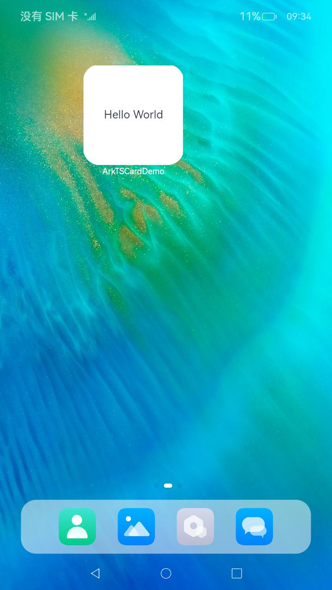
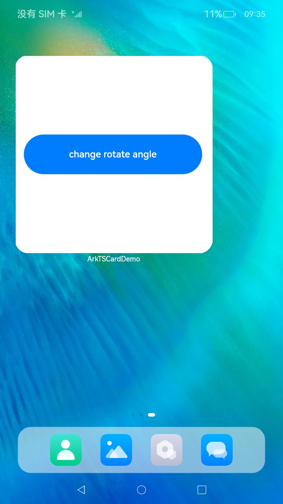

# 服务卡片开发指导：开发卡片页面 

### 介绍

此Sample为开发指南中**服务卡片开发指导（Stage模型）**章节中**开发卡片页面**三小节示例代码的完整工程。

[卡片页面能力说明](https://gitee.com/openharmony/docs/blob/master/zh-cn/application-dev/application-models/arkts-ui-widget-page-overview.md)
[卡片使用动效能力](https://gitee.com/openharmony/docs/blob/master/zh-cn/application-dev/application-models/arkts-ui-widget-page-animation.md)
[卡片使用自定义绘制能力](https://gitee.com/openharmony/docs/blob/master/zh-cn/application-dev/application-models/arkts-ui-widget-page-custom-drawing.md)

### 效果预览
|默认卡片|动效卡片|自定义绘制卡片|
|--------------------------------|--------------------------------|--------------------------------|
||||

使用说明：

1.长按ArkTSCardDemo应用图标，弹出菜单后点击**服务卡片**选项进入卡片预览界面。

2.卡片预览界面默认显示第一张默认卡片(helloworld卡片)，向右滑动可以看到第二张(动效卡片)和第三张(自定义绘制)卡片。

3.点击下方**添加到桌面**按钮即可以将卡片添加到桌面。


### 工程目录
```shell
├── AppScope
│   ├── app.json5
│   └── resources
│       └── base
│           ├── element
│           │   └── string.json
│           └── media
│               └── app_icon.png
├── README_zh.md
├── build-profile.json5
├── entry
│   ├── build-profile.json5
│   ├── hvigorfile.ts
│   ├── oh-package.json5
│   └── src
│       ├── main
│       │   ├── ets
│       │   │   ├── entryability
│       │   │   │   └── EntryAbility.ts
│       │   │   ├── entryformability
│       │   │   │   └── EntryFormAbility.ts
│       │   │   ├── pages
│       │   │   │   └── Index.ets
│       │   │   └── widget
│       │   │       └── pages
│       │   │           ├── AnimationCard.ets // 动效卡片
│       │   │           ├── CanvasCard.ets    // 自定义绘制卡片
│       │   │           └── WidgetCard.ets    // 默认Helloworld卡片
│       │   ├── module.json5
│       │   └── resources
│       │       ├── base
│       │       │   ├── element
│       │       │   │   ├── color.json
│       │       │   │   ├── float.json
│       │       │   │   └── string.json
│       │       │   ├── media
│       │       │   │   └── icon.png
│       │       │   └── profile
│       │       │       ├── form_config.json
│       │       │       └── main_pages.json
│       │       ├── en_US
│       │       │   └── element
│       │       │       └── string.json
│       │       ├── rawfile
│       │       └── zh_CN
│       │           └── element
│       │               └── string.json
│       └── ohosTest
│           ├── ets
│           │   ├── test
│           │   │   ├── Index.test.ets     // UI自动化用例
│           │   │   └── List.test.ets
│           │   ├── testability
│           │   │   ├── TestAbility.ets
│           │   │   └── pages
│           │   │       └── Index.ets
│           │   └── testrunner
│           │       └── OpenHarmonyTestRunner.ts
│           ├── module.json5
│           └── resources
│               └── base
│                   ├── element
│                   │   ├── color.json
│                   │   └── string.json
│                   ├── media
│                   │   └── icon.png
│                   └── profile
│                       └── test_pages.json
├── hvigor
│   ├── hvigor-config.json5
│   └── hvigor-wrapper.js
├── hvigorfile.ts
├── hvigorw
├── hvigorw.bat
├── oh-package.json5
├── ohosTest.md
└── screenshots
    └── device
        ├── FormAnimation.jpeg     // 动效卡片效果图
        ├── FormCanvas.jpeg        // 自定义绘制卡片效果图
        └── FormHelloWorld.jpeg    // 默认Helloworld卡片效果图
```

### 具体实现

可参考服务卡片开发指南如下三个章节：

[卡片页面能力说明](https://gitee.com/openharmony/docs/blob/master/zh-cn/application-dev/application-models/arkts-ui-widget-page-overview.md)

[卡片使用动效能力](https://gitee.com/openharmony/docs/blob/master/zh-cn/application-dev/application-models/arkts-ui-widget-page-animation.md)

[卡片使用自定义绘制能力](https://gitee.com/openharmony/docs/blob/master/zh-cn/application-dev/application-models/arkts-ui-widget-page-custom-drawing.md)

### 相关权限

不涉及。

### 依赖

不涉及。

### 约束与限制

1.本示例仅支持标准系统上运行。

2.本示例支持API10版本SDK，SDK版本号(API Version 10 Release),镜像版本号(4.0Release)。

3.本示例需要使用DevEco Studio 版本号(4.0Release)及以上版本才可编译运行。

### 下载

如需单独下载本工程，执行如下命令：

```shell
git init
git config core.sparsecheckout true
echo code/DocsSample/Form/ArkTSCardDocsSample/ > .git/info/sparse-checkout
git remote add origin https://gitee.com/openharmony/applications_app_samples.git
git pull origin master
```
