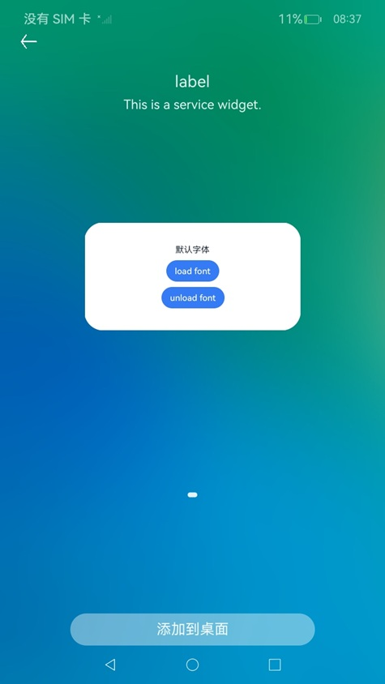

# 服务卡片开发指导：开发卡片使用自定义字体

### 介绍

此Sample为卡片使用自定义字体开发指南。

### 效果预览
|加卡|默认字体|自定义字体|
|--------------------------------|--------------------------------|--------------------------------|
||||

使用说明：

1.长按ArkTSCardDemo应用图标，弹出菜单后点击**服务卡片**选项进入卡片预览界面。

2.卡片预览界面默认显示第一张默认卡片，点击下方**添加到桌面**按钮即可以将卡片添加到桌面。

3.点击卡片中的`load font`按钮，卡片显示自定义字体。然后点击卡片中的`unload font`按钮，卡片显示默认字体。


### 工程目录
```shell
├── AppScope
│   ├── app.json5
│   └── resources
│       └── base
│           ├── element
│           │   └── string.json
│           └── media
│               └── background.png
│               └── foreground.png
│               └── layered_image.json
├── README_zh.md
├── build-profile.json5
├── entry
│   ├── build-profile.json5
│   ├── hvigorfile.ts
│   ├── oh-package.json5
│   └── src
│       ├── main
│       │   ├── ets
│       │   │   ├── entryability
│       │   │   │   └── EntryAbility.ts
│       │   │   ├── entryformability
│       │   │   │   └── EntryFormAbility.ts
│       │   │   ├── pages
│       │   │   │   └── Index.ets
│       │   │   └── widget
│       │   │       └── pages
│       │   │           └── WidgetCard.ets    // 自定义字体卡片
│       │   ├── module.json5
│       │   └── resources
│       │       ├── base
│       │       │   ├── element
│       │       │   │   ├── color.json
│       │       │   │   ├── float.json
│       │       │   │   └── string.json
│       │       │   ├── media
│       │       │   │   └── background.png
│       │       │   │   └── foreground.png
│       │       │   │   └── startIcon.png
│       │       │   │   └── layered_image.json
│       │       │   └── profile
│       │       │       ├── backup_config.json
│       │       │       ├── form_config.json
│       │       │       └── main_pages.json
│       │       ├── rawfile
│       │       │   └── xxx.ttf
│       └── ohosTest
│           ├── ets
│           │   ├── test
│           │   │   ├── Ability.test.ets
│           │   │   └── List.test.ets
│           ├── module.json5
│           └── resources
│               └── base
│                   ├── element
│                   │   ├── color.json
│                   │   └── string.json
│                   ├── media
│                   │   └── icon.png
│                   └── profile
│                       └── test_pages.json
├── hvigor
│   ├── hvigor-config.json5
│   └── hvigor-wrapper.js
├── hvigorfile.ts
├── hvigorw
├── hvigorw.bat
├── oh-package.json5
├── ohosTest.md
└── screenshots
    └── device
        ├── addcard.jpg
        ├── defaultfont.jpg
        └── customfont.jpg
```

### 具体实现

可参考服务卡片使用自定义字体开发指南：

[ArkTS卡片使用自定义字体](https://gitcode.com/openharmony/docs/blob/master/zh-cn/application-dev/form/arkts-ui-widget-load-custom-font.md)

### 相关权限

不涉及。

### 依赖

不涉及。

### 约束与限制

1.  本示例支持标准系统上运行，支持设备：RK3568；

2.  本示例支持API22版本SDK，版本号：6.0.2.129；

3.  本示例已支持使DevEco Studio 6.0.2 Release (构建版本：6.0.2.636，构建 2025年11月31日)编译运行；

4.  高等级APL特殊签名说明：无；

### 下载

如需单独下载本工程，执行如下命令：

```shell
git init
git config core.sparsecheckout true
echo code/DocsSample/Form/CustomFontWidgetCards/ > .git/info/sparse-checkout
git remote add origin https://gitee.com/openharmony/applications_app_samples.git
git pull origin master
```
