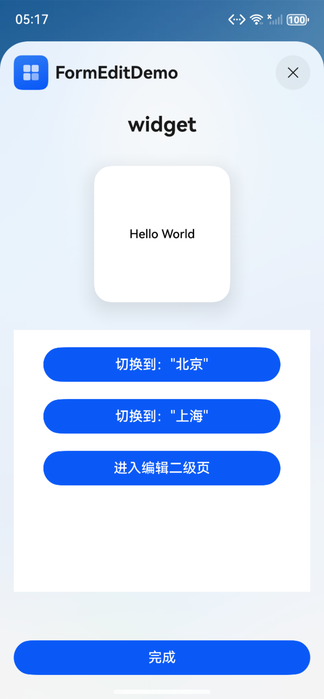

# 卡片编辑开发指导

### 介绍

ArkTS卡片提供卡片页面编辑能力，支持实现用户自定义卡片内容的功能，例如：编辑联系人卡片、修改卡片中展示的联系人、编辑天气卡片等。

桌面提供统一的卡片编辑页，卡片提供方使用卡片框架提供的[FormEditExtensionAbility](https://gitcode.com/openharmony/docs/blob/master/zh-cn/application-dev/reference/apis-form-kit/js-apis-app-form-formEditExtensionAbility.md)开发卡片编辑功能。
通过FormEditExtensionAbility组件的上下文[FormEditExtensionContext](https://gitcode.com/openharmony/docs/blob/master/zh-cn/application-dev/reference/apis-form-kit/js-apis-inner-application-formEditExtensionContext.md)提供的[startSecondPage](https://gitcode.com/openharmony/docs/blob/master/zh-cn/application-dev/reference/apis-form-kit/js-apis-inner-application-formEditExtensionContext.md#startsecondpage)方法，将卡片提供方的二级编辑页信息传递给桌面，桌面将二级编辑页拉起后即可进行页面内容编辑。

### 效果预览

| 长按编辑                                      | 一级编辑页                            | 修改后                                           | 二级编辑页                                   | 最终效果       |
|-------------------------------------------|-----------------------------------|-----------------------------------------------|-----------------------------------------|------------|
|  |  |  |  |  |

使用说明

1. 用户在桌面（卡片使用方）上长按卡片，在弹出的菜单栏中点击编辑；

2. 卡片使用方识别到卡片提供方继承[FormEditExtensionAbility](https://gitcode.com/openharmony/docs/blob/master/zh-cn/application-dev/reference/apis-form-kit/js-apis-app-form-formEditExtensionAbility.md)后，拉起卡片提供方的一级编辑页；

3. 在一级编辑页中便可直接自定义编辑卡片内容；

4. 卡片提供方亦可在[FormEditExtensionAbility](https://gitcode.com/openharmony/docs/blob/master/zh-cn/application-dev/reference/apis-form-kit/js-apis-app-form-formEditExtensionAbility.md)被拉起后，在回调方法[onSessionCreate](https://gitcode.com/openharmony/docs/blob/master/zh-cn/application-dev/reference/apis-ability-kit/js-apis-app-ability-uiExtensionAbility.md#onsessioncreate)中直接调用[FormEditExtensionContext](https://gitcode.com/openharmony/docs/blob/master/zh-cn/application-dev/reference/apis-form-kit/js-apis-inner-application-formEditExtensionContext.md)上下文的[startSecondPage](https://gitcode.com/openharmony/docs/blob/master/zh-cn/application-dev/reference/apis-form-kit/js-apis-inner-application-formEditExtensionContext.md#startsecondpage)方法；

5. 卡片使用方在接收到卡片提供方二级页面信息后，拉起二级页面，即可进行页面内容编辑。

### 工程目录

给出项目中关键的目录结构并描述它们的作用，示例如下：

```
entry/src/main/ets/
|---entryability
|   |---EntryAbility.ets                   // 主进程UIAbility
|---entryformability
|   |---EntryFormAbility.ets               // 卡片进程Ability
|---entryformeditability
|   |---EntryFormEditAbility.ets           // 卡片一级编辑页Ability
|   |---FormEditSecPageAbility.ets         // 卡片二级编辑页Ability
|---model
|   |---ExtensionEvent.ets                 // 二级编辑页跳转控制类
|---pages
|   |---FormEditExtension.ets              // 卡片一级编辑页页面
|   |---FormEditSecPage.ets                // 卡片二级编辑页页面
|   |---index.ets                          // 卡片提供方主应用首页
|---widget
|   |---pages
|   |   |---WidgetCard.ets                 // 卡片页
|---mock                                   // 本地模拟数据
```

### 具体实现

* 卡片编辑能力通过[FormEditExtensionAbility](https://gitcode.com/openharmony/docs/blob/master/zh-cn/application-dev/reference/apis-form-kit/js-apis-app-form-formEditExtensionAbility.md)实现，可参考[卡片编辑开发指导](https://gitcode.com/openharmony/docs/blob/master/zh-cn/application-dev/form/arkts-ui-widget-event-formeditextensionability.md)
  * 创建继承[FormEditExtensionAbility](https://gitcode.com/openharmony/docs/blob/master/zh-cn/application-dev/reference/apis-form-kit/js-apis-app-form-formEditExtensionAbility.md)的EntryFormEditAbility类，参考[EntryFormEditAbility.ets](entry%2Fsrc%2Fmain%2Fets%2Fentryformeditability%2FEntryFormEditAbility.ets)；
  * 在EntryFormEditAbility的[onSessionCreate](https://gitcode.com/openharmony/docs/blob/master/zh-cn/application-dev/reference/apis-ability-kit/js-apis-app-ability-uiExtensionAbility.md#onsessioncreate)回调方法中创建ExtensionEvent对象，通过此对象注册二级编辑页的跳转接口，参考[ExtensionEvent.ets](entry%2Fsrc%2Fmain%2Fets%2Fmodel%2FExtensionEvent.ets)；
  * 给ExtensionEvent对象注册的接口中获取EntryFormEditAbility的[FormEditExtensionContext](https://gitcode.com/openharmony/docs/blob/master/zh-cn/application-dev/reference/apis-form-kit/js-apis-inner-application-formEditExtensionContext.md)上下文，并调用上下文的[startSecondPage](https://gitcode.com/openharmony/docs/blob/master/zh-cn/application-dev/reference/apis-form-kit/js-apis-inner-application-formEditExtensionContext.md#startsecondpage)方法实现卡片二级编辑页的跳转，参考[EntryFormEditAbility.ets](entry%2Fsrc%2Fmain%2Fets%2Fentryformeditability%2FEntryFormEditAbility.ets)；
  * 在一级编辑页中可通过[formProvider](https://gitcode.com/openharmony/docs/blob/master/zh-cn/application-dev/reference/apis-form-kit/js-apis-app-form-formProvider.md)的[updateform](https://gitcode.com/openharmony/docs/blob/master/zh-cn/application-dev/reference/apis-form-kit/js-apis-app-form-formProvider.md#formproviderupdateform-1)更新卡片，参考[FormEditExtension.ets](entry%2Fsrc%2Fmain%2Fets%2Fpages%2FFormEditExtension.ets)；
  * 也可跳转到二级编辑页对卡片编辑。

### 相关权限

不涉及。

### 依赖

不涉及。

### 约束与限制

1. 本示例是否支持取决于卡片使用方的实现；
2. 本示例为Stage模型，支持API18版本及以上SDK，SDK版本号(API Version 18 Release),镜像版本号(5.1Release)；
3. 本示例需要使用DevEco Studio 版本号(5.1Release)版本才可编译运行；
4. 本示例不涉及系统接口。

### 下载

如需单独下载本工程，执行如下命令：

```
git init
git config core.sparsecheckout true
echo code\DocsSample\Form\FormEditDemo > .git/info/sparse-checkout
git remote add origin https://gitcode.com/openharmony/applications_app_samples.git
git pull origin master
```