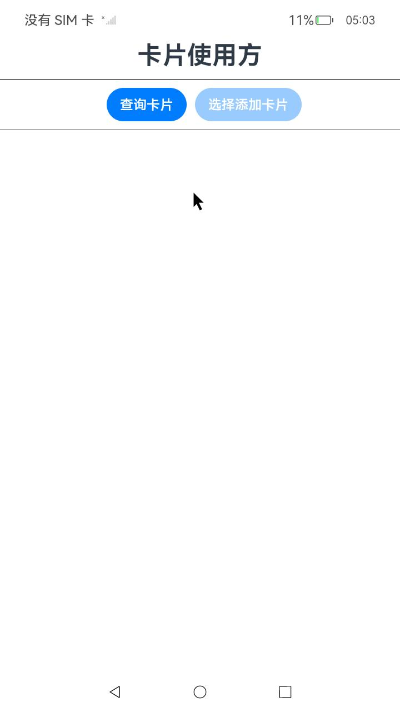
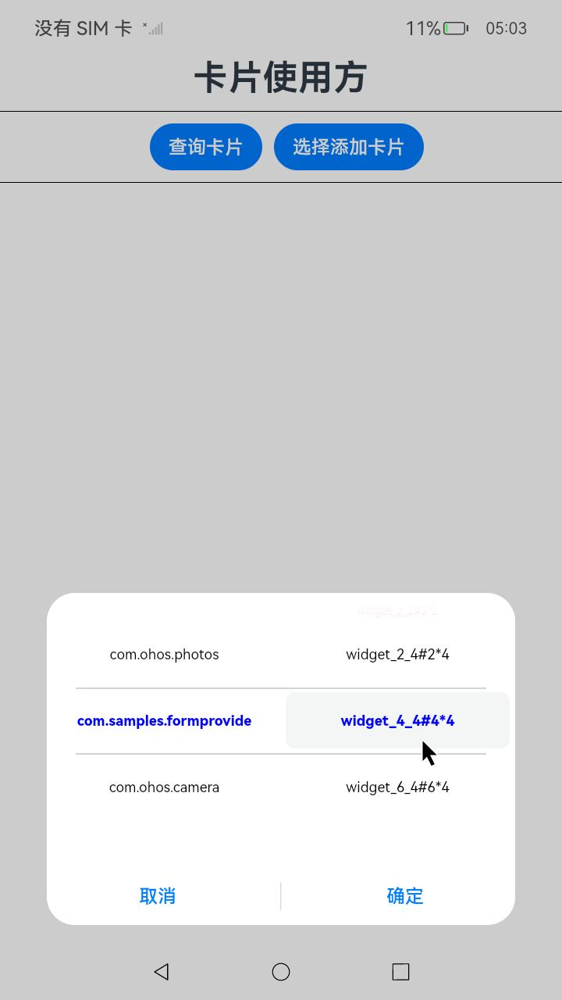
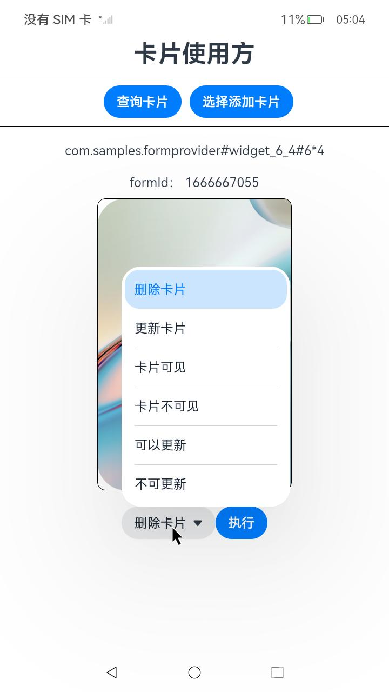
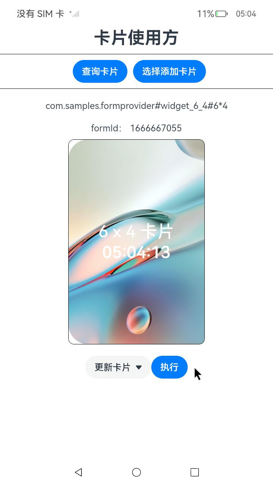

# 卡片使用方

## 介绍

本示例展示了一个卡片使用方应用，实现了以下几点功能：

1.查询所有卡片信息，并选择显示某一张卡片。

2.监听所有应用安装、卸载、升级事件，监听的回调为重新获取所有卡片信息。

3.提供了卡片的更新、删除等功能。

## 相关概念

卡片使用方：显示卡片内容的宿主应用，控制卡片在宿主中展示的位置，当前仅系统应用可以作为卡片使用方。

卡片管理服务：用于管理系统中所添加卡片的常驻代理服务，提供formProvider和formHost的接口能力，同时提供卡片对象的管理与使用以及卡片周期性刷新等能力。

## 效果预览

| 卡片使用方 | 选择添加卡片 | formHost接口 | 更新展示 |
|--------|--------------|---------------|-----|
| |  |  |  |

## 使用说明

1. 点击查询卡片按钮，将查询所有卡片信息显示到选择添加卡片列表中；点击选择添加卡片，会弹出可选卡片列表；在选择框选择一张卡片点击确定，将卡片添加到界面上。

2. 添加卡片后，在卡片下方的选择列表可以对当前卡片进行操作。
   删除卡片：删除当前卡片。
   更新卡片：请求卡片更新。
   卡片可见：向卡片框架发送通知以使指定的卡片可见。
   卡片不可见：向卡片框架发送通知以使指定的卡片不可见。
   不可更新：向卡片框架发送通知以使当前的卡片不可以更新。
   可以更新：向卡片框架发送通知以使当前的卡片可以更新。

> **注意事项：**
>
> 1. 卡片的可见和不可见选项，并不是界面上的可见与否，而是卡片使用方设定的属性，在本示例中可以通过formObserver.on接口的回调日志中来确定是否改变了可见属性。
> 2. 添加下一张卡片时，需要删除当前卡片才可添加成功。

## 工程目录

```
entry/src/main/ets/
├── entryability
│   └── EntryAbility.ets
└── pages
    └── Index.ets             //卡片使用方页面

```

## 具体实现

* 卡片组件
  * 使用卡片组件FormComponent （系统能力：SystemCapability.ArkUI.ArkUI.Full），展示卡片提供方提供的卡片内容。
  * 源码参考：[Index.ets](./entry/src/main/ets/pages/Index.ets)
  * 参考：[FromComponent组件](https://gitee.com/openharmony/docs/blob/master/zh-cn/application-dev/reference/apis-arkui/arkui-ts/ts-basic-components-formcomponent-sys.md)

* formHost接口
  * 使用formHost接口（系统能力：SystemCapability.Ability.Form），对使用方同一用户下安装的卡片进行删除、更新、获取卡片信息、状态等操作。
  * 源码参考：[Index.ets](./entry/src/main/ets/pages/Index.ets)
  * 接口参考：[@ohos.app.form.formHost](https://gitee.com/openharmony/docs/blob/master/zh-cn/application-dev/reference/apis-form-kit/js-apis-app-form-formHost-sys.md)
  
* 应用事件监听
  * 使用bundle模块的bundleMonitor.on监听到应用的安装，卸载，更新（系统能力：SystemCapability.BundleManager.BundleFramework.Core），应用的安装、卸载、更新时重新获取全部卡片信息。
  * 源码参考：[Index.ets](./entry/src/main/ets/pages/Index.ets)
  * 接口参考：[@ohos.bundle.bundleMonitor](https://gitee.com/openharmony/docs/blob/master/zh-cn/application-dev/reference/apis-ability-kit/js-apis-bundleMonitor-sys.md)
  
## 依赖

卡片提供方 [FormProvider](../FormProvider/)

## 相关权限

| 权限名                                     | 权限说明                                         | 级别         |
| ------------------------------------------ | ------------------------------------------------ | ------------ |
| [ohos.permission.GET_BUNDLE_INFO_PRIVILEGED](https://docs.openharmony.cn/pages/v4.0/zh-cn/application-dev/security/permission-list.md#ohospermissiongetbundleinfoprivileged) | 允许应用查询其他应用的信息。                     | system_basic |
| [ohos.permission.LISTEN_BUNDLE_CHANGE](https://docs.openharmony.cn/pages/v4.0/zh-cn/application-dev/security/permission-list.md#ohospermissionlistenbundlechange)      | 允许应用监听其他应用安装、更新、卸载状态的变化。 | system_basic |
| [ohos.permission.REQUIRE_FORM](https://docs.openharmony.cn/pages/v4.0/zh-cn/application-dev/security/permission-list.md#ohospermissionrequireform)               | 允许应用获取Ability Form。                       | system_basic |
| [ohos.permission.OBSERVE_FORM_RUNNING](https://docs.openharmony.cn/pages/v4.0/zh-cn/application-dev/security/permission-list.md#ohospermissionobserveformrunning)       | 允许应用监听卡片运行状态                      | system_basic |

## 约束与限制

1.本示例仅支持标准系统上运行，支持设备：RK3568。

2.本示例为Stage模型，支持API12版本SDK，SDK版本号(API Version 12 Release),镜像版本号(5.0.0.20)。

3.本示例需要使用DevEco Studio 版本号(4.1.3.500)及以上版本才可编译运行。

4.本示例需要使用系统权限的系统接口，需要使用Full SDK编译。使用Full SDK时需要手动从镜像站点获取，并在DevEco Studio中替换，具体操作可参考[替换指南](https://docs.openharmony.cn/pages/v4.1/zh-cn/application-dev/faqs/full-sdk-switch-guide.md)。

5.本示例所配置的权限均为system_basic或system_core级别(相关权限级别可通过[权限定义列表](https://docs.openharmony.cn/pages/v4.1/zh-cn/application-dev/security/AccessToken/permissions-for-system-apps.md)查看)，需要手动配置对应级别的权限签名(具体操作可查看[自动化签名方案]( https://developer.huawei.com/consumer/cn/doc/harmonyos-guides-V2/signing-0000001587684945-V2))。

6.本示例类型为系统应用，需要手动配置对应级别的应用类型("app-feature": "hos_system_app")。具体可参考profile配置文件[bundle-info对象内部结构]( https://gitee.com/openharmony/docs/blob/eb73c9e9dcdd421131f33bb8ed6ddc030881d06f/zh-cn/application-dev/security/app-provision-structure.md#bundle-info%E5%AF%B9%E8%B1%A1%E5%86%85%E9%83%A8%E7%BB%93%E6%9E%84 )

## 下载

如需单独下载本工程，执行如下命令：

```git
git init
git config core.sparsecheckout true
echo code/DocsSample/Form/FormHost/ > .git/info/sparse-checkout
git remote add origin https://gitee.com/openharmony/applications_app_samples.git
git pull origin master
```
