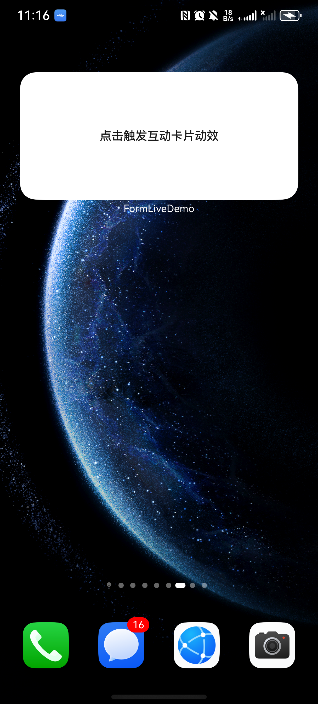
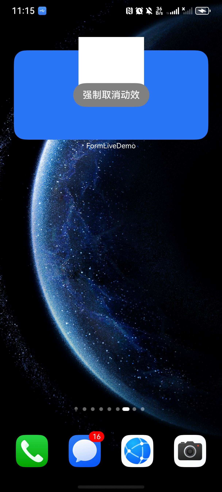
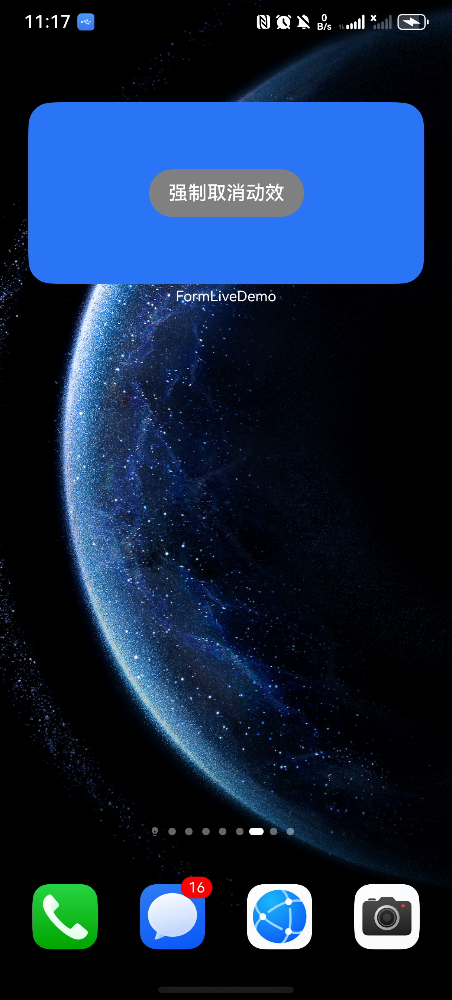

# 场景动效类型互动卡片开发指导

### 介绍

场景动效类型互动卡片支持在特定场景下触发互动卡片的特有效果。例如，开发者可以选择将动效渲染区域扩展到卡片自身的渲染区域之外，营造“破框”效果。

场景动效类型互动卡片主要包含两个状态：激活态和非激活态。卡片生命周期中的事件，如数据定时或定点刷新、用户点击等交互场景，可触发卡片动效，使卡片切换至激活态。动效结束后，卡片切回非激活态。

非激活态：在此状态下，卡片与普通卡片行为无异，遵循既有的卡片开发规范，卡片UI由卡片提供方widgetCard.ets中的内容所承载。

激活态： 表示互动卡片动效渲染状态，在此状态下，卡片UI由卡片提供方所开发的LiveFormExtensionAbility对应page页面完成渲染。详细可参考场景动效类型互动卡片开发指导。

### 效果预览

| 卡片非激活态                        | 卡片互动特效                            | 卡片打断特效按钮                                      |
|-------------------------------|-----------------------------------|-----------------------------------------------|
|  |  |  |

使用说明

1. 用户在桌面（卡片使用方）上点击卡片；

2. [EntryFormEditAbility.ets](entry%2Fsrc%2Fmain%2Fets%2Fentryformeditability%2FEntryFormEditAbility.ets)中调用formProvider.requestOverflow接口发起互动卡片动效申请，调用时需要明确：（1）动效申请范围。（2）动效持续时间。（3）是否使用系统提供的默认切换动效。

3. 卡片使用方识别到卡片提供方继承[LiveFormExtensionAbility](https://gitcode.com/openharmony/docs/blob/master/zh-cn/application-dev/reference/apis-form-kit/js-apis-app-form-LiveFormExtensionAbility.md)方法，加载互动卡片页面；

4. 在实现互动卡片页面显示时执行动效或者点击按钮强制取消动效；

5. 点击按钮，将调用 formProvider.cancelOverflow 接口，打断当前破框动效，卡片切换为非激活态。

### 工程目录

给出项目中关键的目录结构并描述它们的作用，示例如下：

```
entry/src/main/ets/
|---common
|   |---Constants.ets                      // 互动卡片动效工具函数实现
|---entryability
|   |---EntryAbility.ets                   // 主进程UIAbility
|---entryformability
|   |---EntryFormAbility.ets               // 卡片进程Ability
|---myliveformextensionability
|   |---pages
|       |---MyLiveFormPage.ets             // 实现互动卡片页面
|   |---MyLiveFormExtensionAbility.ets     // 创建互动卡片
|---pages
|   |---index.ets                          // 卡片提供方主应用首页
|---widget
|   |---pages
|   |   |---WidgetCard.ets                 // 卡片页
```

### 具体实现

* 卡片场景动效能力通过[LiveFormExtensionAbility](https://gitcode.com/openharmony/docs/blob/master/zh-cn/application-dev/reference/apis-form-kit/js-apis-app-form-LiveFormExtensionAbility.md)实现，可参考[场景动效类型互动卡片开发指导](https://gitcode.com/ouyanglihao/docs/blob/master/zh-cn/application-dev/form/arkts-ui-liveform-sceneanimation-development.md)
  * 创建继承[LiveFormExtensionAbility](https://gitcode.com/openharmony/docs/blob/master/zh-cn/application-dev/reference/apis-form-kit/js-apis-app-form-LiveFormExtensionAbility.md)的EntryFormEditAbility类，参考[EntryFormEditAbility.ets](entry%2Fsrc%2Fmain%2Fets%2Fentryformeditability%2FEntryFormEditAbility.ets)；
  * 在非激活态卡片页面实现点击卡片时，发起卡片动效请求；
  * 在EntryFormAbility中调用formProvider.requestOverflow接口触发动效，调用时需要明确：（1）动效申请范围。（2）动效持续时间。（3）是否使用系统提供的默认切换动效；
  * 在MyLiveFormExtensionAbility中通过session.loadContent加载互动页面；
  * 在激活态卡片页面实现执行动效的效果和按钮强制取消动效

### 相关权限

不涉及。

### 依赖

不涉及。

### 约束与限制

1. 本示例是否支持取决于卡片使用方的实现(由于桌面差异仅支持特定操作系统)；
2. 本示例为Stage模型，支持API20版本及以上SDK，SDK版本号(API Version 20 Release),镜像版本号(6.0Release)；
3. 本示例需要使用DevEco Studio 版本号(6.0.0Release)版本才可编译运行；
4. 本示例不涉及系统接口。

### 使用说明

场景动效功能仅手机真机支持。

### 下载

如需单独下载本工程，执行如下命令：

```
git init
git config core.sparsecheckout true
echo code\DocsSample\Form\FormLiveDemo > .git/info/sparse-checkout
git remote add origin https://gitcode.com/openharmony/applications_app_samples.git
git pull origin master
```