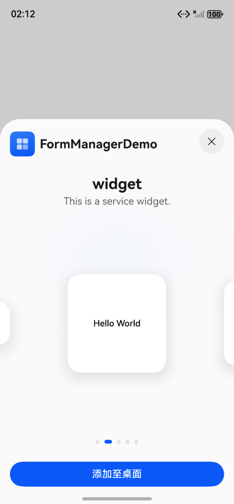

# 应用内拉起卡片管理加桌

### 介绍

本示例展示了在一个Stage模型中，开发基于ArkTS UI的应用内拉起卡片管理加桌指导。

应用通过openFormManager方法在应用内添加拉起卡片管理页面入口。

### 效果预览

| 在应用内点击"添加卡片到桌面"            | 在卡片管理页面，点击"添加至桌面"          | 返回桌面查看新添加的卡片               |
|----------------------------|----------------------------|----------------------------|
|  |  |  |

使用说明

1. 在应用内点击“添加卡片到桌面”按钮，拉起卡片管理页面；

2. 用户可在卡片管理页面，点击“添加至桌面”按钮，此时在桌面即可看到新添加的卡片；

### 工程目录

给出项目中关键的目录结构并描述它们的作用，示例如下：

```
entry/src/main/ets/
|---entryability
|   |---EntryAbility.ets                   // 主进程UIAbility
|---entryformability
|   |---EntryFormAbility.ets               // 卡片进程Ability
|---pages
|   |---Index.ets                          // 应用内添加拉起卡片管理页面入口页面
|---widget
|   |---pages
|   |   |---WidgetCard.ets                 // 卡片页
```

### 具体实现

* 应用内拉起卡片管理加桌能力通过[openFormManager](https://gitcode.com/openharmony/docs/blob/master/zh-cn/application-dev/reference/apis-form-kit/js-apis-app-form-formProvider.md#formprovideropenformmanager18)实现，可参考[应用内拉起卡片管理加桌](https://gitcode.com/openharmony/docs/blob/master/zh-cn/application-dev/form/arkts-ui-widget-open-formmanager.md)
  * 创建卡片，参考[创建卡片](https://gitcode.com/openharmony/docs/blob/master/zh-cn/application-dev/form/arkts-ui-widget-creation.md)；
  * 通过[openFormManager](https://gitcode.com/openharmony/docs/blob/master/zh-cn/application-dev/reference/apis-form-kit/js-apis-app-form-formProvider.md#formprovideropenformmanager18)方法在应用内添加拉起卡片管理页面入口,参考[Index.ets](entry%src%main%ets%pages%Index.ets)；


### 相关权限

不涉及。

### 依赖

不涉及。

### 约束与限制

1.  本示例支持标准系统上运行，支持设备：RK3568；

2. 本示例支持API20版本SDK，版本号：6.0.0.47；

3.  本示例已支持使DevEco Studio 6.0.0 Release (构建版本：6.0.0.858，构建 2025年10月21日)编译运行；

4. 高等级APL特殊签名说明：无；

### 下载

如需单独下载本工程，执行如下命令：

```
git init
git config core.sparsecheckout true
echo code\DocsSample\Form\FormManagerDemo > .git/info/sparse-checkout
git remote add origin https://gitcode.com/openharmony/applications_app_samples.git
git pull origin master
```