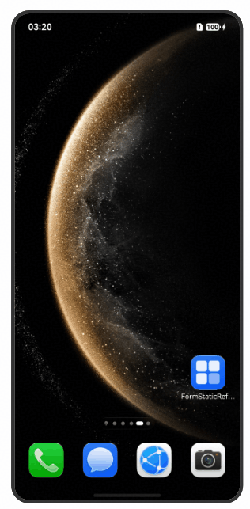
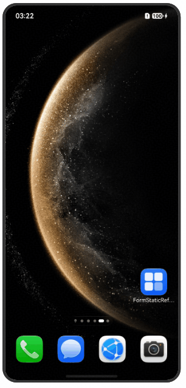
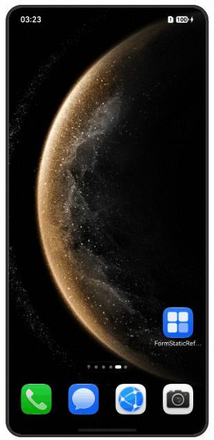

# ArkTS卡片主动刷新

## 相关概念

由于定时、定点刷新存在时间限制，卡片使用方可以通过调用[requestForm](https://gitcode.com/openharmony/docs/blob/master/zh-cn/application-dev/reference/apis-form-kit/js-apis-app-form-formHost-sys.md#requestform)接口向卡片管理服务请求主动触发卡片的刷新。
卡片管理服务触发卡片提供方FormExtensionAbility中的[onUpdateForm](https://gitcode.com/openharmony/docs/blob/master/zh-cn/application-dev/reference/apis-form-kit/js-apis-app-form-formExtensionAbility.md#formextensionabilityonupdateform)生命周期回调，回调中可以使用[updateForm](https://gitcode.com/openharmony/docs/blob/master/zh-cn/application-dev/reference/apis-form-kit/js-apis-app-form-formProvider.md#formproviderupdateform)接口刷新卡片内容。

## 效果预览

| 应用中更新卡片状态                                 | 更新formComponent内卡片状态                                    | 点击卡片更新按钮刷新状态                                    |
|-----------------------------------------|-------------------------------------------|-------------------------------------------|
|  |  |  |

## 使用说明

1. 长按应用图片，点击卡片，点击添加至桌面，完成两张卡片加卡。

2. 应用启动后切换到formProvier，点击reloadForms、reloadAllForms， 会通过formProvier提供的reloadForms、reloadAllForms仅支持系统应用使用）接口请求更新卡片，卡片管理服务会进而通知卡片提供方完成卡片更新。

3. 应用启动后切换到FormHost会通过FormComponent组件自动添加卡片，并且获取formId。

4. 点击更新卡片按钮，会通过formHost提供的requestForm（仅支持系统应用使用）接口请求更新卡片，卡片管理服务会进而通知卡片提供方完成卡片更新。

5. 长按应用图片，点击卡片，左滑选择第二张卡片，点击添加至桌面。

6. 点击update按钮，触发postCardAction()接口的message事件，由UpdateByMessageFormAbility的onFormEvent接口处理，通过formProvider提供的updateForm（仅支持系统应用使用）接口请求更新卡片，卡片管理服务会进而通知卡片提供方完成卡片更新。

### 工程结构&模块类型

   ```
   entry/src/main/ets/
|---entryformability
|   |---EntryFormAbility.ets
|---widget
|   |---pages
|   |   |---WidgetCard.ets                            // 卡片接收Update刷新
|   |   |---UpdateByMessageCard.ets                   // 卡片按钮点击刷新
|---pages
|   |---index.ets                                     // 首页
   ```

## 具体实现

* 卡片组件
  * 使用卡片组件FormComponent （系统能力：SystemCapability.ArkUI.ArkUI.Full），展示卡片提供方提供的卡片内容。
  * 源码参考：[Index.ets](./entry/src/main/ets/pages/Index.ets)
  * 参考：[FromComponent组件](https://gitcode.com/openharmony/docs/blob/master/zh-cn/application-dev/reference/apis-arkui/arkui-ts/ts-basic-components-formcomponent-sys.md)

* formHost接口
  * 使用formHost接口（系统能力：SystemCapability.Ability.Form），对使用方同一用户下安装的卡片进行删除、更新、获取卡片信息、状态等操作。
  * 源码参考：[Index.ets](./entry/src/main/ets/pages/Index.ets)
  * 接口参考：[@ohos.app.form.formHost](https://gitcode.com/openharmony/docs/blob/master/zh-cn/application-dev/reference/apis-form-kit/js-apis-app-form-formHost-sys.md)


## 依赖

卡片提供方 [FormProvider](../FormProvider/)

## 相关权限

| 权限名                                     | 权限说明                                         | 级别         |
| ------------------------------------------ | ------------------------------------------------ | ------------ |
| [ohos.permission.GET_BUNDLEILEGED](https://docs.openharmony.cn/pages/v4.0/zh-cn/application-dev/security/permission-list.md#ohospermissiongetbundleivileged) | 允许应用查询其他应用的包名、版本号、元数据等信息 | system_basic      |
| [ohosISTEN_BUNDLE_CHANGE](https://docs.openharmony.cn/pages/v4.0/zh-cn/application-dev/security/permission-list.md#ohoslistenbundlechange) | 允许应用监听其他应用安装、更新或卸载事件         | system_basic      |
| [ohos.permission.REQUIRE_FORMhttps://docs.openharmony.cn/pages/v4.0/zh-cn/application-dev/security/permission-list.md#ohospermissionrequireform) | 允应用创建Ability Form                         | system_basic |
| [ohos.permission.OBSERVE_FORM_RUNNING](https://docs.openharmony.cn/pages/v4.0zh/application-dev/security/permission-list.md#ohospermissionobserveformrunning) | 允许应用监听卡片的启动、停止等状态变化 |         system_basic |


### 依赖

无

### 约束与限制

1.  本示例仅支持标准系统上运行，支持设备：Phone;

2.  本示例支持API26版本SDK，版本号：26.0.0.25；

3.  本示例已支持使DevEco Studio 6.0.0 Release (构建版本：6.0.0，构建 2026年5月26日)编译运行；

### 下载

如需单独下载本工程，执行如下命令：

```
git init
git config core.sparsecheckout true
echo code/DocsSample/Form/FormStaticRefresh > .git/info/sparse-checkout
git remote add origin https://gitcode.com/openharmony/applications_app_samples.git
git pull
```