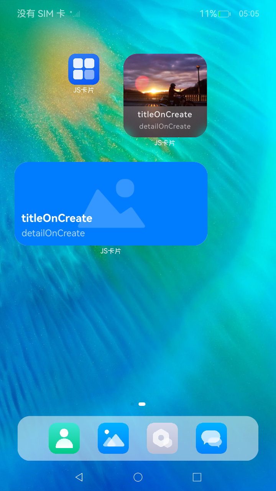

# JS卡片开发指导（Stage模型）

#### 使用说明

1.开发卡片页面

1）长按应用图标并点击<卡片>；

2）选择第一张卡片后点击添加至桌面；

2.开发卡片事件

1）长按应用图标并点击<卡片>；

2）选择第二张卡片后点击添加至桌面；

### 效果预览

| 卡片页面                          |
|-------------------------------|
|  |

使用说明
FormExtensionAbility不能常驻后台，即在卡片生命周期回调函数中无法处理长时间的任务。

### 工程目录

给出项目中关键的目录结构并描述它们的作用，示例如下：

```
entry/src/main/ets/
|---entryability
|   |---EntryAbility.ets                   // 主进程UIAbility
|---entryformability
|   |---EntryFormAbility.ets               // 卡片进程Ability
|---jscardformability
|   |---JsCardFormAbility.ets              // 创建基于JS开发的卡片
|---pages
|   |---index.ets                          // 卡片提供方主应用首页

entry/src/main/js/
|---common                                 // 公共文件
|---widget
|   |---pages
|   |   |---index.css                 // 开发卡片页面 CSS：HML中类Web范式组件的样式信息。
|   |   |---index.hml                 // 开发卡片页面 HML：使用类Web范式的组件描述卡片的页面信息。
|   |   |---index.json                // 开发卡片页面 JSON：卡片页面中的数据和事件交互。
|---widgetjs
|   |---pages
|   |   |---index.css                 // 开发卡片事件 CSS：HML中类Web范式组件的样式信息。
|   |   |---index.hml                 // 开发卡片事件 HML：使用类Web范式的组件描述卡片的页面信息。
|   |   |---index.json                // 开发卡片事件 JSON：卡片页面中的数据和事件交互。
```

### 具体实现
Stage卡片开发，即基于[Stage](https://gitcode.com/openharmony/docs/blob/master/zh-cn/application-dev/application-models/stage-model-development-overview.md)模型的卡片提供方开发，主要涉及如下关键步骤：

* [创建卡片FormExtensionAbility](https://gitcode.com/openharmony/docs/blob/master/zh-cn/application-dev/form/js-ui-widget-development.md#%E5%88%9B%E5%BB%BA%E5%8D%A1%E7%89%87formextensionability)：卡片生命周期回调函数FormExtensionAbility开发。

* [配置卡片配置文件](https://gitcode.com/openharmony/docs/blob/master/zh-cn/application-dev/form/js-ui-widget-development.md#%E9%85%8D%E7%BD%AE%E5%8D%A1%E7%89%87%E9%85%8D%E7%BD%AE%E6%96%87%E4%BB%B6)：配置应用配置文件module.json5和profile配置文件。

* [卡片信息的持久化](https://gitcode.com/openharmony/docs/blob/master/zh-cn/application-dev/form/js-ui-widget-development.md#%E5%8D%A1%E7%89%87%E4%BF%A1%E6%81%AF%E7%9A%84%E6%8C%81%E4%B9%85%E5%8C%96)：对卡片信息进行持久化管理。

* [卡片数据交互](https://gitcode.com/openharmony/docs/blob/master/zh-cn/application-dev/form/js-ui-widget-development.md#%E5%8D%A1%E7%89%87%E6%95%B0%E6%8D%AE%E4%BA%A4%E4%BA%92)：通过updateForm更新卡片显示的信息。

* [开发卡片页面](https://gitcode.com/openharmony/docs/blob/master/zh-cn/application-dev/form/js-ui-widget-development.md#%E5%BC%80%E5%8F%91%E5%8D%A1%E7%89%87%E9%A1%B5%E9%9D%A2)：使用HML+CSS+JSON开发JS卡片页面。

* [开发卡片事件](https://gitcode.com/openharmony/docs/blob/master/zh-cn/application-dev/form/js-ui-widget-development.md#%E5%BC%80%E5%8F%91%E5%8D%A1%E7%89%87%E4%BA%8B%E4%BB%B6)：为卡片添加router事件和message事件。

### 相关权限

不涉及。

### 依赖

不涉及。

### 约束与限制

1. 本示例是否支持取决于卡片使用方的实现(由于桌面差异仅支持特定操作系统)；
2. 本示例为Stage模型，支持API20版本及以上SDK，SDK版本号(API Version 20 Release),镜像版本号(6.0Release)；
3. 本示例需要使用DevEco Studio 版本号(6.0.0Release)版本才可编译运行；
4. 本示例不涉及系统接口。
5. 说明： FormExtensionAbility不能常驻后台，即在卡片生命周期回调函数中无法处理长时间的任务。

### 下载

如需单独下载本工程，执行如下命令：

```
git init
git config core.sparsecheckout true
echo code\DocsSample\Form\JSForm > .git/info/sparse-checkout
git remote add origin https://gitcode.com/openharmony/applications_app_samples.git
git pull origin master
```