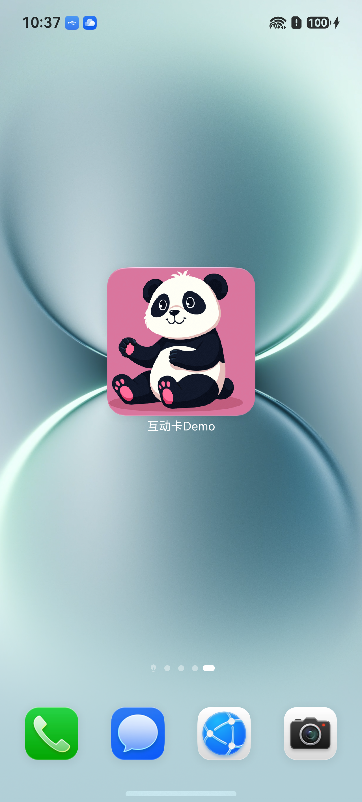

# 场景动效类型互动卡片动效实践

### 介绍

场景动效类型互动卡片触发动效时，使用主体分割检测出卡片图片中区别于背景的前景物体或区域并将其从背景中分离出来，针对分离出来的主体做放大动效。

### 效果预览

| 卡片非激活态                        | 卡片互动特效                            | 
|-------------------------------|-----------------------------------|
|  |  | 

使用说明

1. 用户在当前卡片页面触发手机摇一摇；

2. [EntryFormEditAbility.ets](entry%2Fsrc%2Fmain%2Fets%2Fentryformability%2FEntryFormAbility.ets)中调用formProvider.requestOverflow接口发起互动卡片动效申请，调用时需要明确：（1）动效申请范围。（2）动效持续时间。（3）是否使用系统提供的默认切换动效。

3. 卡片使用方识别到卡片提供方继承[LiveFormExtensionAbility](https://gitcode.com/openharmony/docs/blob/master/zh-cn/application-dev/reference/apis-form-kit/js-apis-app-form-LiveFormExtensionAbility.md)方法，加载互动卡片页面；

4. 在互动卡片页面中调用subjectSegmentation.doSegmentation接口对图片进行主体分割，然后执行动效；

### 工程目录

给出项目中关键的目录结构并描述它们的作用，示例如下：

```
entry/src/main/ets/
|---common
|   |---Constants.ets                      // 互动卡片动效工具函数实现
|---entryability
|   |---EntryAbility.ets                   // 主进程UIAbility
|---entryformability
|   |---EntryFormAbility.ets               // 卡片进程Ability
|---entryformliveability
|   |---EntryFormLiveAbility.ets     // 创建互动卡片
|---pages
|   |---Index.ets                          // 卡片提供方主应用首页
|   |---Page.ets                          // 实现互动卡片页面
|---widget
|   |---pages
|   |   |---WidgetCard.ets                 // 卡片页
```

### 具体实现

* 卡片场景动效能力通过[LiveFormExtensionAbility](https://gitcode.com/openharmony/docs/blob/master/zh-cn/application-dev/reference/apis-form-kit/js-apis-app-form-LiveFormExtensionAbility.md)实现，可参考[场景动效类型互动卡片开发指导](https://gitcode.com/openharmony/docs/blob/master/zh-cn/application-dev/form/arkts-ui-liveform-sceneanimation-development.md)
  * 创建继承[LiveFormExtensionAbility](https://gitcode.com/openharmony/docs/blob/master/zh-cn/application-dev/reference/apis-form-kit/js-apis-app-form-LiveFormExtensionAbility.md)的EntryFormEditAbility类，参考[EntryFormLiveAbility.ets](entry%2Fsrc%2Fmain%2Fets%2Fentryformliveability%2FEntryFormLiveAbility.ets)；
  * 在非激活态卡片页面摇一摇时，发起卡片动效请求；
  * 在EntryFormAbility中调用formProvider.requestOverflow接口触发动效，调用时需要明确：（1）动效申请范围。（2）动效持续时间。（3）是否使用系统提供的默认切换动效；
  * 在EntryFormLiveAbility中通过session.loadContent加载互动页面；
  * 在激活态卡片页面通过subjectSegmentation.doSegmentation接口对图片进行主体分割，然后执行动效；

### 相关权限

不涉及。

### 依赖

不涉及。

### 约束与限制

1. 本示例是否支持取决于卡片使用方的实现(由于桌面差异仅支持特定操作系统)；
2. 本示例为Stage模型，支持API20版本及以上SDK，SDK版本号(API Version 26 Release),镜像版本号(6.1Release)；
3. 本示例需要使用DevEco Studio 版本号(6.1.1Release)版本才可编译运行；
4. 本示例不涉及系统接口。

### 使用说明

场景动效功能仅手机真机支持。

### 下载

如需单独下载本工程，执行如下命令：

```
git init
git config core.sparsecheckout true
echo code\DocsSample\Form\FormLiveDemo > .git/info/sparse-checkout
git remote add origin https://gitcode.com/openharmony/applications_app_samples.git
git pull origin master
```