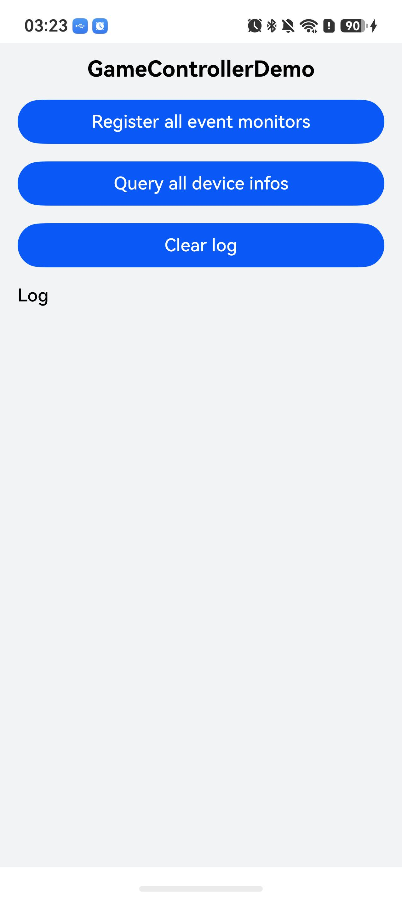

# Game Controller Event Monitoring (C/C++)

## Introduction

This project engineering-izes the sample code snippets in the following guide documents: [Monitoring Device Online and Offline Status](https://gitcode.com/openharmony/docs/blob/master/zh-cn/application-dev/game-controller/game-controller-monitor-device.md) and [Monitoring Gamepad Axis and Button Events](https://gitcode.com/openharmony/docs/blob/master/zh-cn/application-dev/game-controller/game-controller-monitor-pad.md). With this project, you can register and unregister all GameControllerKit event monitors with one tap (device status monitor, 17 gamepad button monitors, and 5 gamepad axis monitors), query the information of all online game devices with one tap, and view device online/offline events, button and axis event callbacks, and query results in real time on the log page. Device management uses [GameControllerKit](https://gitcode.com/openharmony/docs/blob/master/zh-cn/application-dev/reference/apis-game-controller-kit/capi-gamecontroller.md) (C API).

## Effect Preview

|  |
|-----------------------------------------|

How to use:

1. Install the built hap package and open the app.
2. Tap **Register all event monitors** to register all event monitors with one tap. The button switches to **Unregister all event monitors**, and the log page displays the results of the 23 registrations one by one, in the order of device monitor, 17 button monitors, and 5 axis monitors.
3. Connect a gamepad (Bluetooth or USB). Plug and unplug the gamepad to view device online/offline events in real time on the log page, and operate the gamepad buttons and sticks to view button events and axis events in real time.
4. Tap **Query all device infos** to query the information of all online game devices. The log page displays the total number of devices and the deviceId, name, product, version, physicalAddress, and type of each device.
5. Tap **Unregister all event monitors** to unregister all event monitors with one tap. The button switches back to **Register all event monitors**, and operating the gamepad no longer generates new logs.
6. Tap **Clear log** to clear the log page. This does not affect the monitor registration status, and new events keep being appended.
7. Open the "DocsSample/GameControllerKit/NdkGameControllerDemo/entry/src/ohosTest/ets/test/Ability.test.ets" file to run UI automation tests for this project.

## Project Structure

```
NdkGameControllerDemo
├──entry/src/main
│  ├──cpp                           // C++ code
│  │  ├──CMakeLists.txt             // CMake configuration, links libohgame_controller.z.so
│  │  ├──napi_init.cpp              // napi module registration, thread-safe log callback, aggregate APIs
│  │  ├──device_api.cpp/.h          // Device online/offline monitor and online device query, aligned with the guide snippets
│  │  ├──game_pad_api.cpp/.h        // Gamepad button and axis monitors, aligned with the guide snippets
│  │  ├──game_controller_log.h      // Log singleton
│  │  ├──types
│  │  │  ├──libentry
│  │  │  │  ├──Index.d.ts
│  │  │  │  ├──oh-package.json5
│  ├──ets                           // ets code
│  │  ├──entryability
│  │  │  ├──EntryAbility.ets
│  │  ├──entrybackupability
│  │  │  ├──EntryBackupAbility.ets
│  │  ├──pages
│  │     ├──Index.ets               // Main page
```

## Required Permissions

None.

## Dependencies

None.

## Constraints

1. This sample can only run on standard systems. Supported devices: Phone, Tablet, TV, 2in1.
2. This sample only supports SDKs of API 21 or later (the initial version of GameControllerKit), and has been verified to compile with the API 26.0.1 SDK. Event monitoring and device query must run on a real device, and the event callback chain requires a gamepad connected via Bluetooth or USB.
3. This sample can be compiled and run using DevEco Studio 26.0.1 Release.

## Download

To download this project separately, run the following commands:

```
git init
git config core.sparsecheckout true
echo code/DocsSample/GameControllerKit/NdkGameControllerDemo > .git/info/sparse-checkout
git remote add origin https://gitcode.com/openharmony/applications_app_samples.git
git pull origin master
```
