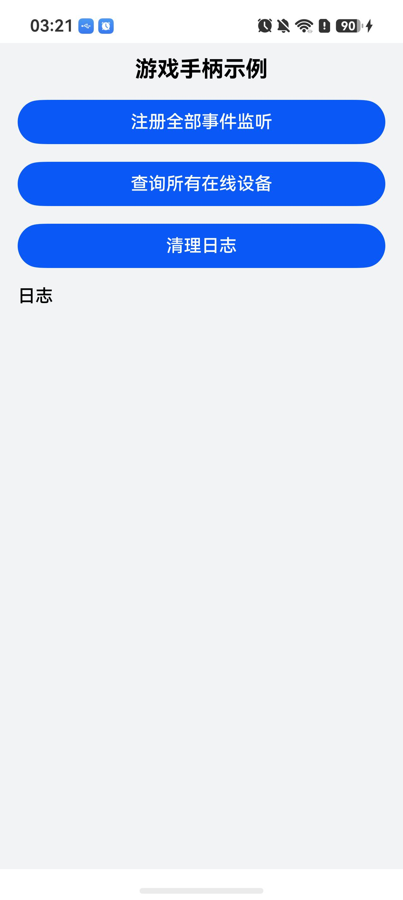

# 游戏手柄事件监听（C/C++）

## 介绍

本工程主要实现了对以下指南文档[监听设备上下线](https://gitcode.com/openharmony/docs/blob/master/zh-cn/application-dev/game-controller/game-controller-monitor-device.md)和[监听游戏手柄的轴和按键事件](https://gitcode.com/openharmony/docs/blob/master/zh-cn/application-dev/game-controller/game-controller-monitor-pad.md)中示例代码片段的工程化。通过该工程可以一键注册和取消注册GameControllerKit的全部事件监听（设备状态监听、17组手柄按键监听和5组手柄轴监听），一键查询所有在线游戏设备信息，并在日志界面实时查看设备上下线、按键和轴事件回调以及查询结果。

## 效果预览

|  |
|-------------------------------------------|

使用说明：

1. 安装编译生成的hap包，打开应用。
2. 点击**Register all event monitors**一键注册全部事件监听，按钮切换为**Unregister all event monitors**，日志区按设备监听、17组按键、5组轴的顺序逐条显示23项注册结果。
3. 连接游戏手柄（蓝牙或USB），插拔手柄可在日志区实时查看设备上下线事件，操作手柄按键和摇杆可实时查看按键事件与轴事件。
4. 点击**Query all device infos**查询所有在线设备信息，日志区显示设备总数及每台设备的deviceId、name、product、version、physicalAddress、type。
5. 点击**Unregister all event monitors**一键取消全部事件监听，按钮切换回**Register all event monitors**，再次操作手柄不再产生新日志。
6. 点击**Clear log**清空日志区，不影响监听注册状态，新事件继续正常追加。
7. 进入"DocsSample/GameControllerKit/NdkGameControllerDemo/entry/src/ohosTest/ets/test/Ability.test.ets"文件，可以对本项目进行UI的自动化测试。

## 工程目录

```
NdkGameControllerDemo
├──entry/src/main
│  ├──cpp                           // C++代码区
│  │  ├──CMakeLists.txt             // CMake配置文件，链接libohgame_controller.z.so
│  │  ├──napi_init.cpp              // napi模块注册、线程安全日志回调与聚合接口
│  │  ├──device_api.cpp/.h          // 设备上下线监听与在线设备查询，对齐指南片段
│  │  ├──game_pad_api.cpp/.h        // 手柄按键与轴监听，对齐指南片段
│  │  ├──game_controller_log.h      // 日志单例
│  │  ├──types
│  │  │  ├──libentry
│  │  │  │  ├──Index.d.ts
│  │  │  │  ├──oh-package.json5
│  ├──ets                           // ets代码区
│  │  ├──entryability
│  │  │  ├──EntryAbility.ets
│  │  ├──entrybackupability
│  │  │  ├──EntryBackupAbility.ets
│  │  ├──pages
│  │     ├──Index.ets               // 主界面
```

## 相关权限

不涉及。

## 依赖

不涉及。

## 约束与限制

1. 本示例仅支持标准系统上运行，支持设备：Phone、Tablet、TV、2in1。
2. 本示例仅支持API21及以上版本SDK（GameControllerKit起始版本），已在API26.0.1版本SDK上验证编译。事件监听与设备查询需要真机运行，事件回调链路需连接游戏手柄（蓝牙或USB）。
3. 本示例已支持使用DevEco Studio 26.0.1 Release 编译运行。

## 下载

如需单独下载本工程，执行如下命令：

```
git init
git config core.sparsecheckout true
echo code/DocsSample/GameControllerKit/NdkGameControllerDemo > .git/info/sparse-checkout
git remote add origin https://gitcode.com/openharmony/applications_app_samples.git
git pull origin master
```
