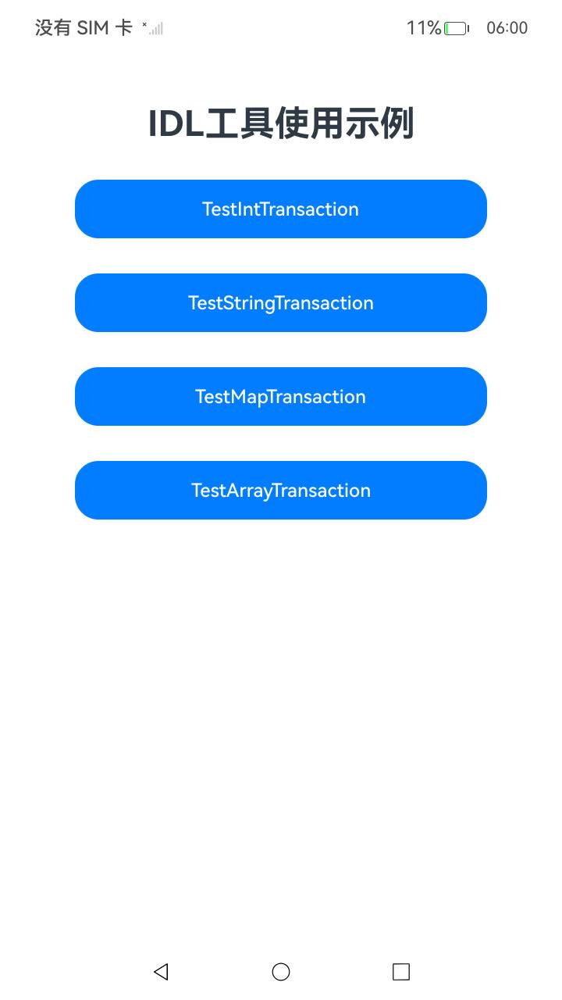
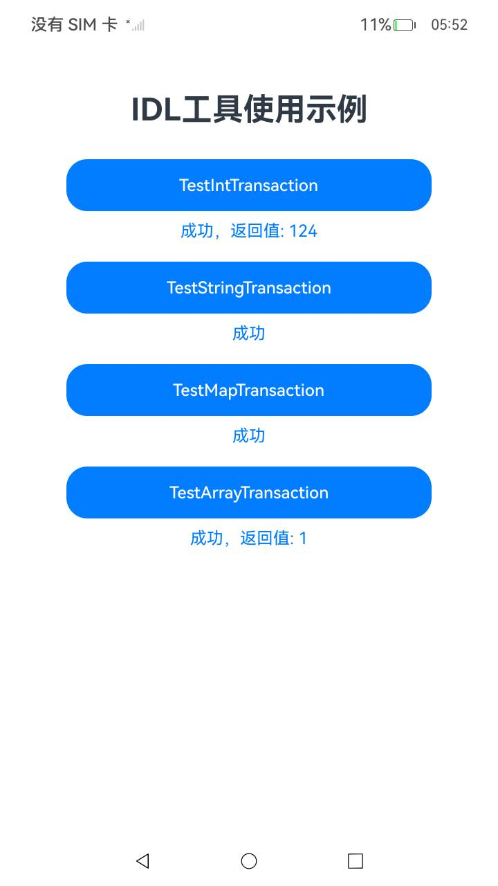

# OpenHarmony IDL工具使用示例

## 介绍

本示例为OpenHarmony IDL（Interface Definition Language，接口描述语言）工具文档的代码同源示例，对应文档：[IDL工具规格及使用说明书](https://gitcode.com/openharmony/docs/blob/master/zh-cn/application-dev/IDL/idl-guidelines.md)。

OpenHarmony IDL是一种定义IPC（Inter-Process Communication，跨进程通信）接口的工具。开发者通过编写.idl文件描述接口，IDL工具可自动生成服务端Stub和客户端Proxy代码，简化跨进程通信的开发。

主要包含以下与文档同源的代码示例：

**TS/ArkTS侧示例：**
1. IDL接口定义文件（IIdlTestService.idl）：演示如何使用IDL语法定义接口，支持int、String、Map、数组等多种参数类型。
2. 接口定义文件（i_idl_test_service.ts）：IDL工具生成的TS接口定义及回调类型声明。
3. Stub桩代码（idl_test_service_stub.ts）：IDL工具生成的服务端桩代码，负责反序列化请求并分发到具体方法。
4. Proxy代理代码（idl_test_service_proxy.ts）：IDL工具生成的客户端代理代码，负责序列化参数并发送远程调用。
5. 类型声明IDL（idl_type_declaration.idl）：演示TS侧sequenceable和interface前置声明语法。
6. 生成的import语句（idl_type_import.ts）：IDL工具生成的sequenceable和interface导入语句示例。
7. Sequenceable对象（MySequenceable.ts）：实现Parcelable接口的可序列化对象示例，支持IPC传输。
8. 服务端实现（IdlTestImp.ets）：继承Stub类实现具体业务逻辑。
9. 服务Ability（ServiceAbility.ets）：通过onConnect向客户端公开IRemoteObject。
10. 客户端调用（Index.ets）：使用connectServiceExtensionAbility连接服务，通过Proxy代理对象调用IPC方法。

**C++侧示例：**
1. 类型声明IDL（idl_type_declaration.idl）：演示C++侧sequenceable声明形式及示例。
2. 解析后的sequenceable头文件（idl_sequenceable_parsed.h）：IDL工具解析sequenceable生成的C++代码。

## 效果预览

| IDL工具使用示例页 | IDL工具运行结果页 |
|-----------------------------------|----------------------------------|
|  |  |

## 工程目录

```
├───entry/src
│   ├───main
│   │   ├───ets
│   │   │   ├───IIdlTestServiceTs                  // IDL生成及服务实现代码
│   │   │   │   ├───IIdlTestService.idl            // [idl_interface_definition] IDL接口定义文件
│   │   │   │   ├───i_idl_test_service.ts          // 生成的接口定义及回调类型
│   │   │   │   ├───idl_test_service_stub.ts       // [idl_ts_stub] 生成的Stub桩代码
│   │   │   │   ├───idl_test_service_proxy.ts      // 生成的Proxy代理代码
│   │   │   │   └───IdlTestImp.ets                 // [idl_ts_service_implementation] 服务端接口实现
│   │   │   ├───idl                                // IDL类型声明相关TS代码
│   │   │   │   ├───idl_type_declaration.idl       // [idl_ts_sequenceable_declaration] sequenceable/interface声明
│   │   │   │   ├───idl_type_import.ts             // [idl_ts_sequenceable_import][idl_ts_interface_import] 生成的import语句
│   │   │   │   ├───my_sequenceable.ts             // sequenceable实现（支撑导入）
│   │   │   │   └───i_idl_test_observer.ts         // 观察者接口占位（支撑导入）
│   │   │   ├───service                            // 服务端Ability
│   │   │   │   └───ServiceAbility.ets             // [idl_ts_service_ability] 服务Ability
│   │   │   ├───pages
│   │   │   │   └───Index.ets                      // [idl_ts_client] 客户端调用示例页
│   │   │   ├───MySequenceable.ts                  // [idl_ts_sequenceable] Sequenceable对象实现
│   │   │   ├───entryability
│   │   │   │   └───EntryAbility.ets               // 入口Ability
│   │   │   └───entrybackupability
│   │   │       └───EntryBackupAbility.ets         // 备份Ability
│   │   ├───cpp                                    // C++示例代码
│   │   │   ├───idl_type_declaration.idl           // [idl_cpp_sequenceable_example] 类型声明IDL
│   │   │   └───idl_sequenceable_parsed.h          // [idl_cpp_sequenceable_parsed] 解析后的sequenceable头文件
│   │   └───resources                              // 资源目录
│   └───ohosTest
│       └───ets/test
│           ├───Ability.test.ets                   // IDL功能测试用例
│           └───List.test.ets                      // 基础测试用例
└───AppScope                                       // 应用全局配置
```

## 依赖

不涉及。

## 相关权限

不涉及。

## 使用说明

1. 编译并安装示例应用到设备上。
2. 打开应用，进入IDL工具使用示例页面。
3. 点击各测试按钮验证IPC接口调用：
   - **TestIntTransaction**：验证int类型参数的IPC传输，调用成功返回 `成功，返回值: 124`。
   - **TestStringTransaction**：验证String类型参数的IPC传输，调用成功返回 `成功`。
   - **TestMapTransaction**：验证Map类型参数的IPC传输，调用成功返回 `成功`。
   - **TestArrayTransaction**：验证数组类型参数的IPC传输，调用成功返回 `成功，返回值: 1`。

## 具体实现

### IDL接口定义
IDL接口定义文件位于 `entry/src/main/ets/IIdlTestServiceTs/IIdlTestService.idl`，定义了四个测试方法：
- `testIntTransaction(int data)`：测试int类型参数传输
- `testStringTransaction(String data)`：测试String类型参数传输
- `testMapTransaction(Map&lt;int, int&gt; data)`：测试Map类型参数传输
- `testArrayTransaction(String[] data)`：测试数组类型参数传输

### Stub与Proxy生成代码
IDL工具根据.idl文件自动生成服务端Stub和客户端Proxy代码：
- **Stub（idl_test_service_stub.ts）**：服务端桩代码，继承自 `rpc.RemoteObject`，在 `onRemoteMessageRequest` 中根据请求码分发到对应方法。
- **Proxy（idl_test_service_proxy.ts）**：客户端代理代码，实现IIdlTestService接口，通过 `sendMessageRequest` 向远端发送请求。


## 约束与限制

1.本示例仅支持标准系统上运行，支持设备：RK3568。

2.本示例已适配API version 26版本SDK，版本号：26.0.0。

3.本示例需要使用DevEco Studio 26.0.0 Release及以上版本才可编译运行。

## 下载

如需单独下载本工程，执行如下命令：

```git
git init
git config core.sparsecheckout true
echo code/DocsSample/IDLTool > .git/info/sparse-checkout
git remote add origin https://gitcode.com/openharmony/applications_app_samples.git
git pull origin master
```
