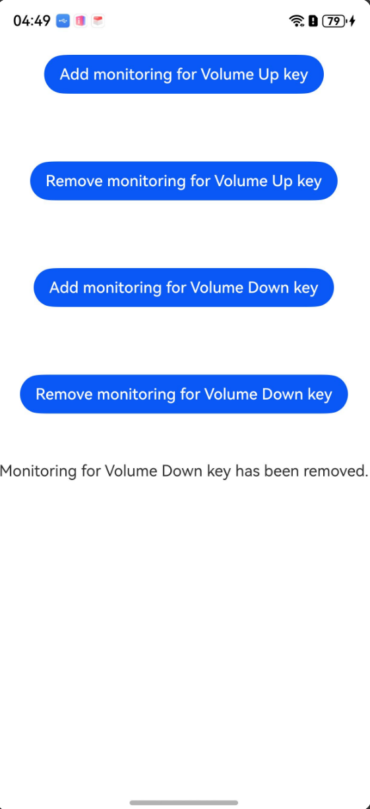

# 优先响应系统功能键（ArkTS）

## 介绍

本工程主要实现了对以下指南文档[优先响应系统功能键开发指导](https://gitcode.com/openharmony/docs/blob/master/zh-cn/application-dev/device/input/keypressed-guidelines.md)
中示例代码片段的工程化，通过该工程可以添加和取消对音量上下键的拦截监听。

## 效果预览

|  |
|-----------------------------------|

使用说明：

1. 安装编译生成的hap包,打开应用时会自动添加对音量上下键的拦截监听。
2. 使用音量上下键，按键事件会被拦截并在页面弹出提示，无法正常调节音量。
3. 点击对应按钮取消对音量上下键的拦截监听，再次使用音量上下键，可以正常调节音量。
4. 点击对应按钮重新添加对音量上下键的拦截监听，再次使用音量上下键，无法正常调节音量。

## 工程目录

```
ArkTSInputConsumer-Sta
├──entry/src/main
│  ├──ets
│  │  ├──entryability
|  |  ├──entrybackupability
│  │  └──pages
│  │     └──Index.ets               // 示例代码
|  ├──resources
```

### 具体实现

每个系统功能键均具有默认功能，由系统固定实现，比如音量键是用来调节设备音量，但是部分应用在特定场景下期望定制这部分按键的功能，本篇指导用于支撑这部分应用的诉求达成。
常见使用场景：阅读类型应用期望通过音量键翻页，相机应用期望通过音量键拍照等应用响应系统功能键做其他业务的场景。
在[Index.ets](entry/src/main/ets/pages/Index.ets)文件中，通过点击按钮取消监听音量按键上/下的监听。

## 相关权限

无。

## 依赖

不涉及。

## 约束和限制

1.本示例仅支持标准系统上运行，支持设备：RK3568;

2.本示例为Stage模型，仅支持API26版本SDK，SDK版本号(API Version 26 Beta)，镜像版本号(7.0Beta);

3.本示例需要使用DevEco Studio 6.0.0 Canary1 (Build Version: 6.0.0.94SP4, built on April 8, 2026)及以上版本才可编译运行。

## 下载

如需单独下载本工程，执行如下命令：

```
git init
git config core.sparsecheckout true
echo code/DocsSample/InputKit/ArkTSInputDevice-Sta > .git/info/sparse-checkout
git remote add origin https://gitcode.com/openharmony/applications_app_samples.git
git pull origin master
```

