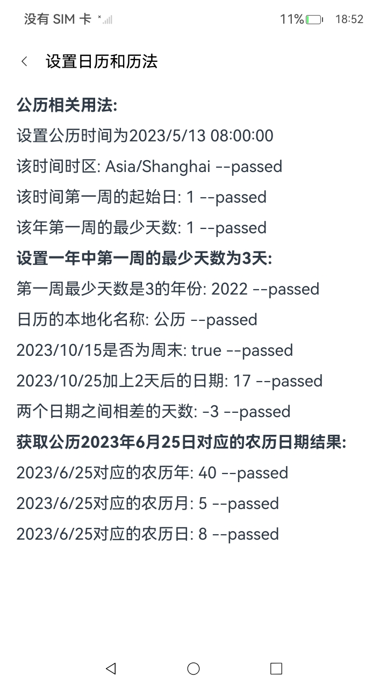
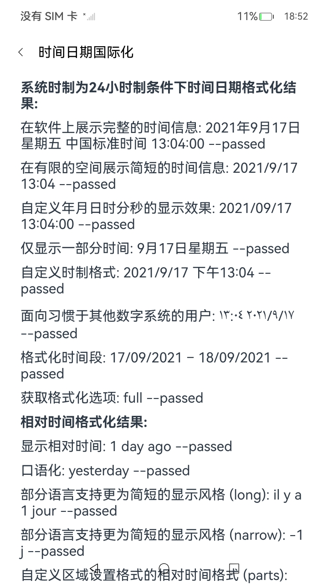

# 国际化Internationalization

## 介绍

本示例依照指南 开发->应用框架->Localization Kit（本地化开发服务）->[本地化开发服务（应用国际化）](https://gitee.com/openharmony/docs/tree/OpenHarmony-5.0.1-Release/zh-cn/application-dev/internationalization)进行编写。
本示例主要展示了国际化的相关基础功能，通过调用`intl`,`i18n`实现简单的国际化操作。

### 效果预览

| **主页面**                            | **区域标识与文化习惯划分界面**                               | **设置日历和历法界面**                              | **时间日期国际化界面**                                    |
| ------------------------------------- | ------------------------------------------------------------ | --------------------------------------------------- | --------------------------------------------------------- |
|  |  |  |  |

使用说明：

1. 启动应用，进入主页面。
2. 点击主页面不同的功能按钮，进入对应国际化功能输出判断显示界面。
3. 功能界面中点击返回按钮，返回主页面。
4. 测试超时设置为：Time out(s)：30。

### 工程目录

```
Internationalization
entry/src/main/ets
|---component          
|   |---TitleBar.ets                        // 公共标题栏
|   |---AssertEqual.ets                     // 断言判断函数
|---entryability
|   |---EntryAbility.ets                    // 程序入口类
|---entrybackupability
|   |---EntryBackupAbility.ets
|---i18napplication                         // 页面文件
|   |---CalendarSetting.ets                 // 设置日历和历法界面
|   |---CharacterProcessing.ets             // 字符处理界面
|   |---DateTimeFormatting.ets              // 时间日期国际化界面
|   |---LanguagePreferenceSetting.ets       // 设置语言与用户偏好界面
|   |---LocaleCulturalDivision.ets          // 区域标识与文化习惯划分界面
|   |---MultilingualSorting.ets             // 多语言排序界面 
|   |---NameLocalization.ets                // 本地化名称界面
|   |---NumberMeasurementFormatting.ets     // 数字与度量衡国际化界面
|   |---PhoneNumberFormatting.ets           // 电话号码格式化界面
|   |---TimezoneDstSetting.ets              // 时区与夏时令国际化界面
|---pages
|   |---Index.ets                           // 主界面
|---resources                               // 资源文件目录
```

### 具体实现

- 设置在主页面集成所有功能界面模块，将`Listitem`中`Row`组件设置点击事件进入相关需求界面模块的展示。

- 每个子模块页面的实现代码对应国际化开发指南中的具体章节，子模块目录按其功能进行命名，如`DateTimeFormatting（时间日期格式化）`，示例代码内容由`Text`文本输出显示。

- 公共功能（如标题栏）提取为公共组件供各个子模块复用，设置公共组件`TitleBar`标题栏展示需求界面模块的功能名称，公共功能（如标题栏）提取为公共组件供各个子模块复用。

### 相关权限

[ohos.permission.UPDATE_CONFIGURATION](https://gitee.com/openharmony/docs/blob/OpenHarmony-5.0.1-Release/zh-cn/application-dev/security/AccessToken/permissions-for-system-apps.md#ohospermissionupdate_configuration)

### 依赖

不涉及。

### 约束与限制

1. 本示例仅支持标准系统上运行，支持设备：RK3568。
2. 本示例为Stage模型，支持API18版本full-SDK，版本号：5.1.0。
3. 支持的IDE版本：本示例已支持DevEco Studio 5.0.1 Release (构建版本：5.0.5.306，构建 2024年12月6日)编译运行。
4. 本示例涉及[ohos.permission.UPDATE_CONFIGURATION](https://gitee.com/openharmony/docs/blob/OpenHarmony-5.0.1-Release/zh-cn/application-dev/security/AccessToken/permissions-for-system-apps.md#ohospermissionupdate_configuration)为system_core级别，需要配置高权限签名，可参考[特殊权限配置方法](https://gitee.com/openharmony/docs/blob/OpenHarmony-5.0.1-Release/zh-cn/application-dev/security/hapsigntool-overview.md)。
5. 本示例涉及系统接口，需要配置系统应用签名，可以参考[特殊权限配置方法](https://gitee.com/openharmony/docs/blob/OpenHarmony-5.0.1-Release/zh-cn/application-dev/security/hapsigntool-overview.md)，把配置文件中的“app-feature”字段信息改为“hos_system_app”。

### 下载

如需单独下载本工程，执行如下命令：

```
git init
git config core.sparsecheckout true
echo code/DocsSample/International/Internationalization > .git/info/sparse-checkout
git remote add origin https://gitee.com/openharmony/applications_app_samples.git
git pull origin master
```