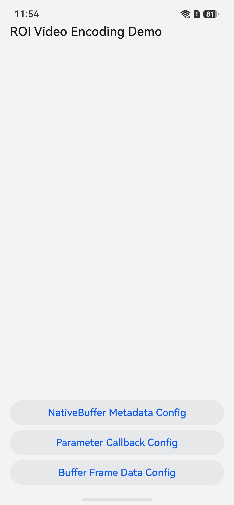
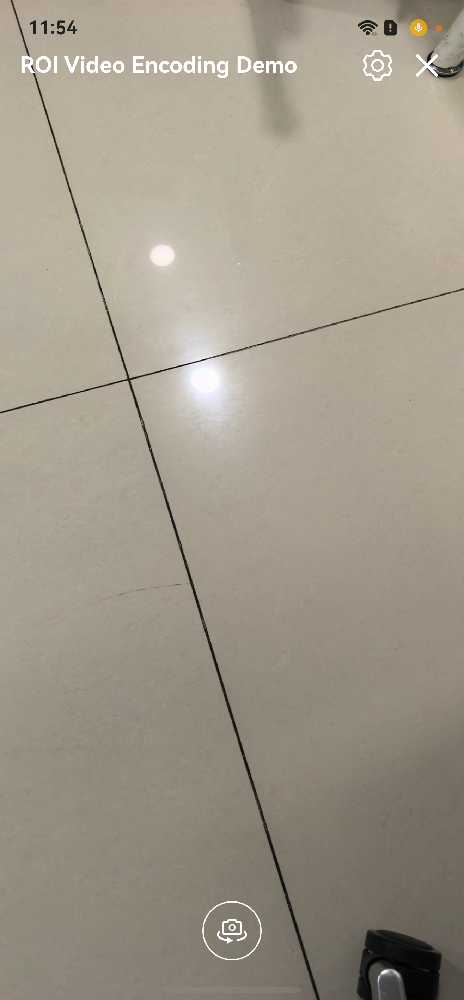

# ROI Video Encoding Live Streaming Feature Based on the OpenHarmony Media Subsystem

## Overview

This sample demonstrates how to implement the live streaming broadcasting end based on the OpenHarmony media subsystem.
This sample implements common features in live streaming scenarios, including audio and video capture, ROI video encoding,
background music addition, and front/rear camera switching. This sample helps developers understand the ROI video encoding
configuration methods and their application in live streaming scenarios.

- The main process of video recording on the live streaming end is: camera capture, OpenGL rotation, ROI region extraction
  and configuration, encoding, and multiplexing into MP4 files.
- In the recording scenario, the OpenGL rendering pipeline is added between the camera and encoding. Developers can add
  corresponding shaders, such as beauty and filter operators, to the live streaming scenario by referring to the process.
- This sample demonstrates three ROI encoding configuration methods: NativeBuffer Metadata Config, Parameter Callback Config,
  and Buffer Frame Data Config.

### Atomic Capability Specifications Supported for Recording

| Muxing Format | Video Codec Type | Audio Codec Type |
|---------------|------------------|------------------|
| mp4           | H.264/H.265      | AAC              |

### Preview

| HomePage                                                                        | Page of Live Streaming End                                                             |
|---------------------------------------------------------------------------------|----------------------------------------------------------------------------------------|
|  |  |

## How to Use

1. When a dialog box is displayed asking whether to allow **HMOSLiveStream** to access the camera, tap **Allow**.
2. When a dialog box is displayed asking whether to allow **HMOSLiveStream** to access the microphone, tap **Allow**.
3. When a dialog box is displayed asking whether to allow **HMOSLiveStream** to discover and connect to nearby devices,
   tap **Allow**.

### Starting Live Stream

1. Select an ROI encoding configuration method (NativeBuffer Metadata Config, Parameter Callback Config, or Buffer Frame Data Config), and tap the corresponding button.

2. Confirm to allow the recorded files to be saved to distributed files.

3. After recording is completed, tap the button in the upper-right corner to close it.

## Project Directory

```       
├──entry/src/main/cpp                 // Native layer 
│  ├──capbilities                     // Capability APIs and implementation 
│  │  ├──render                       // APIs and implementation of the display module 
│  │  │  ├──include                   // Display module APIs 
│  │  │  │  ├──egl_render_context.h   // EGL rendering context APIs 
│  │  │  │  ├──render_thread.h        // Rendering thread APIs 
│  │  │  │  └──shader_program.h       // APIs for muxing OpenGL ES shader programs 
│  │  │  ├──render_thread.cpp         // Rendering thread (ROI region extraction, ROI overlay drawing, metadata writing)
│  │  │  ├──egl_render_context.cpp    // EGL rendering context implementation 
│  │  │  └──shader_program.cpp        // OpenGL ES shader program Encapsulation 
│  │  ├──codec                        // Audio/video capture codec 
│  │  │  ├──include                   // APIs for audio/video capture codec 
│  │  │  │  ├──CodecCallback.h        // Codec callback APIs
│  │  │  │  ├──CodecInfo.h            // Codec data structures
│  │  │  │  └──VideoEncoder.h         // Video encoding APIs (ROI encoding path configuration)
│  │  │  ├──AudioCapturer.cpp         // Audio capture implementation 
│  │  │  ├──AudioDecoder.cpp          // Audio decoding implementation 
│  │  │  ├──AudioEncoder.cpp          // Audio encoding implementation 
│  │  │  ├──AudioRender.cpp           // Audio rendering implementation 
│  │  │  ├──CodecCallback.cpp         // Codec callback (Buffer mode ROI data filling)
│  │  │  ├──Demuxer.cpp               // Demuxing implementation 
│  │  │  ├──Muxer.cpp                 // Muxing implementation 
│  │  │  └──VideoEncoder.cpp          // Video encoding implementation (ROI parameter callback path) 
│  ├──common                          // Common modules 
│  │  ├──dfx                          // Logs 
│  │  ├──ApiCompatibility.h           // API compatibility 
│  │  ├──FrameQueue.h                 // Frame queue (Buffer mode data transfer)
│  │  └──SampleInfo.h                 // Common classes for functionality implementation (ROI path type enum) 
│  ├──player                          // Player APIs and implementation at the native layer 
│  │  ├──include                      // Player APIs at the native layer 
│  │  │  ├──Player.h                  // Player invocation APIs at the native layer 
│  │  │  └──PlayerNative.h            // Player entry APIs at the native layer 
│  │  ├──Player.cpp                   // Player implementation at the native layer 
│  │  └──PlayerNative.cpp             // Player entry at the native layer 
│  └──recorder                        // Recorder APIs and implementation at the native layer 
│  │     ├──include                   // Recorder implementation at the native layer 
│  │     │  ├──Recorder.h             // Recorder invocation APIs at the native layer 
│  │     │  └──RecorderNative.h       // Recorder entry APIs at the native layer 
│  │     ├──Recorder.cpp              // Recorder implementation at the native layer (ROI path initialization) 
│  │     └──RecorderNative.cpp        // Recorder entry at the native layer 
│  ├──types                           // APIs provided by the native layer 
│  │  ├──libplayer                    // APIs provided by the player module to the UI layer 
│  │  └──librecorder                  // APIs provided by the recorder module to the UI layer (ROI toggle control) 
│  └──CMakeLists.txt                  // Compilation entry 
├──ets                                // UI layer 
│  ├──common                          // Common modules 
│  │  ├──utils                        // Common utilities 
│  │  │  ├──BackgroundTaskManager.ets // Background task utility class 
│  │  │  ├──CameraCheck.ets           // File to check whether the camera parameters are supported 
│  │  │  ├──DateTimeUtils.ets         // Time conversion utility class 
│  │  │  ├──ImageUtil.ets             // Image processing utility class 
│  │  │  ├──Logger.ets                // Log utilities 
│  │  │  ├──PermissionUtil.ets        // Permission utility class 
│  │  │  └──WindowUtils.ets           // Window utility class 
│  │  └──CommonConstants.ets          // Common constants 
│  ├──components                      // Component directories 
│  │  └──SettingPopupDialog.ets       // Settings popup component 
│  ├──controller                      // Controller 
│  │  ├──BgmController.ets            // Background music controller 
│  │  ├──CameraController.ets         // Camera controller (MetadataOutput face detection)
│  │  └──DistributeFileManager.ets    // Distributed file manager 
│  ├──entryability                    // Application entry 
│  │  └──EntryAbility.ets             
│  ├──entrybackupability             
│  │  └──EntryBackupAbility.ets    
│  ├──model             
│  │  ├──CameraDataModel.ets          // Camera parameter data class 
│  │  └──SettingPopupOptionItem.ets   // Settings data class 
│  ├──pages                           // Pages contained in the EntryAbility 
│  │  ├──Index.ets                    // Home page (ROI path selection entry)
│  │  └──StartLiveStream.ets          // Page of live streaming end 
│  └──view                            // Pages contained in the EntryAbility 
│     ├──StartLiveDecorationView.ets  // Interaction page at the live streaming end 
│     └──StartLiveRenderView.ets      // Renderer at the live streaming end 
├──resources                          // Resource files for storing applications 
└──module.json5                       // Module configuration
```

## How to Implement

### Starting Live Stream

#### UI Layer

1. On the Index page at the UI layer, after a user selects an ROI encoding path and taps the corresponding button, confirms
   to save the recording file to the distributed folder, a new video file and an ROI log file are created.
2. After the files are created, the FDs of the created files and the recording parameters preset by the user are used to
   call **initNative()** at the native layer for recording initialization. After the initialization is complete, the
   native layer calls **OH_NativeWindow_GetSurfaceId** to obtain the **surfaceId** of **NativeWindow** and transfers the
   **surfaceId** to the UI layer.
3. After obtaining the **surfaceId** from the encoder, the UI layer constructs **cameraController** and **bgmController**, 
   and calls the page route to redirect to the **StartLiveStream** page.
4. When the **XComponent** of the **StartLiveRenderView** component on the **StartLiveStream** page is constructed, the
   **.onLoad()** method is called. This method first obtains the **surfaceId** of the **XComponent**, and then calls 
   **createRecorder()** and **startNative()** of **cameraController**. The function establishes a producer-consumer model
   where the camera serves as the producer, and the surfaces of the **XComponent** and encoder serve as the consumers.

#### Native Layer Encoding

1. On the recording page, the encoder starts to encode the camera preview stream at the UI layer.
2. Each time the encoder successfully encodes a frame, the callback function **OnNewOutputBuffer()** in 
   **sample_callback.cpp** is invoked once, and the AVCodec framework provides an **OH_AVBuffer**.
3. In the output callback, you need to manually store the frame buffer and index in the output queue and instruct the
   output thread to unlock.
4. The output thread stores the frame information in the previous step as bufferInfo and pops out of the queue.
5. The output thread uses bufferInfo obtained in the previous step to call **WriteSample** to mux the frame into the MP4
   format.
6. The output thread calls **FreeOutputBuffer** to return the buffer of this frame to the AVCodec framework, achieving
   buffer cycling.

## Required Permissions

- **ohos.permission.CAMERA**: allows an application to use the camera.
- **ohos.permission.MICROPHONE**: allows an application to use the microphone.
- **ohos.permission.DISTRIBUTED_DATASYNC**: allows an application to synchronize using distributed files.
- **ohos.permission.KEEP_BACKGROUND_RUNNING**: allows an application to run in the background.

## Dependencies

- N/A

## Constraints

1. This sample is only supported on standard systems. Supported devices: default (phone), tablet.

2. OpenHarmony API version: API 26 or later.

3. DevEco Studio version: DevEco Studio 5.0.5 Release or later.

4. OpenHarmony SDK version: OpenHarmony SDK 26.0.0 or later.
