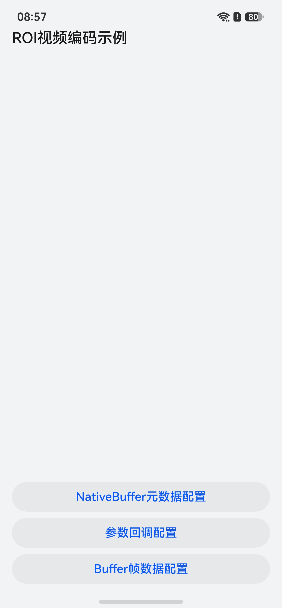
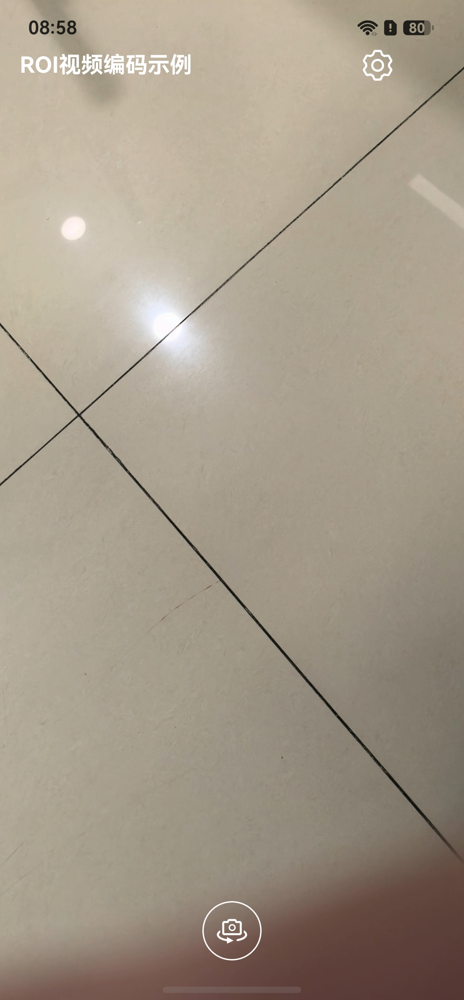

# 基于OpenHarmony媒体子系统实现ROI视频编码直播功能

## 项目简介

本示例基于OpenHarmony媒体子系统，实现媒体直播的开直播端功能。本示例实现了直播场景常用的音视频采集、ROI视频编码、背景音乐添加、前后摄像头翻转等功能。基于本示例可帮助开发者理解ROI视频编码的配置方式及其在直播场景中的应用。

- 直播端视频录制的主要流程是相机采集->OpenGL旋转->ROI区域提取与配置->编码->封装成mp4文件。
- 录制场景在相机和编码之间加了OpenGL渲染管线，开发者可参考该流程加上对应的Shader，如直播场景加上美颜、滤镜等算子。
- 本示例展示了三种ROI编码通路：NativeBuffer元数据配置、参数回调配置、Buffer帧数据配置。

### 录制支持的原子能力规格

| 封装格式 | 视频编解码类型     | 音频编解码类型 |
|------|-------------|---------|
| mp4  | H.264/H.265 | AAC     |

## 效果预览

| 应用主界面                                                                           | 直播页                                                                                    |
|---------------------------------------------------------------------------------|----------------------------------------------------------------------------------------|
|  |  |

## 使用说明

1. 在弹出是否允许"HMOSLiveStream"访问相机后，点击"允许"。
2. 在弹出是否允许"HMOSLiveStream"访问麦克风后，点击"允许"。
3. 在弹出是否允许"HMOSLiveStream"发现和连接附近的设备后，点击"允许"。

### 开直播

1. 选择ROI编码配置方式（NativeBuffer元数据配置、参数回调配置或Buffer帧数据配置），点击相应按钮。

2. 确认允许录制文件保存到分布式文件。

3. 录制完成后点击右上角的按钮关闭。

## 工程目录

```   
├──entry/src/main/cpp                 // Native层
│  ├──capbilities                     // 能力接口和实现
│  │  ├──render                       // 送显模块接口和实现
│  │  │  ├──include                   // 送显模块接口
│  │  │  │  ├──egl_render_context.h   // EGL渲染上下文接口
│  │  │  │  ├──render_thread.h        // 渲染线程接口
│  │  │  │  └──shader_program.h       // 封装 OpenGL ES 着色器程序的接口
│  │  │  ├──render_thread.cpp         // 渲染线程（含ROI区域提取、ROI框绘制、元数据写入）
│  │  │  ├──egl_render_context.cpp    // EGL渲染上下文实现
│  │  │  └──shader_program.cpp        // 封装 OpenGL ES 着色器程序
│  │  ├──codec                        // 音视频采集编解码
│  │  │  ├──include                   // 音视频采集编解码接口
│  │  │  │  ├──CodecCallback.h        // 编解码回调接口
│  │  │  │  ├──CodecInfo.h            // 编解码数据结构
│  │  │  │  └──VideoEncoder.h         // 视频编码接口（含ROI编码通路配置）
│  │  │  ├──AudioCapturer.cpp         // 音频采集实现
│  │  │  ├──AudioDecoder.cpp          // 音频解码实现
│  │  │  ├──AudioEncoder.cpp          // 音频编码实现
│  │  │  ├──AudioRender.cpp           // 音频渲染实现
│  │  │  ├──CodecCallback.cpp         // 编解码回调（含Buffer模式ROI数据填充）
│  │  │  ├──Demuxer.cpp               // 解封装实现
│  │  │  ├──Muxer.cpp                 // 封装实现
│  │  │  └──VideoEncoder.cpp          // 视频编码实现（含ROI参数回调通路）
│  ├──common                          // 公共模块
│  │  ├──dfx                          // 日志
│  │  ├──ApiCompatibility.h           // API兼容性
│  │  ├──FrameQueue.h                 // 帧队列（Buffer模式数据传递）
│  │  └──SampleInfo.h                 // 功能实现公共类（含ROI通路类型枚举）
│  ├──player                          // Native层播放接口和实现
│  │  ├──include                      // Native层播放接口
│  │  │  ├──Player.h                  // Native层播放功能调用逻辑的接口
│  │  │  └──PlayerNative.h            // Native层 播放的入口的接口
│  │  ├──Player.cpp                   // Native层播放功能调用逻辑的实现
│  │  └──PlayerNative.cpp             // Native层 播放的入口
│  └──recorder                        // Native层录制接口和实现
│  │     ├──include                   // Native层录制功能调用逻辑的实现
│  │     │  ├──Recorder.h             // Native层录制功能调用逻辑的接口
│  │     │  └──RecorderNative.h       // Native层 录制入口的接口
│  │     ├──Recorder.cpp              // Native层录制功能调用逻辑的实现（含ROI通路初始化）
│  │     └──RecorderNative.cpp        // Native层 录制的入口
│  ├──types                           // Native层提供上来的接口
│  │  ├──libplayer                    // 播放模块提供给UI层的接口
│  │  └──librecorder                  // 录制模块提供给UI层的接口（含ROI开关控制）
│  └──CMakeLists.txt                  // 编译入口       
├──ets                                // UI层
│  ├──common                          // 公共模块
│  │  ├──utils                        // 共用的工具类
│  │  │  ├──BackgroundTaskManager.ets // 后台任务工具类
│  │  │  ├──CameraCheck.ets           // 检查相机参数是否支持
│  │  │  ├──DateTimeUtils.ets         // 时间转换工具类
│  │  │  ├──ImageUtil.ets             // 图片处理工具类
│  │  │  ├──Logger.ets                // 日志工具
│  │  │  ├──PermissionUtil.ets        // 权限工具类
│  │  │  └──WindowUtils.ets           // 窗口工具类
│  │  └──CommonConstants.ets          // 参数常量
│  ├──components                      // 组件目录
│  │  └──SettingPopupDialog.ets       // 设置弹窗组件
│  ├──controller                      // 控制器
│  │  ├──BgmController.ets            // 背景音乐控制器
│  │  ├──CameraController.ets         // 相机控制器（含MetadataOutput人脸检测）
│  │  └──DistributeFileManager.ets    // 分布式文件管理器
│  ├──entryability                    // 应用的入口
│  │  └──EntryAbility.ets            
│  ├──entrybackupability            
│  │  └──EntryBackupAbility.ets   
│  ├──model            
│  │  ├──CameraDataModel.ets          // 相机参数数据类  
│  │  └──SettingPopupOptionItem.ets   // 设置的数据类  
│  ├──pages                           // EntryAbility 包含的页面
│  │  ├──Index.ets                    // 首页（ROI通路选择入口）
│  │  └──StartLiveStream.ets          // 直播端页面
│  └──view                            // EntryAbility 包含的页面
│     ├──StartLiveDecorationView.ets  // 直播端交互页面
│     └──StartLiveRenderView.ets      // 直播端渲染器
├──resources                          // 存放应用的资源文件
└──module.json5                       // 模块配置信息
```

## 具体实现

### 开直播

#### UI层

1. 在UI层Index页面，用户选择ROI编码通路后点击按钮，确认保存录制文件到分布式文件夹下，将会创建一个新的视频文件和ROI日志文件。
2. 创建好文件后，会用刚刚创建文件的fd，和用户预设的录制参数，调用Native层的initNative()进行录制初始化，待初始化结束后，Native层会调用
   OH_NativeWindow_GetSurfaceId接口，得到NativeWindow的surfaceId，并把surfaceId回调回UI层。
3. UI层拿到编码器给的surfaceId后，构造cameraController和bgmController，并调起页面路由，跳转到StartLiveStream页面。
4. StartLiveStream页面中的StartLiveRenderView组件的XComponent在构建时，会调起.onLoad()方法，此方法首先会拿到XComponent的surfaceId，
   然后调起cameraController的createRecorder()和startNative()，此函数会建立一个相机生产，XComponent和编码器的surface消费的生产消费模型。

#### Native层编码

1. 进入录制界面后，编码器启动，开始对UI层相机预览流进行编码。
2. 编码器每编码成功一帧，sample_callback.cpp的输出回调OnNewOutputBuffer()就会调起一次，此时用户会拿到AVCodec框架给出的OH_AVBuffer。
3. 在输出回调中，用户需手动把帧buffer、index存入输出队列中，并通知输出线程解锁。
4. 在输出线程中，把上一步的帧信息储存为bufferInfo后，pop出队。
5. 在输出线程中，使用上一步的bufferInfo，调用封装接口WriteSample后，这一帧被封装入MP4中。
6. 最后调用FreeOutputBuffer接口后，这一帧buffer释放回AVCodec框架，实现buffer轮转。

## 相关权限

- 允许应用使用相机：ohos.permission.CAMERA。
- 允许应用使用麦克风：ohos.permission.MICROPHONE。
- 允许应用使用分布式文件进行同步：ohos.permission.DISTRIBUTED_DATASYNC。
- 允许应用后台运行：ohos.permission.KEEP_BACKGROUND_RUNNING。

## 依赖

- 不涉及

## 约束与限制

1. 本示例仅支持标准系统上运行，支持设备：default（手机）、tablet（平板）。

2. OpenHarmony API版本：API 26及以上。

3. DevEco Studio版本：DevEco Studio 5.0.5 Release及以上。

4. OpenHarmony SDK版本：OpenHarmony SDK 26.0.0及以上。
