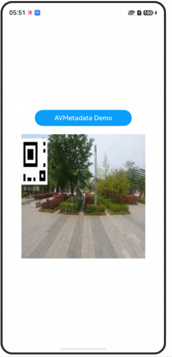

# AVImageGeneratorArkTS-sta

## 介绍

本示例为媒体->Media Kit(媒体服务)->[使用AVImageGenerator提取视频指定时间图像(ArkTS-sta)](https://gitcode.com/openharmony/docs/blob/master/zh-cn/application-dev/media/media/avimagegenerator.md)的静态配套示例工程。 

本示例展示了如何获取视频资源的缩略图。

## 效果预览

| 预览                                      | 
| -------------------------------------------- | 


## 使用说明
1. 安装编译生成的hap包，并打开应用；
2. 点击获取缩略图按钮，获取视频缩略图；


## 工程目录

```
AVImageGeneratorArkTS
entry/src/main/ets/
└── pages
    └── Index.ets (获取缩略图界面)
entry/src/main/resources/
├── base
│   ├── element
│   │   ├── color.json
│   │   ├── float.json
│   │   └── string.json
│   └── media
│
└── rawfile
    └── H264_AAC.mp4 (视频资源)
entry/src/ohosTest/ets/
└── test
    ├── Ability.test.ets (UI测试代码)
    └── List.test.ets (测试套件列表)
```

## 具体实现
* 源码参考：[Index.ets](./entry/src/main/ets/pages/Index.ets)
* 使用流程：
* 点击'AVMetadata Demo'按钮，可看到使用fetchFrameByTime函数从视频中获取第0帧缩略图的操作结果。

## 相关权限

不涉及

## 依赖

不涉及

## 约束和限制

1. 本示例支持标准系统上运行，支持设备：RK3568;

2. 本示例支持API26版本SDK
   
3. 本示例已支持使DevEco Studio 6.0.94 Release

## 下载

如需单独下载本工程，执行如下命令：

```
git init
git config core.sparsecheckout true
echo code/DocsSample/Media/AVImageGenerator/AVImageGeneratorArkTS/ > .git/info/sparse-checkout
git remote add origin https://gitcode.com/openharmony/applications_app_samples.git
git pull origin master
```