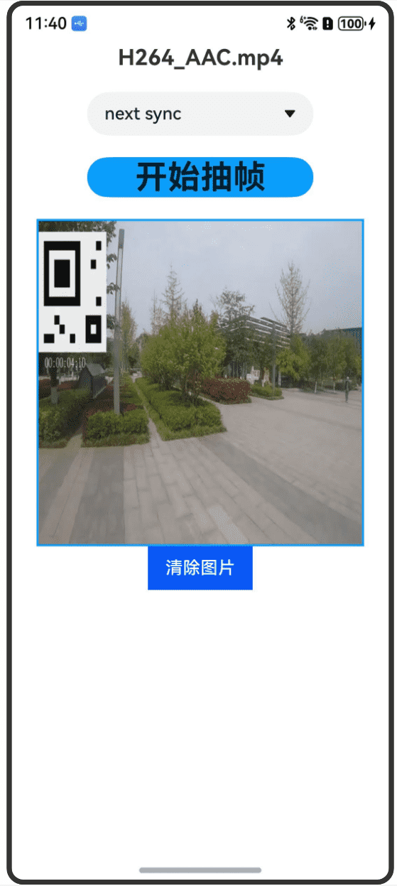

# AVImageGeneratorNDK

## 介绍

本示例为媒体->Media Kit(媒体服务)->[使用AVImageGenerator获取视频帧(C/C++)](https://gitee.com/openharmony/docs/blob/master/zh-cn/application-dev/media/media/using-ndk-avimagegenerator-for-video.md)的配套示例工程。 

本示例展示了如何获取视频资源的缩略图。

## 效果预览

| 预览                                      | 
| -------------------------------------------- | 


## 使用说明
1. 安装编译生成的hap包，并打开应用；
2. 选择传入时间点与关键帧的关系，点击开始抽帧按钮，获取指定时间的视频缩略图；
3. 点击清楚图片按钮，清除生成的缩略图；


## 工程目录

```
AVImageGeneratorNDK
entry/src/main/ets/
└── pages
    └── Index.ets (获取缩略图界面)
entry/src/main/
├── cpp
│   ├── types
│   │   └── libentry
│   │       └── Index.d.ts (NDK函数对应的js映射)
│   ├── CMakeLists.txt (CMake脚本)
│   └── napi_init.cpp (NDK函数)
└── resources
    ├── base
    │   ├── element
    │   │   ├── color.json
    │   │   ├── float.json
    │   │   └── string.json
    │   └── media
    │
    └── rawfile
        └── H264_AAC.mp4 (视频资源)
entry/src/ohosTest/ets/
└── test
    ├── Ability.test.ets (UI测试代码)
    └── List.test.ets (测试套件列表)
```

## 相关权限

不涉及

## 依赖

不涉及

## 约束和限制

1. 本示例支持标准系统上运行，支持设备：RK3568;

2. 本示例支持API20版本SDK，版本号：6.0.0.34;
   
3. 本示例已支持使DevEco Studio 5.0.3 Release (构建版本：5.0.9.300，构建 2025年3月13日)编译运行

## 下载

如需单独下载本工程，执行如下命令：

```
git init
git config core.sparsecheckout true
echo code/DocsSample/Media/AVImageGenerator/AVImageGeneratorNDK/ > .git/info/sparse-checkout
git remote add origin https://gitee.com/openharmony/applications_app_samples.git
git pull origin master
```