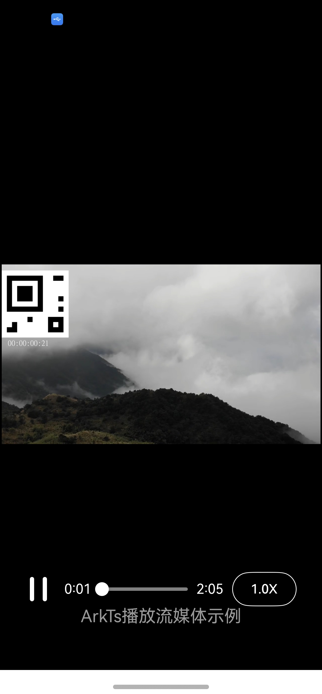

# AVPlayerArkTSStreamingMedia

## 介绍

本示例为媒体->Media Kit(媒体服务)->[使用AVPlayer播放流媒体(ArkTS)](https://gitcode.com/openharmony/docs/blob/master/zh-cn/application-dev/media/media/streaming-media-playback-development-guide.md)的配套示例工程。 

本示例展示了如何使用AVPlayer组件完整地播放一个流媒体视频。

## 效果预览

| 播放效果                                      | 
| -------------------------------------------- | 



## 工程目录

```
AVPlayerArkTSStreamingMedia
entry/src/main/ets/
└── pages
    └── Index.ets (播放界面)
entry/src/main/resources/
├── base
│   ├── element
│   │   ├── color.json
│   │   ├── float.json
│   │   └── string.json
│   └── media
│       ├── ic_video_play.svg  (播放键图片资源)
│       └── ic_video_pause.svg (暂停键图片资源)
└── rawfile
    └── test1.mp4 （视频资源）
entry/src/ohosTest/ets/
└── test
    ├── Ability.test.ets (UI测试代码)
    └── List.test.ets (测试套件列表)
```
### 具体实现

1. 使用createAVPlayer()创建播放实例。
2. 注册onStateChange()回调监听状态流转。
3. initialized状态设置surfaceId并调用prepare()。
4. prepared状态自动调用play()开始播放。
5. playing状态启动定时器setInterval每秒更新当前时间，并触发UI刷新。
6. completed状态停止定时器，重置时间显示，播放结束。
7. 播放结束后，调用release()释放播放器资源，防止内存泄漏。

## 相关权限

不涉及

## 依赖

不涉及

## 约束和限制

1. 本示例支持标准系统上运行，支持设备：RK3568;

2. 本示例支持API26版本SDK;
   
3. 本示例已支持使DevEco Studio 6.0.94 Release

## 下载

如需单独下载本工程，执行如下命令：

```
git init
git config core.sparsecheckout true
echo code/DocsSample/Media/AVPlayer-sta/AVPlayerArkTSStreamingMedia/ > .git/info/sparse-checkout
git remote add origin https://gitcode.com/openharmony/applications_app_samples.git
git pull origin master
```