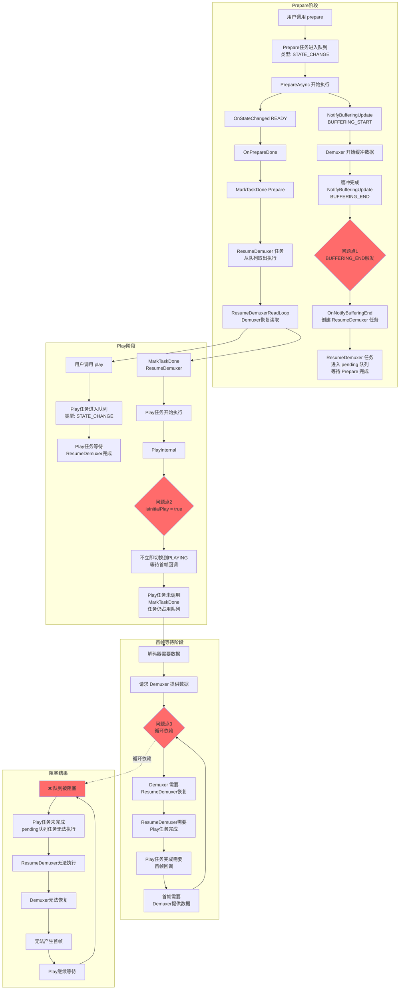

# AVPlayer Prepare缓冲流程与任务队列循环依赖问题

## 流程图



## 问题说明

### 循环依赖链：

```
┌─────────────────────────────────────────────────────────┐
│                                                         │
│  Play任务未完成 (等待首帧)                                │
│         ↓                                               │
│  队列中 ResumeDemuxer 无法执行                           │
│         ↓                                               │
│  Demuxer 未恢复读取                                      │
│         ↓                                               │
│  无法产生首帧                                            │
│         ↓                                               │
│  Play任务继续等待                                        │
│         ↓                                               │
│  🔁 回到起点，形成死锁                                    │
│                                                         │
└─────────────────────────────────────────────────────────┘
```

### 三个关键问题点：

| 问题点 | 触发位置 | 原因 |
|-------|---------|------|
| **问题点1** | Prepare完成时触发BUFFERING_END | Prepare阶段不应触发BUFFERING_END，导致提前创建ResumeDemuxer任务 |
| **问题点2** | Play执行时isInitialPlay=true | Play不立即切换状态，等待首帧，导致未调用MarkTaskDone |
| **问题点3** | 任务队列串行执行机制 | ResumeDemuxer依赖Play完成，Play依赖首帧，首帧依赖ResumeDemuxer |

### 任务队列状态图：

```
时间轴:
────────────────────────────────────────────────────────────────→
  
  T1: Prepare执行中
      ├─ currTask: Prepare
      └─ pending: []
      
  T2: BUFFERING_END触发
      ├─ currTask: Prepare
      └─ pending: [ResumeDemuxer]  ⚠️ 进入队列
      
  T3: Prepare完成
      ├─ currTask: ResumeDemuxer
      └─ pending: []
      
  T4: 用户调用play()
      ├─ currTask: ResumeDemuxer
      └─ pending: [Play]  ⚠️ 进入队列
      
  T5: ResumeDemuxer完成
      ├─ currTask: Play
      └─ pending: []
      
  T6: Play等待首帧 ⚠️ 卡住
      ├─ currTask: Play (未完成)
      └─ pending: [后续任务无法执行]
      
  T7+ : 死锁状态
       Play无法完成 → ResumeDemuxer无法再次执行 → 无首帧
```

## 问题根因分析

### 核心代码位置

| 文件 | 功能 |
|------|------|
| `hiplayer_impl.cpp:716-768` | PrepareAsync实现 |
| `hiplayer_impl.cpp:2897-2918` | BUFFERING_END事件处理 |
| `player_server.cpp:2134-2146` | OnNotifyBufferingEnd |
| `player_server_task_mgr.cpp:73-103` | 任务队列LaunchTask |
| `hiplayer_impl.cpp:2941-2977` | HandleInitialPlayingStateChange |

### 关键代码片段

**1. BUFFERING_END触发ResumeDemuxer (hiplayer_impl.cpp:2897-2910)**

```cpp
case EventType::BUFFERING_END : {
    isBufferingEnd_ = true;
    if (!isBufferingStartNotified_.load() || isSeekClosest_.load()) {
        break;  // ✅ 正常情况应该break，但prepare时可能触发
    }
    NotifyBufferingEnd(AnyCast<int32_t>(event.param));  // ❌ 触发ResumeDemuxer任务
}
```

**2. ResumeDemuxer任务创建 (player_server.cpp:2134-2146)**

```cpp
void PlayerServer::OnNotifyBufferingEnd() {
    auto playingTask = std::make_shared<TaskHandler<void>>([this]() {
        auto currState = std::static_pointer_cast<BaseState>(GetCurrState());
        (void)currState->ResumeDemuxer();  // ❌ 进入任务队列
    });
    taskMgr_.LaunchTask(playingTask, PlayerServerTaskType::LIGHT_TASK, "ResumeDemuxer");
}
```

**3. 任务队列机制 (player_server_task_mgr.cpp:73-103)**

```cpp
int32_t PlayerServerTaskMgr::LaunchTask(...) {
    if (currTwoPhaseTask_ == nullptr) {
        return EnqueueTask(task, type, taskName);  // 直接执行
    }
    // ❌ 当前有任务，放入pending队列
    pendingTwoPhaseTasks_.push_back({ type, task, nullptr, taskName });
}
```

**4. Play等待首帧 (hiplayer_impl.cpp:998-1007)**

```cpp
if (ret == MSERR_OK) {
    if (!isInitialPlay_) {
        OnStateChanged(PlayerStateId::PLAYING);  // ✅ 直接切换
    } else {
        MEDIA_LOG_D_SHORT("InitialPlay, pending to change state of playing");  
        // ❌ 等待首帧，不调用MarkTaskDone
    }
}
```

## 死锁形成原因总结

这就是 prepare 缓冲结束后，ResumeDemuxer 任务进入队列，但 Play 任务需要首帧才能完成，而首帧需要 ResumeDemuxer 恢复 Demuxer 读取，形成了循环依赖导致死锁。

**完整的循环依赖链**：
```
Play任务未完成(等待首帧) 
→ 队列中ResumeDemuxer无法执行
→ Demuxer未恢复读取
→ 无法产生首帧
→ Play任务继续等待
→ ♻️ 循环阻塞
```