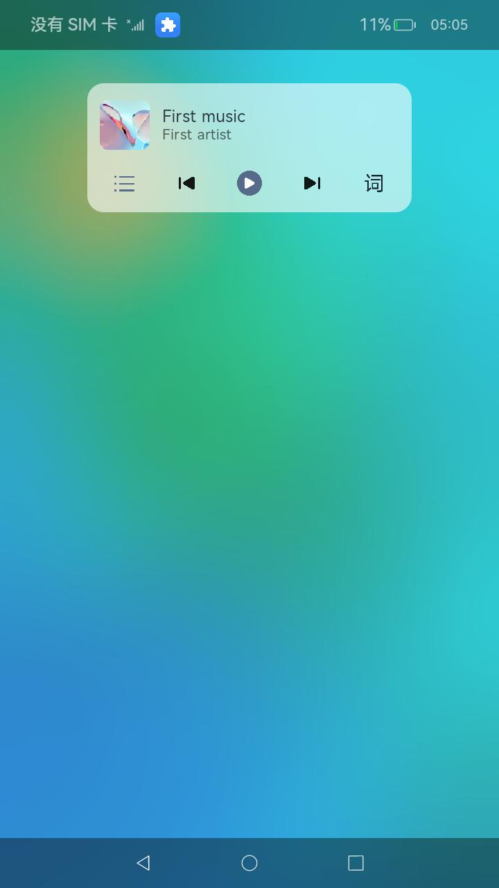
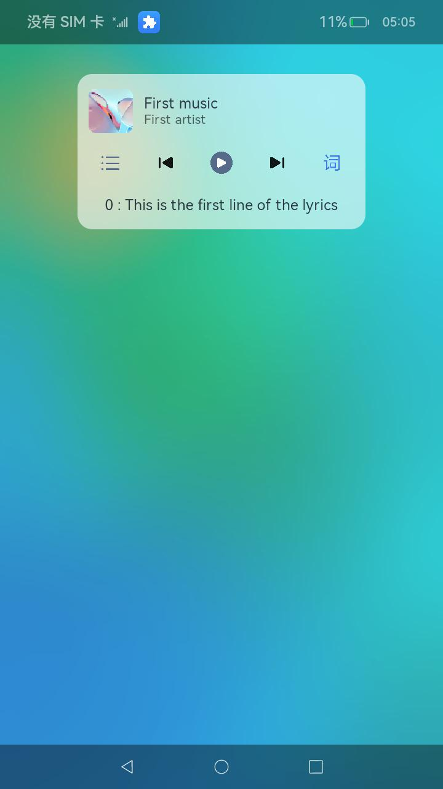
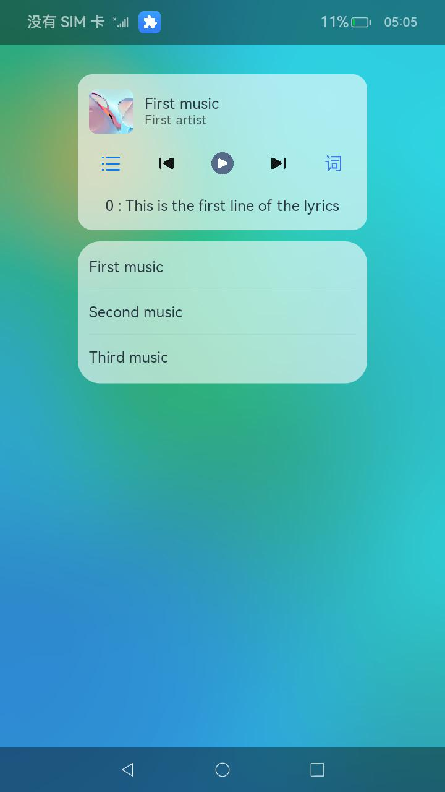

# 媒体会话——控制方

### 介绍

本示例主要展示了媒体会话（媒体控制方）的相关功能，使用[@ohos.multimedia.avsession](https://gitee.com/openharmony/docs/blob/master/zh-cn/application-dev/reference/apis-avsession-kit/arkts-apis-avsession.md)等接口实现媒体提供方与媒体控制方自定义信息的交互功能。

> 注意：
> 此示例中媒体控制方所使用的能力从API版本23开始支持，更多信息请参见[约束与限制](#约束与限制)。
> 此示例仅展示媒体控制方的相关功能，如果需要媒体会话提供的完整的自定义信息交互功能，请将本示例与[媒体提供方示例](https://gitcode.com/openharmony/applications_app_samples/tree/master/code/DocsSample/Media/AVSession/LocalAVSession/AccessingAVSession)共同使用。

### 效果预览

| 主页 | 显示歌词信息 | 显示播放列表信息 |
|--------------------------------|--------------------------------|--------------------------------|
|  |  |  |

#### 使用说明（需与媒体提供方一起使用）

1. 点击播放按钮，应用的播放状态发生变化。
2. 点击暂停按钮，应用的播放状态开始变化。
3. 点击上一首按钮，界面展示播放列表中的上一首歌曲的信息。
4. 点击下一首按钮，界面展示播放列表中的下一首歌曲的信息。
5. 点击歌词按钮，界面中出现歌词。
6. 点击播放列表按钮，界面中出现播放列表。

### 工程目录

给出项目中关键的目录结构并描述它们的作用，示例如下：

```
entry/src/main/ets/
|---common
|---|---Log.ets                             //日志打印封装
|---feature
|---|---MediaController.ets                 //逻辑实现
|---pages
|---|---PresentPage.ets                    //界面实现
```

### 具体实现

* 界面相关的实现都封装在pages/Index.ets下，源码参考：[pages/PresentPage.ets](./entry/src/main/ets/pages/PresentPage.ets)
    * 使用`@StorageLink`来设置与逻辑代码同步更新的变量，当逻辑代码中对应的变量更新时，界面会同步的刷新。

    * 通过引入逻辑代码对应的类，创建出对象，实现对onClick事件的响应，关键代码段：
      ```js
      import control from '../feature/MediaController';

      controller = new control(); // 创建对象

      await this.controller.startControl(); // 通过类的对象来调用逻辑代码
      ```

* 逻辑相关的实现都封装在feature/MediaController.ets下，源码参考：[feature/MediaController.ets](./entry/src/main/ets/feature/MediaController.ets)

  应用的初始化相关操作

    * 链接变量

      通过`AppStorage.SetAndLink()`将逻辑代码中的变量与界面代码中使用`@StorageLink`声明的变量连接起来，通过`set()`与`get()`操作来修改或获取变量的值，关键代码段：

      ```ets
      private metaDataLink: SubscribedAbstractProperty< avSession.AVMetadata> | undefined = undefined;
      this.metaDataLink = AppStorage.setAndLink<avSession.AVMetadata>('metaData', undefined);
      this.metaDataLink?.set(metadata); // 设置变量的值
      ```

    * 获取当前设备中会话并创建Controller

      通过接口`getAllSessionDescriptors()`获取当前设备中的媒体会话；

      通过接口`createController()`创建媒体会话对应的控制器；

      通过接口`on(metadataChange | playbackStateChange | queueItemsChange)`开启对媒体提供方发送事件的监听，对媒体提供方的事件进行处理；

  应用在运行中相关的操作

    * 发送基础控制命令到媒体提供方

      基础控制命令可以通过接口`sendControlCommand()`发送。本示例中，从媒体控制方到媒体提供方的基础控制命令主要包括`play, pause, playPrevious, playNext`。发送命令的参考代码如下：
      ```ets
      let command : AVSessionManager.AVControlCommand = {
        command : 'play',
      } // 构造AVControlCommand参数
      await controller.sendControlCommand(command); // 媒体会话控制器与媒体会话一一对应，通过sendControlCommand发送命令
      ```

    * 获取当前会话信息

      通过接口`getAVQueueItems()`获取当前歌曲列表信息；

      通过接口`getAVPlaybackState()`获取当前歌曲播放状态信息；

      通过接口`getAVMetadata()`获取当前歌曲媒体会话元数据信息；

### 相关权限

#### 媒体资源管理相关权限（必选）

如果需要获取当前设备正在播放的媒体资源，并对其进行管理，需要申请媒体资源管理权限[ohos.permission.MANAGE_MEDIA_RESOURCES_FOR_PUBLIC](https://gitee.com/openharmony/docs/blob/master/zh-cn/application-dev/security/AccessToken/restricted-permissions.md#ohospermissionmanage_media_resources_for_public)

请在需要获取Bundle信息权限的Ability的`module.json5`中添加以下配置：

```json5
{
  "module": {
      "requestPermissions": [
        {
          "name": "ohos.permission.MANAGE_MEDIA_RESOURCES_FOR_PUBLIC"
        }
      ]
  }
}
```

#### 网络权限（可选）

如果需要展示媒体提供方提供的网络资源（例如：Url形式的图片），需要获取网络权限[ohos.permission.INTERNET](https://gitee.com/openharmony/docs/blob/master/zh-cn/application-dev/security/AccessToken/permissions-for-all.md#ohospermissioninternet)

请在需要获取网络权限的Ability的`module.json5`中添加以下配置：

```json5
{
  "module": {
      "requestPermissions": [
        {
          "name": "ohos.permission.INTERNET"
        }
      ]
  }
}
```
#### Bundle相关权限（可选）

如果需要通过媒体提供方的包名来获取媒体提供方的应用名与应用图标，需要申请Bundle权限[ohos.permission.GET_BUNDLE_INFO_PRIVILEGED](https://gitee.com/openharmony/docs/blob/master/zh-cn/application-dev/security/AccessToken/permissions-for-enterprise-apps.md#ohospermissionget_bundle_info_privileged)

请在需要获取Bundle信息权限的Ability的`module.json5`中添加以下配置：

```json5
{
"module": {
   "requestPermissions": [
     {
       "name": "ohos.permission.GET_BUNDLE_INFO_PRIVILEGED"
     }
   ]
}
}
```

### 依赖

不涉及。

### 约束与限制

1. 本示例仅支持标准系统上运行，支持设备：RK3568。

2.  本示例支持API23版本的SDK，版本号：6.1.0.25；

3.  本示例已支持使用Build Version: 6.0.1.251, built on November 22, 2025；

### 下载

如需单独下载本工程，执行如下命令：

```
git init
git config core.sparsecheckout true
echo code/SystemFeature/Media/AVSession/MediaController > .git/info/sparse-checkout
git remote add origin https://gitee.com/openharmony/applications_app_samples.git
git pull origin master
```